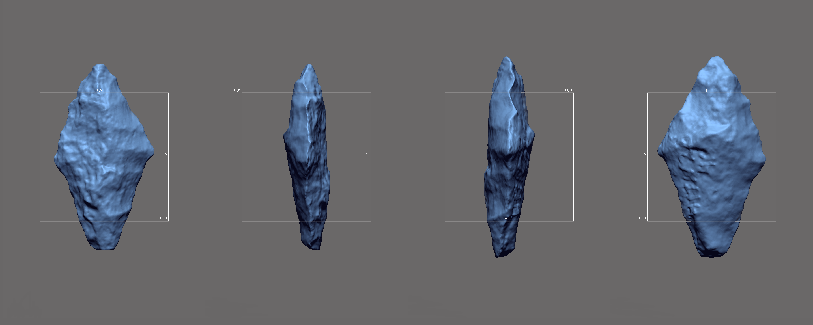
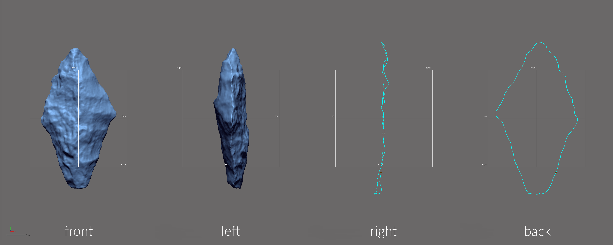
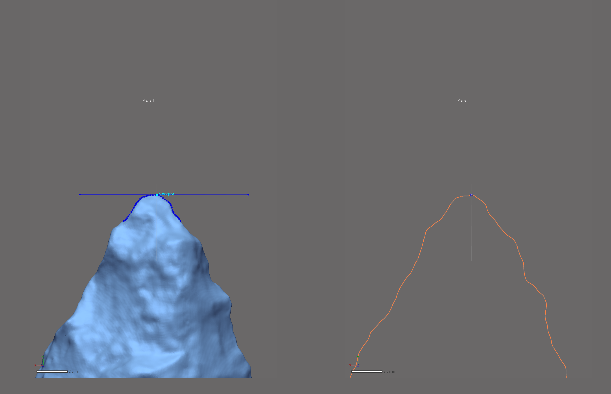
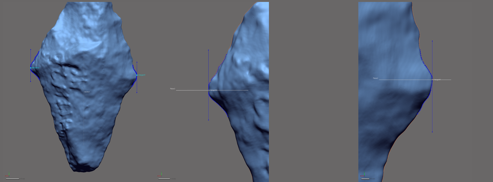
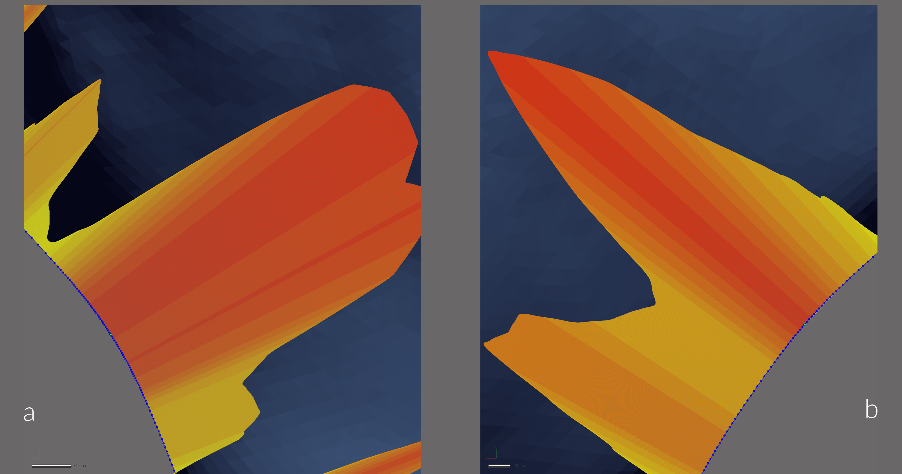
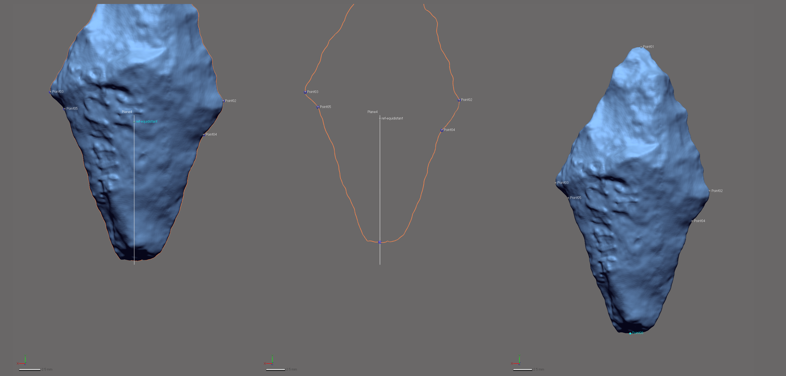
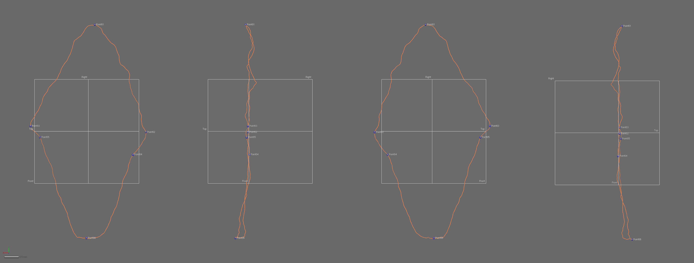
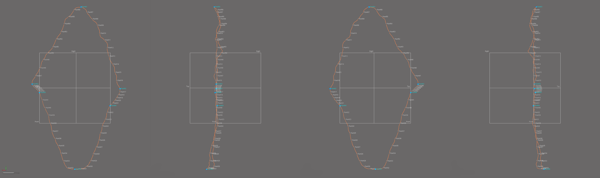
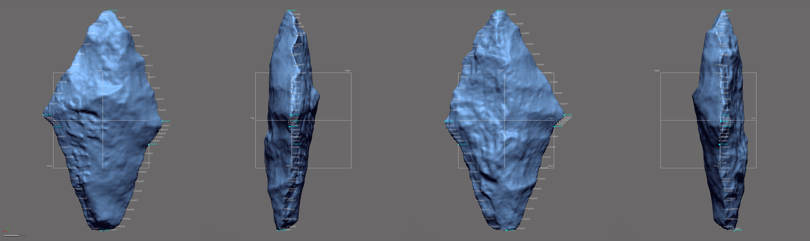
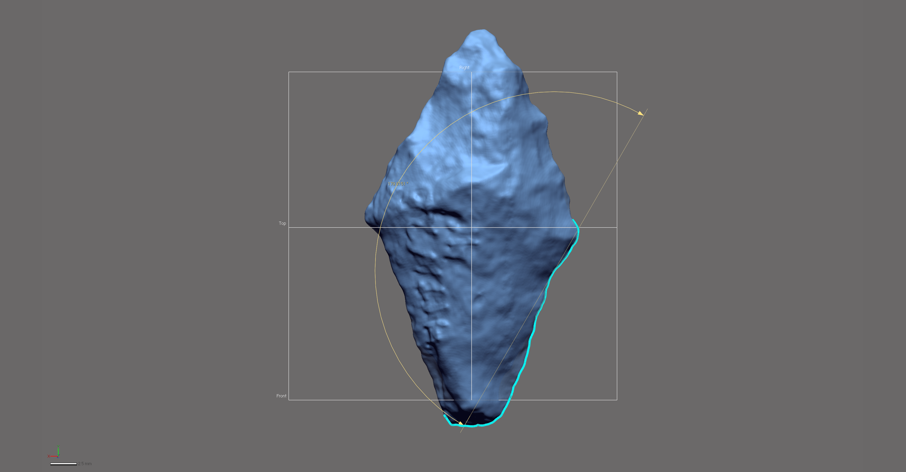

```{r setup, include=FALSE}
knitr::opts_chunk$set(echo = TRUE)
```

This document includes supplemental materials for the article, "A quantitative assessment of intraspecific morphological variation in Gary dart points: An exercise in archaeological epistemology and heuristics." The study asks whether the morphologically-derived temporal frameworks advanced Ford and Webb [-@RN20898] and Densmore [-@RN20874] might be extended to Gary dart points generally, and whether those specimens assigned to each temporal category using traditional morphometrics exhibit unique morphological characteristics. The landmarking protocol developed for this project bears some visual similarities with the configuration used in the [previous 2D study of basal morphology](https://scholarworks.sfasu.edu/cgi/viewcontent.cgi?article=1280&context=crhr), as well as other two-dimensional geometric morphometric analyses [@RN1754;@RN1736;@RN11731]; however, it differs in some fundamental ways. The first and most obvious difference is that this is a three-dimensional study. The second is the method of landmark placement, where _Geomagic Design X (Build Version 2019.0.2 [Build Number: 78])_ was used to generate a spline around the periphery of each dart point, and to populate the landmarks and equidistant semilandmarks in a replicable manner using mathematically-defined criteria.

```{r figTN20}

fig.cap="Gary dart point from 41TN20. \\label{figTN20}"
```

Inclusion of the third dimension provides a means of capturing those morphological characteristics associated with axial twisting introduced through the practice of bifacial beveling and/or resharpening. This landmarking protocol represents an intermediate iteration between the previous 2D analysis, and the forthcoming protocol that includes semilandmarks placed on a series of equidistant cross-sections (similar to trusses) [@RN20900]. The cross-sections increase the coverage of semilandmarks across the mesh topology, and provide for greater precision in the analysis of gross morphology. The evolution of this landmarking protocol represents a concerted effort to better comprehend the vagaries of morphological similarities and differences among and between sites where Gary dart points have been found. While true that some landmarking protocols can be---and often are---recycled as new specimens are added, this particular research programme endeavours to achieve greater analytical accuracy and precision in each subsequent iteration.

### Generating the spline

Unlike the [previous study](https://scholarworks.sfasu.edu/cgi/viewcontent.cgi?article=1280&context=crhr), where the outline of Gary dart point bases were projected onto a 2D plane, this effort is based upon a spline extracted from the surface geometry of the 3D mesh. That spline is generated with the `extract contour curves` command that detects and extracts 3D contour curves along high-curvature areas of the mesh (i.e., edges). In reverse-engineering, `extract contour curves` is regularly employed as the first step in building a `patch network` used to generate a surface. The extracted feature curve is rendered as a spline, and follows the highest curvature contours around the sinuous edge of each point. The remainder of the landmarking protocol is based upon this spline, which is subsequently split at six mathematically-defined locations.

```{r figspline}

fig.cap="Spline extracted along the highest contours of the projectile. \\label{figspline}"
```

### Splitting the spline

_A few definitions are warranted before proceeding. `Reference geometries` are used in the assistance of creating other features. These include basic geometric entities, such as `planes`, `vectors`, `coordinates`, `points`, and `polygons`. A `reference point` is a virtual point and is used to mark a specific position on a model or in 3D space. A `reference plane` is a virtual plane that has a normal direction and an infinite size. A `reference plane` is not a surface body, and is used to create other features._ 

The characteristic points and tangents developed for this landmarking protocol were inspired by the work of Birkhoff [-@RN11786]. The first landmark (LM1) is placed at the horizontal tangent at the tip (proximal end) of each Gary dart point. The second and third splits (LM2 and LM3) enlist vertical tangents on either side of each point at the junction of the blade and shoulder, and LM2 is always split on the right side of the point when oriented in 3D space following the alignment output of _auto3dgm_. The fourth and fifth landmarks (LM4 and LM5) occur at points of highest curvature at the junction of the shoulder and base. The final landmark (LM6) is placed by calculating the linear distance between LM4 and LM5, projecting a reference point equidistant between the landmarks, and using that point to place the reference plane that then splits the spline at the location of LM6 (centre base).

#### Spline split at location of LM1 (tip/proximal point)

The `horizontal tangent` is calculated by drawing a horizontal line above the tip of the Gary dart point using the tangent as a `common constraint`, and the horizontal as the `independent constraint`. To split the 3D spline at the location of the horizontal tangent, a `reference point` was inserted at the location of the `tangent` in the sketch (light blue point; below, left), followed by a `reference plane` (in white; below, left and right) using the `pick point and normal axis` function where the `reference point` (h-tangent) was used as the `pick point`, and the `Right plane` as the `normal axis` (below, left). The 3D spline was then cut at the location where the `reference plane` intersects with the spline (below image, right).

```{r figlm1}

fig.cap="Identify horizontal tangent, insert reference point and reference plane (left). Use reference plane to cut spline at the location of the horizontal tangent (right). \\label{figlm1}"
```

#### Spline split at locations of LM2 and LM3 (junction of blade and shoulder)

The `vertical tangent` is calculated by drawing a vertical line to the left or right of the Gary dart point using the tangent as a `common constraint`, and the vertical as the `independent constraint`. To split the 3D spline at the location of the vertical tangent, a `reference point` was inserted at the location of the `tangent` in the 2D sketch (light blue point; below, left), followed by a `reference plane` (in white; below, left and right) using the `pick point and normal axis` function where the `reference point` (v-tangent) was used as the `pick point`, and the `Top plane` as the `normal axis`. The 3D spline was cut at the location where the `reference plane` intersected with the spline. The alignment and orientation of each point was dictated by the _auto3dgm_ output, and the landmarking protocol follows the mesh orientation in that figure, where LM2 was always placed on the right side of the basal edge, and LM3 on the left.

```{r figlm2-3}

fig.cap="Identify vertical tangents, insert reference points (left). Then insert and use reference planes to cut spline at location of the vertical tangents (center [LM3] and right [LM2]) for junction of blade and shoulder. \\label{figsplinesplitvlr}"
```

#### Spline Split at locations of LM4 and LM5 (junction of shoulder and base)

The point of highest curvature between the shoulder and base was calculated using the `curvature function` in the Accuracy Analyser. This function displays the curvature flow as a continuous colour plot across the area of the curve. In this instance, _curvature_ is defined as the amount by which a geometric shape deviates from being flat or straight in the case of a line. The curvature is displayed in different colours according to the local radius, and is calculated in only one direction (U or V) along the curve. Using this tool, the two points of highest curvature were located between the edges of the shoulder and base on either side of each Gary dart point where the local radius measure was largest.

```{r figlm4-5}

fig.cap="Identify points of hightest curvature (light blue) at left [LM5] and right [LM4] intersections of shoulder and basal edges. \\label{figsplinesplitcrvlr}"
```

#### Spline split at location of LM6 (centre base)

One additional landmark (LM6) was placed at the centre of the base. The location of this landmark was identified by calculating the linear distance between LM4 and LM5, and projecting a `reference point` (ref-equidistant; below left) equidistant between the two. A `reference plane` was added using the ref-equidistant as the pick point, and the `Right plane` as the `normal axis`. The spline was then split where it intersected with the `reference plane`.

```{r figlm6}

fig.cap="Calculate linear distance between LM4 and LM5 (ref-equidistant, left), use point to insert reference plane coplanar to Right plane and use reference plane to cut the spline(center). LM6 added at location of split.  \\label{figlm4}"
```

#### Final spline

Through the preceding protocol, the initial spline was split into six discrete splines, and landmarks placed at the intersection of each. These splines articulate with components of bifacial morphology that can be compartmentalised in the subsequent analyses (i.e., left/right [directional] asymmetry, blade/base morphological integration, etc.). The primary analytical gain achieved through this exercise is the requisite foundation needed to carry out replicable analyses of Gary dart point morphology in three dimensions, further increasing the precision of the geometric morphometric analysis.

```{r figsplinesplit-frbl}

fig.cap="Result of spline splits include six discrete splines, each articulating with a region of analytical interest, with landmarks placed at the intersection of each. \\label{figsplinesplit-frbl}"
```

### Semilandmark placement

Landmarks (LM1-6) were placed at the location of each spline split (blue points, below). Equidistant semilandmarks were then added to each of the six splines; 10 between LM1 and LM2, five between LM2 and LM4, 10 between LM4 and LM6, 10 between LM6 and LM5, five between LM5 and LM3, and 10 between LM3 and LM1.

```{r figlmslm-all}

fig.cap="3D spline with landmarks (blue) and equidistant semilandmarks (white) applied, with top, right, and front planes. Semilandmarks are renumbered in post.  \\label{figlmslm-all}"
```

Superficially, this constellation of landmarks and semilandmarks appears similar to those used in recent 2D studies. However, the rigour of this protocol aids in capturing morphological variation that articulates with axial twisting introduced by knappers through the practice of beveling and/or resharpening. Thus, this constellation of landmarks and semilandmarks provides for greater precision in the geometric morphometric analysis, marking a substantive advancement in those analytical protocols used to achieve a more complete and holistic analysis of Gary dart point morphology.

```{r figmesh-lmslm}

fig.cap="Mesh for Gary dart point from 41TN20 with landmarks and equidistant semilandmarks applied. \\label{figmesh-lmslm}"
```

### Linear metrics

[Linear metrics](linear-metrics.md) associated with Gary type-varieties initially developed by Ford, Phillips, and Haag [-@RN20899], Ford and Webb [-@RN20898], and Schambach [-@RN3132] were used in tests to identify whether they could be replicated, and---if so---whether those differences can be said to articulate with temporal differences based upon relative or chronometric dating. Those type-varieties that could be replicated were incorporated into the geometric morphometric analysis, and were used to inform the phenotypic trajectory analysis.

### Angle calculation

In her study of Gary dart point morphology, Densmore [-@RN20874] employed an angle measurement between the stem and shoulder of each point. This study enlists the original approach advanced by Densmore [-@RN20874], in addition to a modified approach that ensures angle calculations remain consistent across the sample. The modified approach calculates the angle using LMs 2, 4, and 6, providing a means of data collection that is consistent and replicable across the entirety of the sample.

```{r figangle}

fig.cap="Mesh for Gary dart point from 41TN20 with landmarks and equidistant semilandmarks applied, and angle calculated between landmarks 2, 4, and 6. \\label{figangle}"
```

### Acknowledgments

I extend my gratitude to Christian S. Hoggard and David K. Thulman for their thoughtful comments and constructive criticisms on an earlier draft of this landmarking protocol. The current iteration of the landmarking protocol was developed using the `digit3DLand` package in R (code available in this repository); however, the capacity to populate replicable reference geometry across the sample in _Geomagic Design X_ made it a better option for the dynamic design process.

Funding for this project was provided to RZS by the United States Forest Service, National Forests and Grasslands in Texas (15-PA-11081300-033 and 20-PA-11081300-074), and components of this analytical work flow were developed and funded by a Preservation Technology and Training grant (P14AP00138) to RZS from the National Center for Preservation Technology and Training.

### References cited
