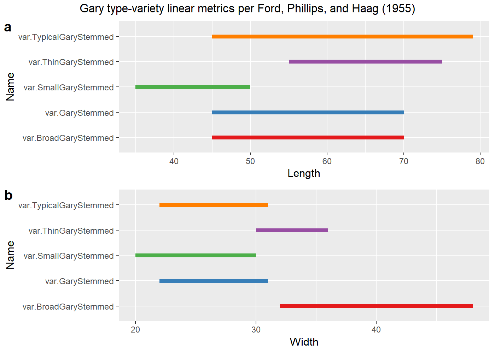
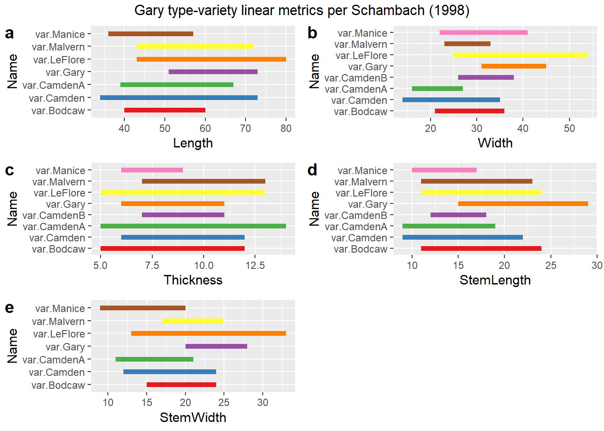

Traditional metrics for type-varieties of Gary dart points
================
Robert Z. Selden, Jr.
March 1, 2020

### Introduction

This document includes supplemental materials for the article, “A
quantitative assessment of intraspecific morphological variation in Gary
dart points: An exercise in archaeological epistemology and heuristics.”
The traditional linear measures of maximum length, width, and thickness
were combined with stem length and stem width for this study. These
variables represent the standard suite of metrics used to characterise
Gary points in previous studies, and provide those data needed to
examine whether specimens included in this study may transcend the
threshold between dart and arrow points (Hildebrandt and King 2012).

Others have noted the gradual diminution in the size of Gary dart points
through time (Baerreis 1951; Ford and Webb 1956; Schambach 1998;
Densmore 2007), thus it was necessary to begin by asking whether the
size of those points aggregated for this study may fall below the
arbitrary 11.8 mm dart-arrow index (DAI) threshold posited by
Hildebrandt and King (2012). The temporal span associated with
morphologically-diagnostic Gary dart points is thought to transcend the
cultural shift from hunter-gatherer to emergent horticulturalist, and
overlaps temporally with the advent and flourescence of the bow and
arrow. The dart-arrow index was calculated for all specimens of Gary
dart points used in this study, and none fall below the dart-arrow
threshold posited by Hildebrandt and King (2012). It is noteworthy that
others (Erlandson, Watts, and Jew 2014) have found that the DAI may not
be universally applicable; however, the DAI and the threshold identified
by Hildebrandt and King (2012) is a useful heuristic in this instance.

### Load packages for analysis

``` r
# install required analysis packages
#devtools::install_github("rich-iannone/DiagrammeR")
#devtools::install_github("vqv/ggbiplot")
#devtools::install_github("mlcollyer/RRPP")
#devtools::install_github("tidyverse/ggplot2")
#devtools::install_github("kassambara/ggpubr")
# load libraries
library(DiagrammeR)
library(ggbiplot)
```

    ## Loading required package: ggplot2

    ## Loading required package: plyr

    ## Loading required package: scales

    ## Loading required package: grid

``` r
library(RRPP)
library(ggplot2)
library(ggpubr)
```

    ## Loading required package: magrittr

    ## 
    ## Attaching package: 'ggpubr'

    ## The following object is masked from 'package:plyr':
    ## 
    ##     mutate

### Set working directory, load data, and define variables

``` r
# set working directory
setwd(getwd())
data<-read.csv("garymorphlm.csv",header = TRUE, as.is=TRUE)
# define variables
maxl<-data$maxl # maximum length
maxw<-data$maxw # maximum width
maxth<-data$maxth # maximum thickness
maxstl<-data$maxstl # maximum stem length
maxstw<-data$maxstw # maximum stem width
site<-data$site # site name
```

### Krieger’s (1944, Figure 25) typological concept and the Gary dart point

``` r
#grViz("
#  digraph{
#    node[shape = rectangle
#         fontname = lato
#         penwidth = 0.2]
#    Material; Pattern1; Pattern2; Pattern3; 1; 2; 3; 4
#    
#    node[shape = doublecircle]
#    A; B; C; D; E; F; G
#    
#    node[shape = diamond
#         style = filled
#         fillcolor = grey]
#    x
#    
#    edge[fontname = lato
#         penwidth = 0.2]
#    Material->Pattern1; Material->Pattern2; Material->Pattern3;
#    Pattern2->A; Pattern2->B; Pattern2->C; Pattern2->D; 
#    Pattern2->E; Pattern2->F; Pattern2->G; A->1; C->1; F->1; B->2;
#    D->3; E->3; G->4; x->4
#    
#    graph[nodesep = 0.8]
#  }
#")
knitr::include_graphics('krieger.png')
```


``` r
fig.cap = "Step 1: sorting into working patterns of distinct structural plan. Step 2: sorting into detailed working groups each consistently combining features in but one way. Step 3: recombining working groups into tentative types on basis of comparative distributions and associations of working groups. Step 4: consolidation of types through further testing for consistency in form and variation. Step 5: description and illustration of types with full range of variation. Step 6: a - determination of series of linked types, b - determination of material-culture complexes, and c - determination of type relationships in related cultures."
```

### Calculate dart-arrow index

``` r
# calculate dart-arrow index (max stem width + max thickness)
dai<-maxstw + maxth
dai
```

    ##   [1] 44.05 42.17 27.59 40.47 37.55 36.55 38.94 34.81 37.01 39.62 37.32 32.32
    ##  [13] 33.60 27.26 28.58 25.96 28.76 28.00 32.85 36.73 38.55 29.36 39.01 34.68
    ##  [25] 28.28 24.73 25.19 28.01 23.81 24.53 20.59 25.92 27.12 19.16 26.42 26.33
    ##  [37] 17.70 20.52 18.93 20.13 25.12 33.19 36.56 28.00 36.08 34.01 30.26 31.36
    ##  [49] 33.92 27.97 30.39 29.38 27.30 34.16 25.09 31.20 36.02 32.25 28.93 28.57
    ##  [61] 32.01 32.01 33.70 29.51 26.08 27.44 29.76 29.11 22.56 30.09 32.71 26.92
    ##  [73] 36.95 30.71 28.86 31.34 32.64 24.83 24.91 25.12 33.19 28.90 27.95 30.12
    ##  [85] 26.73 36.43 26.12 26.82 24.17 34.50 24.62 26.67 24.55 25.28 23.80 25.68
    ##  [97] 17.75 22.13 22.20 17.18 19.21 31.06 23.25 32.00 26.78 30.83 26.06 19.27
    ## [109] 28.60 25.81 23.21 23.94 21.07 29.02 23.43 26.58 29.73 21.93 24.00 30.50
    ## [121] 21.16 27.67 22.66 22.63 25.43 31.09 23.35 20.78 30.33 18.84 22.17 20.92
    ## [133] 22.19 17.17 21.99 23.43 26.36 23.38 29.81 27.64 24.08 17.44 22.68 19.89
    ## [145] 20.02 22.79 20.43 25.73

``` r
# how many observations fall at or below 11.8 mm
arrow<-sum(data$dai <= 11.8)
arrow
```

    ## [1] 0

## Linear metrics of Gary dart points by `site`

### Boxplots for `variable` by `site`

``` r
# boxplot of maximum length ~ site
sitemaxl<-ggplot(data,aes(x=site,y=maxl,color=site)) + geom_boxplot(notch = TRUE) +
  geom_dotplot(binaxis = 'y',stackdir = 'center',dotsize = 0.3) +
  scale_color_brewer(palette = "Dark2") +
  theme(legend.position = "none")
# boxplot of maximum width ~ site
sitemaxw<-ggplot(data,aes(x=site,y=maxw,color=site)) + geom_boxplot(notch = TRUE) +
  geom_dotplot(binaxis = 'y',stackdir = 'center',dotsize = 0.3) +
  scale_color_brewer(palette = "Dark2") +
  theme(legend.position = "none")
# boxplot of maximum thickness ~ site
sitemaxth<-ggplot(data,aes(x=site,y=maxth,color=site)) + geom_boxplot(notch = TRUE) +
  geom_dotplot(binaxis = 'y',stackdir = 'center',dotsize = 0.3) +
  scale_color_brewer(palette = "Dark2") +
  theme(legend.position = "none")
# boxplot of stem length ~ site
sitemaxstl<-ggplot(data,aes(x=site,y=maxstl,color=site)) + geom_boxplot(notch = TRUE) +
  geom_dotplot(binaxis = 'y',stackdir = 'center',dotsize = 0.3) +
  scale_color_brewer(palette = "Dark2") +
  theme(legend.position = "none")
# boxplot of stem width ~ site
sitemaxstw<-ggplot(data,aes(x=site,y=maxstw,color=site)) + geom_boxplot(notch = TRUE) +
  geom_dotplot(binaxis = 'y',stackdir = 'center',dotsize = 0.3) +
  scale_color_brewer(palette = "Dark2") +
  theme(legend.position = "none")
# render figure
sitefigure<-ggarrange(sitemaxl,sitemaxw,sitemaxth,sitemaxstl,sitemaxstw,
                  labels = c("a","b","c","d","e"),
                  ncol = 3, nrow = 2)
```

    ## `stat_bindot()` using `bins = 30`. Pick better value with `binwidth`.
    ## `stat_bindot()` using `bins = 30`. Pick better value with `binwidth`.
    ## `stat_bindot()` using `bins = 30`. Pick better value with `binwidth`.
    ## `stat_bindot()` using `bins = 30`. Pick better value with `binwidth`.
    ## `stat_bindot()` using `bins = 30`. Pick better value with `binwidth`.

``` r
sitefigure
```

<!-- -->

### Principal Components Analysis for `site`

``` r
#pca
data.pca<-prcomp(data[c(2:6)],center = TRUE,scale. = TRUE)
summary(data.pca)
```

    ## Importance of components:
    ##                           PC1    PC2    PC3     PC4     PC5
    ## Standard deviation     1.7517 0.9361 0.7493 0.59569 0.37254
    ## Proportion of Variance 0.6137 0.1753 0.1123 0.07097 0.02776
    ## Cumulative Proportion  0.6137 0.7890 0.9013 0.97224 1.00000

``` r
sitepca<-ggbiplot(data.pca,obs.scale = 1,var.scale = 1,ellipse = TRUE,groups = site) +
  scale_color_brewer(name = "Site",palette = "Dark2") +
  theme(legend.position = "right")
#render figure
sitepca
```

<!-- -->

### Analyses of Variance (ANOVA) for `variable` \~ `site`

``` r
# anova = maximum length ~ site
siteml<-lm.rrpp(maxl ~ site, SS.type = "I",data = data,iter = 9999,print.progress = FALSE)
anova(siteml)
```

    ## 
    ## Analysis of Variance, using Residual Randomization
    ## Permutation procedure: Randomization of null model residuals 
    ## Number of permutations: 10000 
    ## Estimation method: Ordinary Least Squares 
    ## Sums of Squares and Cross-products: Type I 
    ## Effect sizes (Z) based on F distributions
    ## 
    ##            Df    SS      MS     Rsq      F      Z Pr(>F)    
    ## site        2  3982 1991.01 0.19503 17.566 2.6575  1e-04 ***
    ## Residuals 145 16435  113.35 0.80497                         
    ## Total     147 20417                                         
    ## ---
    ## Signif. codes:  0 '***' 0.001 '**' 0.01 '*' 0.05 '.' 0.1 ' ' 1
    ## 
    ## Call: lm.rrpp(f1 = maxl ~ site, iter = 9999, SS.type = "I", data = data,  
    ##     print.progress = FALSE)

``` r
# anova = maximum width ~ site
sitemw<-lm.rrpp(maxw ~ site, SS.type = "I",data = data,iter = 9999,print.progress = FALSE)
anova(sitemw)
```

    ## 
    ## Analysis of Variance, using Residual Randomization
    ## Permutation procedure: Randomization of null model residuals 
    ## Number of permutations: 10000 
    ## Estimation method: Ordinary Least Squares 
    ## Sums of Squares and Cross-products: Type I 
    ## Effect sizes (Z) based on F distributions
    ## 
    ##            Df     SS      MS     Rsq      F      Z Pr(>F)    
    ## site        2 2371.9 1185.94 0.45153 59.687 3.6275  1e-04 ***
    ## Residuals 145 2881.1   19.87 0.54847                         
    ## Total     147 5253.0                                         
    ## ---
    ## Signif. codes:  0 '***' 0.001 '**' 0.01 '*' 0.05 '.' 0.1 ' ' 1
    ## 
    ## Call: lm.rrpp(f1 = maxw ~ site, iter = 9999, SS.type = "I", data = data,  
    ##     print.progress = FALSE)

``` r
# anova = maximum thickness ~ site
sitemth<-lm.rrpp(maxth ~ site, SS.type = "I",data = data,iter = 9999,print.progress = FALSE)
anova(sitemth)
```

    ## 
    ## Analysis of Variance, using Residual Randomization
    ## Permutation procedure: Randomization of null model residuals 
    ## Number of permutations: 10000 
    ## Estimation method: Ordinary Least Squares 
    ## Sums of Squares and Cross-products: Type I 
    ## Effect sizes (Z) based on F distributions
    ## 
    ##            Df     SS     MS     Rsq      F      Z Pr(>F)    
    ## site        2 154.36 77.178 0.20035 18.165 2.7085  1e-04 ***
    ## Residuals 145 616.07  4.249 0.79965                         
    ## Total     147 770.42                                        
    ## ---
    ## Signif. codes:  0 '***' 0.001 '**' 0.01 '*' 0.05 '.' 0.1 ' ' 1
    ## 
    ## Call: lm.rrpp(f1 = maxth ~ site, iter = 9999, SS.type = "I", data = data,  
    ##     print.progress = FALSE)

``` r
# anova = maximum stem length ~ site
sitemstl<-lm.rrpp(maxstl ~ site, SS.type = "I",data = data,iter = 9999,print.progress = FALSE)
anova(sitemstl)
```

    ## 
    ## Analysis of Variance, using Residual Randomization
    ## Permutation procedure: Randomization of null model residuals 
    ## Number of permutations: 10000 
    ## Estimation method: Ordinary Least Squares 
    ## Sums of Squares and Cross-products: Type I 
    ## Effect sizes (Z) based on F distributions
    ## 
    ##            Df      SS     MS     Rsq      F      Z Pr(>F)    
    ## site        2  766.25 383.12 0.29273 30.006 3.0826  1e-04 ***
    ## Residuals 145 1851.38  12.77 0.70727                         
    ## Total     147 2617.63                                        
    ## ---
    ## Signif. codes:  0 '***' 0.001 '**' 0.01 '*' 0.05 '.' 0.1 ' ' 1
    ## 
    ## Call: lm.rrpp(f1 = maxstl ~ site, iter = 9999, SS.type = "I", data = data,  
    ##     print.progress = FALSE)

``` r
# anova = maximum stem width ~ site
sitemstw<-lm.rrpp(maxstw ~ site, SS.type = "I",data = data,iter = 9999,print.progress = FALSE)
anova(sitemstw)
```

    ## 
    ## Analysis of Variance, using Residual Randomization
    ## Permutation procedure: Randomization of null model residuals 
    ## Number of permutations: 10000 
    ## Estimation method: Ordinary Least Squares 
    ## Sums of Squares and Cross-products: Type I 
    ## Effect sizes (Z) based on F distributions
    ## 
    ##            Df     SS     MS    Rsq      F      Z Pr(>F)    
    ## site        2 1250.3 625.13 0.4418 57.383 3.5488  1e-04 ***
    ## Residuals 145 1579.7  10.89 0.5582                         
    ## Total     147 2829.9                                       
    ## ---
    ## Signif. codes:  0 '***' 0.001 '**' 0.01 '*' 0.05 '.' 0.1 ' ' 1
    ## 
    ## Call: lm.rrpp(f1 = maxstw ~ site, iter = 9999, SS.type = "I", data = data,  
    ##     print.progress = FALSE)

## Gary varieties proposed by Ford, Phillips, and Haag (1955)

The `tv0` argument used within this and the subsequent section
articulates with three variants of the Gary type–including *Gary
Stemmed*, *Typical Gary Stemmed*, *Broad Gary Stemmed*, *Thin Gary
Stemmed*, and *Small Gary Stemmed*, which were assigned using those
morphological criteria advanced by Ford, Phillips, and Haag (1955) at
the Jaketown site in west central Mississippi. The *Long Gary Stemmed*
type was omitted from consideration due to the absence of reported
metrics.

``` r
# Ford, Phillips, and Haag (1955)
fphl<-data.frame(Name=c('var.GaryStemmed','var.TypicalGaryStemmed','var.BroadGaryStemmed','var.ThinGaryStemmed','var.SmallGaryStemmed'),
           Length=c(45,45,45,55,35), # in mm
           end=c(70,79,70,75,50) # in mm
)
fphlength<-ggplot(fphl,aes(x=Length,xend=end,y=Name,yend=Name,color=Name)) +
  geom_segment(size=2) +
  scale_color_brewer(palette = "Dark2") +
  theme(legend.position = "none")
fphw<-data.frame(Name=c('var.GaryStemmed','var.TypicalGaryStemmed','var.BroadGaryStemmed','var.ThinGaryStemmed','var.SmallGaryStemmed'),
           Width=c(22,22,32,30,20), # in mm
           end=c(31,31,48,36,30) # in mm
)
fphwidth<-ggplot(fphw,aes(x=Width,xend=end,y=Name,yend=Name,color=Name)) +
  geom_segment(size=2) +
  scale_color_brewer(palette = "Dark2") +
  theme(legend.position = "none")
# render figure
fwebbfig<-ggarrange(fphlength,fphwidth,
                  labels = c("a","b"),
                  ncol = 1, nrow = 2)
annotate_figure(fwebbfig,
                top=text_grob("Gary type-variety linear metrics per Ford, Phillips, and Haag (1955)")
)
```

<!-- -->

### Assign Gary type-varieties proposed by Ford, Phillips, and Haag (1955)

Ford, Phillips, and Haag (1955) used a series of metrics (maximum
length) to assign Gary varieties at the Jaketown site. The approach
empoyed here enlists all of Ford and Webb’s (1956) reported metrics, and
applies them to each of the points. Those points that do not match with
one of the three criteria were assigned as unidentified ( *UID* ). Due
to the degree of overlap in those ranges associated with the Gary
type-varieties advanced by Ford, Phillips, and Haag (1956), it is
expected that *Gary Stemmed* will fall out due to overlap in length with
*Broad Gary Stemmed*, and overlap in width with *Typical Gary Stemmed*.

``` r
# assign varieties based upon reported metrics in Ford, Phillips, and Haag [1954]
fphlcheck1 <- data$maxl >= 45 & data$maxl <= 70
fphlcheck2 <- data$maxl > 45 & data$maxl <= 79
fphlcheck3 <- data$maxl > 45 & data$maxl < 70
fphlcheck4 <- data$maxl >= 55 & data$maxl <= 75
fphlcheck5 <- data$maxl >= 35 & data$maxl <= 50

fphwcheck1 <- data$maxw >= 22 & data$maxw <=31
fphwcheck2 <- data$maxw > 22 & data$maxw < 31
fphwcheck3 <- data$maxw >= 32 & data$maxw <= 48
fphwcheck4 <- data$maxw >= 30 & data$maxw <= 36
fphwcheck5 <- data$maxw >= 20 & data$maxw <= 30

data$tv0 <- "GNV" # gary no variety
data$tv0 <- ifelse(fphlcheck1 & fphwcheck1, "GS", data$tv0)
data$tv0 <- ifelse(fphlcheck2 & fphwcheck2, "TyGS", data$tv0)
data$tv0 <- ifelse(fphlcheck3 & fphwcheck3, "BGS", data$tv0)
data$tv0 <- ifelse(fphlcheck4 & fphwcheck4, "ThGS", data$tv0)
data$tv0 <- ifelse(fphlcheck5 & fphwcheck5, "SGS", data$tv0)

tv0<-data$tv0
tv0
```

    ##   [1] "GNV"  "GNV"  "GNV"  "GNV"  "BGS"  "BGS"  "BGS"  "BGS"  "ThGS" "GNV" 
    ##  [11] "BGS"  "ThGS" "TyGS" "ThGS" "TyGS" "ThGS" "SGS"  "ThGS" "ThGS" "ThGS"
    ##  [21] "ThGS" "GNV"  "GNV"  "TyGS" "TyGS" "SGS"  "SGS"  "TyGS" "SGS"  "TyGS"
    ##  [31] "GNV"  "TyGS" "TyGS" "SGS"  "GNV"  "SGS"  "GNV"  "GNV"  "GNV"  "SGS" 
    ##  [41] "TyGS" "ThGS" "ThGS" "TyGS" "GNV"  "TyGS" "ThGS" "TyGS" "ThGS" "ThGS"
    ##  [51] "ThGS" "ThGS" "ThGS" "ThGS" "TyGS" "TyGS" "TyGS" "ThGS" "TyGS" "TyGS"
    ##  [61] "TyGS" "TyGS" "ThGS" "TyGS" "TyGS" "ThGS" "TyGS" "TyGS" "TyGS" "ThGS"
    ##  [71] "TyGS" "TyGS" "TyGS" "BGS"  "TyGS" "TyGS" "TyGS" "TyGS" "TyGS" "TyGS"
    ##  [81] "TyGS" "TyGS" "SGS"  "SGS"  "SGS"  "BGS"  "SGS"  "GNV"  "SGS"  "SGS" 
    ##  [91] "SGS"  "SGS"  "SGS"  "SGS"  "SGS"  "SGS"  "GNV"  "SGS"  "GNV"  "GNV" 
    ## [101] "GNV"  "BGS"  "SGS"  "GNV"  "SGS"  "SGS"  "SGS"  "GNV"  "SGS"  "SGS" 
    ## [111] "SGS"  "SGS"  "SGS"  "GNV"  "TyGS" "TyGS" "TyGS" "SGS"  "SGS"  "TyGS"
    ## [121] "SGS"  "TyGS" "GNV"  "SGS"  "SGS"  "TyGS" "TyGS" "SGS"  "SGS"  "GNV" 
    ## [131] "SGS"  "GNV"  "GNV"  "GNV"  "SGS"  "SGS"  "SGS"  "SGS"  "TyGS" "BGS" 
    ## [141] "TyGS" "GNV"  "GNV"  "GNV"  "GNV"  "GNV"  "GNV"  "BGS"

### Maximum and minimum values for all `tv0` variables

The Gary type-varieties defined by Ford, Phillips, and Haag (1955) only
included ranges for maximum length and width. The listing appended below
reflects the maximum and minimum values for each orthogonal measurement
included in the dataset. These metrics may have utility in positing
type-variety assignments to partial specimens.

``` r
# subset dataset by tv0 type-varieties
mmtygs<-subset(data,tv0=="TyGS",select=maxl:tv0)
mmbgs<-subset(data,tv0=="BGS",select=maxl:tv0)
mmthgs<-subset(data,tv0=="ThGS",select=maxl:tv0)
mmsgs<-subset(data,tv0=="SGS",select=maxl:tv0)
```

##### Maximum/minimum for Typical Gary Stemmed

``` r
# identify maximum/minimum metrics for Typical Gary Stemmed

# max length (mm)
max(mmtygs$maxl)
```

    ## [1] 73.05

``` r
# min length (mm)
min(mmtygs$maxl)
```

    ## [1] 48.54

``` r
# max width (mm)
max(mmtygs$maxw)
```

    ## [1] 30.36

``` r
# min width (mm)
min(mmtygs$maxw)
```

    ## [1] 22.04

``` r
# max thickness (mm)
max(mmtygs$maxth)
```

    ## [1] 16.76

``` r
# min thickness (mm)
min(mmtygs$maxth)
```

    ## [1] 7.06

``` r
# max stem length (mm)
max(mmtygs$maxstl)
```

    ## [1] 24.62

``` r
# min stem length (mm)
min(mmtygs$maxstl)
```

    ## [1] 7.11

``` r
# max stem width (mm)
max(mmtygs$maxstw)
```

    ## [1] 25.44

``` r
# min stem width (mm)
min(mmtygs$maxstw)
```

    ## [1] 14.06

##### Maximum/minimum for Broad Gary Stemmed

``` r
# identify maximum/minimum metrics for Broad Gary Stemmed

# max length (mm)
max(mmbgs$maxl)
```

    ## [1] 68.54

``` r
# min length (mm)
min(mmbgs$maxl)
```

    ## [1] 45.66

``` r
# max width (mm)
max(mmbgs$maxw)
```

    ## [1] 44.22

``` r
# min width (mm)
min(mmbgs$maxw)
```

    ## [1] 32

``` r
# max thickness (mm)
max(mmbgs$maxth)
```

    ## [1] 13.73

``` r
# min thickness (mm)
min(mmbgs$maxth)
```

    ## [1] 7.41

``` r
# max stem length (mm)
max(mmbgs$maxstl)
```

    ## [1] 21.52

``` r
# min stem length (mm)
min(mmbgs$maxstl)
```

    ## [1] 11.89

``` r
# max stem width (mm)
max(mmbgs$maxstw)
```

    ## [1] 27.71

``` r
# min stem width (mm)
min(mmbgs$maxstw)
```

    ## [1] 18.32

##### Maximum/minimum for Thin Gary Stemmed

``` r
# identify maximum/minimum metrics for Thin Gary Stemmed

# max length (mm)
max(mmthgs$maxl)
```

    ## [1] 71.8

``` r
# min length (mm)
min(mmthgs$maxl)
```

    ## [1] 55.03

``` r
# max width (mm)
max(mmthgs$maxw)
```

    ## [1] 35.57

``` r
# min width (mm)
min(mmthgs$maxw)
```

    ## [1] 30.1

``` r
# max thickness (mm)
max(mmthgs$maxth)
```

    ## [1] 13.94

``` r
# min thickness (mm)
min(mmthgs$maxth)
```

    ## [1] 6.35

``` r
# max stem length (mm)
max(mmthgs$maxstl)
```

    ## [1] 20.15

``` r
# min stem length (mm)
min(mmthgs$maxstl)
```

    ## [1] 12.38

``` r
# max stem width (mm)
max(mmthgs$maxstw)
```

    ## [1] 26.94

``` r
# min stem width (mm)
min(mmthgs$maxstw)
```

    ## [1] 16.66

##### Maximum/minimum for Small Gary Stemmed

``` r
# identify maximum/minimum metrics for Small Gary Stemmed

# max length (mm)
max(mmsgs$maxl)
```

    ## [1] 49.62

``` r
# min length (mm)
min(mmsgs$maxl)
```

    ## [1] 36.82

``` r
# max width (mm)
max(mmsgs$maxw)
```

    ## [1] 29.54

``` r
# min width (mm)
min(mmsgs$maxw)
```

    ## [1] 20.02

``` r
# max thickness (mm)
max(mmsgs$maxth)
```

    ## [1] 11.84

``` r
# min thickness (mm)
min(mmsgs$maxth)
```

    ## [1] 6.18

``` r
# max stem length (mm)
max(mmsgs$maxstl)
```

    ## [1] 23.81

``` r
# min stem length (mm)
min(mmsgs$maxstl)
```

    ## [1] 6.46

``` r
# max stem width (mm)
max(mmsgs$maxstw)
```

    ## [1] 24.09

``` r
# min stem width (mm)
min(mmsgs$maxstw)
```

    ## [1] 12.4

### Boxplots for `site` by `tv0` for Gary dart points from Cooper

``` r
# subset cooper data
cprmxl<-subset(data,site=="Cooper",select=maxl:tv0)
# boxplot of maximum length
cprmaxl<-ggplot(cprmxl,aes(x=tv0,y=maxl,color=tv0)) + 
  geom_boxplot() +
  geom_dotplot(binaxis = 'y',stackdir = 'center',dotsize = 0.3) +
  scale_color_brewer(palette = "Dark2") +
  theme(legend.position = "none")
# boxplot of maximum width
cprmaxw<-ggplot(cprmxl,aes(x=tv0,y=maxw,color=tv0)) + 
  geom_boxplot() +
  geom_dotplot(binaxis = 'y',stackdir = 'center',dotsize = 0.3)+
  scale_color_brewer(palette = "Dark2") +
  theme(legend.position = "none")
# boxplot of maximum thickness
cprmaxth<-ggplot(cprmxl,aes(x=tv0,y=maxth,color=tv0)) + 
  geom_boxplot() +
  geom_dotplot(binaxis = 'y',stackdir = 'center',dotsize = 0.3)+
  scale_color_brewer(palette = "Dark2") +
  theme(legend.position = "none")
# boxplot of maximum stem length
cprmaxstl<-ggplot(cprmxl,aes(x=tv0,y=maxstl,color=tv0)) + 
  geom_boxplot() +
  geom_dotplot(binaxis = 'y',stackdir = 'center',dotsize = 0.3)+
  scale_color_brewer(palette = "Dark2") +
  theme(legend.position = "none")
# boxplot of maximum thickness
cprmaxstw<-ggplot(cprmxl,aes(x=tv0,y=maxstw,color=tv0)) + 
  geom_boxplot() +
  geom_dotplot(binaxis = 'y',stackdir = 'center',dotsize = 0.3)+
  scale_color_brewer(palette = "Dark2") +
  theme(legend.position = "none")
# render figure
cprfigure<-ggarrange(cprmaxl,cprmaxw,cprmaxth,cprmaxstl,cprmaxstw,
                  labels = c("a","b","c","d","e"),
                  ncol = 3, nrow = 2)
```

    ## `stat_bindot()` using `bins = 30`. Pick better value with `binwidth`.
    ## `stat_bindot()` using `bins = 30`. Pick better value with `binwidth`.
    ## `stat_bindot()` using `bins = 30`. Pick better value with `binwidth`.
    ## `stat_bindot()` using `bins = 30`. Pick better value with `binwidth`.
    ## `stat_bindot()` using `bins = 30`. Pick better value with `binwidth`.

``` r
cprfigure
```

<!-- -->

``` r
fig.cap = "Labels: GS, Gary Stemmed from Cooper; TyGS, Typical Gary Stemmed from Cooper; BGS, Broad Gary Stemmed from Cooper; ThGS, Thin Gary Stemmed from Cooper; SGS, Small Gary Stemmed from Cooper."
```

### Boxplots for `site` by `tv0` for Gary dart points from Means

``` r
# subset means data
mnsmxl<-subset(data,site=="Means",select=maxl:tv0)
# boxplot of maximum length
mnsmaxl<-ggplot(mnsmxl,aes(x=tv0,y=maxl,color=tv0)) + 
  geom_boxplot() +
  geom_dotplot(binaxis = 'y',stackdir = 'center',dotsize = 0.3) +
  scale_color_brewer(palette = "Dark2") +
  theme(legend.position = "none")
# boxplot of maximum width
mnsmaxw<-ggplot(mnsmxl,aes(x=tv0,y=maxw,color=tv0)) + 
  geom_boxplot() +
  geom_dotplot(binaxis = 'y',stackdir = 'center',dotsize = 0.3)+
  scale_color_brewer(palette = "Dark2") +
  theme(legend.position = "none")
# boxplot of maximum thickness
mnsmaxth<-ggplot(mnsmxl,aes(x=tv0,y=maxth,color=tv0)) + 
  geom_boxplot() +
  geom_dotplot(binaxis = 'y',stackdir = 'center',dotsize = 0.3)+
  scale_color_brewer(palette = "Dark2") +
  theme(legend.position = "none")
# boxplot of maximum stem length
mnsmaxstl<-ggplot(mnsmxl,aes(x=tv0,y=maxstl,color=tv0)) + 
  geom_boxplot() +
  geom_dotplot(binaxis = 'y',stackdir = 'center',dotsize = 0.3)+
  scale_color_brewer(palette = "Dark2") +
  theme(legend.position = "none")
# boxplot of maximum thickness
mnsmaxstw<-ggplot(mnsmxl,aes(x=tv0,y=maxstw,color=tv0)) + 
  geom_boxplot() +
  geom_dotplot(binaxis = 'y',stackdir = 'center',dotsize = 0.3)+
  scale_color_brewer(palette = "Dark2") +
  theme(legend.position = "none")
# render figure
mnsfigure<-ggarrange(mnsmaxl,mnsmaxw,mnsmaxth,mnsmaxstl,mnsmaxstw,
                  labels = c("a","b","c","d","e"),
                  ncol = 3, nrow = 2)
```

    ## `stat_bindot()` using `bins = 30`. Pick better value with `binwidth`.
    ## `stat_bindot()` using `bins = 30`. Pick better value with `binwidth`.
    ## `stat_bindot()` using `bins = 30`. Pick better value with `binwidth`.
    ## `stat_bindot()` using `bins = 30`. Pick better value with `binwidth`.
    ## `stat_bindot()` using `bins = 30`. Pick better value with `binwidth`.

``` r
mnsfigure
```

<!-- -->

``` r
fig.cap = "Labels: GS, Gary Stemmed from Means; TyGS, Typical Gary Stemmed from Means; BGS, Broad Gary Stemmed from Means; ThGS, Thin Gary Stemmed from Means; SGS, Small Gary Stemmed from Means."
```

### Boxplots for `site` by `tv0` for Gary dart points from Poverty Point

``` r
# subset poverty point data
pvptmxl<-subset(data,site=="Pov Pt",select=maxl:tv0)
# boxplot of maximum length
pvptmaxl<-ggplot(pvptmxl,aes(x=tv0,y=maxl,color=tv0)) + 
  geom_boxplot() +
  geom_dotplot(binaxis = 'y',stackdir = 'center',dotsize = 0.3) +
  scale_color_brewer(palette = "Dark2") +
  theme(legend.position = "none")
# boxplot of maximum width
pvptmaxw<-ggplot(pvptmxl,aes(x=tv0,y=maxw,color=tv0)) + 
  geom_boxplot() +
  geom_dotplot(binaxis = 'y',stackdir = 'center',dotsize = 0.3)+
  scale_color_brewer(palette = "Dark2") +
  theme(legend.position = "none")
# boxplot of maximum thickness
pvptmaxth<-ggplot(pvptmxl,aes(x=tv0,y=maxth,color=tv0)) + 
  geom_boxplot() +
  geom_dotplot(binaxis = 'y',stackdir = 'center',dotsize = 0.3)+
  scale_color_brewer(palette = "Dark2") +
  theme(legend.position = "none")
# boxplot of maximum stem length
pvptmaxstl<-ggplot(pvptmxl,aes(x=tv0,y=maxstl,color=tv0)) + 
  geom_boxplot() +
  geom_dotplot(binaxis = 'y',stackdir = 'center',dotsize = 0.3)+
  scale_color_brewer(palette = "Dark2") +
  theme(legend.position = "none")
# boxplot of maximum thickness
pvptmaxstw<-ggplot(pvptmxl,aes(x=tv0,y=maxstw,color=tv0)) + 
  geom_boxplot() +
  geom_dotplot(binaxis = 'y',stackdir = 'center',dotsize = 0.3)+
  scale_color_brewer(palette = "Dark2") +
  theme(legend.position = "none")
# render figure
ppfigure<-ggarrange(pvptmaxl,pvptmaxw,pvptmaxth,pvptmaxstl,pvptmaxstw,
                  labels = c("a","b","c","d","e"),
                  ncol = 3, nrow = 2)
```

    ## `stat_bindot()` using `bins = 30`. Pick better value with `binwidth`.
    ## `stat_bindot()` using `bins = 30`. Pick better value with `binwidth`.
    ## `stat_bindot()` using `bins = 30`. Pick better value with `binwidth`.
    ## `stat_bindot()` using `bins = 30`. Pick better value with `binwidth`.
    ## `stat_bindot()` using `bins = 30`. Pick better value with `binwidth`.

``` r
ppfigure
```

<!-- -->

``` r
fig.cap = "Labels: GS, Gary Stemmed from Poverty Point; TyGS, Typical Gary Stemmed from Poverty Point; BGS, Broad Gary Stemmed from Poverty Point; ThGS, Thin Gary Stemmed from Poverty Point; SGS, Small Gary Stemmed from Poverty Point."
```

### Principal Components Analysis for `tv0` at all sites

``` r
#pca
data.pca<-prcomp(data[c(2:6)],center = TRUE,scale. = TRUE)
summary(data.pca)
```

    ## Importance of components:
    ##                           PC1    PC2    PC3     PC4     PC5
    ## Standard deviation     1.7517 0.9361 0.7493 0.59569 0.37254
    ## Proportion of Variance 0.6137 0.1753 0.1123 0.07097 0.02776
    ## Cumulative Proportion  0.6137 0.7890 0.9013 0.97224 1.00000

``` r
tv0pca<-ggbiplot(data.pca,obs.scale = 1,var.scale = 1,ellipse = TRUE,groups = tv0) +
  scale_color_brewer(name = "Type-Variety",palette = "Dark2") +
  theme(legend.position = "right")
#render figure
tv0pca
```

<!-- -->

### Analyses of Variance (ANOVA) for linear variables \~ `tv0`

``` r
# anova = maximum length ~ tv0
t0ml<-lm.rrpp(maxl ~ tv0, SS.type = "I",data = data,iter = 9999,print.progress = FALSE)
anova(t0ml)
```

    ## 
    ## Analysis of Variance, using Residual Randomization
    ## Permutation procedure: Randomization of null model residuals 
    ## Number of permutations: 10000 
    ## Estimation method: Ordinary Least Squares 
    ## Sums of Squares and Cross-products: Type I 
    ## Effect sizes (Z) based on F distributions
    ## 
    ##            Df      SS      MS   Rsq     F      Z Pr(>F)    
    ## tv0         4  6676.4 1669.09 0.327 17.37 3.8827  1e-04 ***
    ## Residuals 143 13740.8   96.09 0.673                        
    ## Total     147 20417.1                                      
    ## ---
    ## Signif. codes:  0 '***' 0.001 '**' 0.01 '*' 0.05 '.' 0.1 ' ' 1
    ## 
    ## Call: lm.rrpp(f1 = maxl ~ tv0, iter = 9999, SS.type = "I", data = data,  
    ##     print.progress = FALSE)

``` r
# anova = maximum width ~ tv0
t0mw<-lm.rrpp(maxw ~ tv0, SS.type = "I",data = data,iter = 9999,print.progress = FALSE)
anova(t0mw)
```

    ## 
    ## Analysis of Variance, using Residual Randomization
    ## Permutation procedure: Randomization of null model residuals 
    ## Number of permutations: 10000 
    ## Estimation method: Ordinary Least Squares 
    ## Sums of Squares and Cross-products: Type I 
    ## Effect sizes (Z) based on F distributions
    ## 
    ##            Df     SS     MS     Rsq      F      Z Pr(>F)    
    ## tv0         4 2433.8 608.44 0.46331 30.862 4.5215  1e-04 ***
    ## Residuals 143 2819.2  19.71 0.53669                         
    ## Total     147 5253.0                                        
    ## ---
    ## Signif. codes:  0 '***' 0.001 '**' 0.01 '*' 0.05 '.' 0.1 ' ' 1
    ## 
    ## Call: lm.rrpp(f1 = maxw ~ tv0, iter = 9999, SS.type = "I", data = data,  
    ##     print.progress = FALSE)

``` r
# anova = maximum thickness ~ tv0
t0mth<-lm.rrpp(maxth ~ tv0, SS.type = "I",data = data,iter = 9999,print.progress = FALSE)
anova(t0mth)
```

    ## 
    ## Analysis of Variance, using Residual Randomization
    ## Permutation procedure: Randomization of null model residuals 
    ## Number of permutations: 10000 
    ## Estimation method: Ordinary Least Squares 
    ## Sums of Squares and Cross-products: Type I 
    ## Effect sizes (Z) based on F distributions
    ## 
    ##            Df     SS     MS     Rsq      F      Z Pr(>F)    
    ## tv0         4 145.40 36.350 0.18873 8.3166 2.9581  1e-04 ***
    ## Residuals 143 625.02  4.371 0.81127                         
    ## Total     147 770.42                                        
    ## ---
    ## Signif. codes:  0 '***' 0.001 '**' 0.01 '*' 0.05 '.' 0.1 ' ' 1
    ## 
    ## Call: lm.rrpp(f1 = maxth ~ tv0, iter = 9999, SS.type = "I", data = data,  
    ##     print.progress = FALSE)

``` r
# anova = maximum stem length ~ tv0
t0mstl<-lm.rrpp(maxstl ~ tv0, SS.type = "I",data = data,iter = 9999,print.progress = FALSE)
anova(t0mstl)
```

    ## 
    ## Analysis of Variance, using Residual Randomization
    ## Permutation procedure: Randomization of null model residuals 
    ## Number of permutations: 10000 
    ## Estimation method: Ordinary Least Squares 
    ## Sums of Squares and Cross-products: Type I 
    ## Effect sizes (Z) based on F distributions
    ## 
    ##            Df      SS     MS     Rsq      F      Z Pr(>F)   
    ## tv0         4  306.18 76.545 0.11697 4.7355 2.2734 0.0017 **
    ## Residuals 143 2311.45 16.164 0.88303                        
    ## Total     147 2617.63                                       
    ## ---
    ## Signif. codes:  0 '***' 0.001 '**' 0.01 '*' 0.05 '.' 0.1 ' ' 1
    ## 
    ## Call: lm.rrpp(f1 = maxstl ~ tv0, iter = 9999, SS.type = "I", data = data,  
    ##     print.progress = FALSE)

``` r
# anova = maximum stem width ~ tv0
t0mstw<-lm.rrpp(maxstw ~ tv0, SS.type = "I",data = data,iter = 9999,print.progress = FALSE)
anova(t0mstw)
```

    ## 
    ## Analysis of Variance, using Residual Randomization
    ## Permutation procedure: Randomization of null model residuals 
    ## Number of permutations: 10000 
    ## Estimation method: Ordinary Least Squares 
    ## Sums of Squares and Cross-products: Type I 
    ## Effect sizes (Z) based on F distributions
    ## 
    ##            Df      SS      MS     Rsq      F      Z Pr(>F)    
    ## tv0         4  666.88 166.719 0.23565 11.022 3.2489  1e-04 ***
    ## Residuals 143 2163.04  15.126 0.76435                         
    ## Total     147 2829.92                                         
    ## ---
    ## Signif. codes:  0 '***' 0.001 '**' 0.01 '*' 0.05 '.' 0.1 ' ' 1
    ## 
    ## Call: lm.rrpp(f1 = maxstw ~ tv0, iter = 9999, SS.type = "I", data = data,  
    ##     print.progress = FALSE)

## Gary varieties proposed by Ford and Webb (1956)

The `tv1` argument used within this and the subsequent section
articulates with three variants of the Gary type that include *Large*,
*Medium/Typical*, and *Small*, which were assigned using those
morphological criteria first advanced by Ford, Phillips, and Haag (1955)
at the Jaketown site, and later refined by Ford and Webb (1956) at
Poverty Point.

Each of the three type-varieties proposed by Ford and Webb (1956) was
based upon a suite of morphological criteria that can be systematically
replicated, and a function was used to assign each of the Gary points to
the correct type-variety. Gary type varieties range between 80 and 140
mm in maxl, and between 30 and 42 mm in maxw for *Gary Large*; between
46 to 79 mm in maxl, and between 20 and 45 mm in maxw for *Gary
Medium/Typical*; and between 33 to 45 mm in maxl, 19 to 32 mm in maxw,
and five to 10 mm in maxth for *Gary Small* (Ford and Webb 1956).

``` r
# Ford and Webb (1956)
fwebbl<-data.frame(Name=c('var.GaryLarge','var.GaryMed/Typical','var.GarySmall'),
           Length=c(80,46,33), # in mm
           end=c(140,80,45) # in mm
)
fwebblength<-ggplot(fwebbl,aes(x=Length,xend=end,y=Name,yend=Name,color=Name)) +
  geom_segment(size=2) +
  scale_color_brewer(palette = "Dark2") +
  theme(legend.position = "none")
fwebbw<-data.frame(Name=c('var.GaryLarge','var.GaryMed/Typical','var.GarySmall'),
           Width=c(30,20,19), # in mm
           end=c(42,45,32) # in mm
)
fwebbwidth<-ggplot(fwebbw,aes(x=Width,xend=end,y=Name,yend=Name,color=Name)) +
  geom_segment(size=2) +
  scale_color_brewer(palette = "Dark2") +
  theme(legend.position = "none")
# thickness values were not precisely reported for GaryLarge and GaryTypical, and are included here for reference only
fwebbth<-data.frame(Name=c('var.GaryLarge','var.GaryMed/Typical','var.GarySmall'),
           Thickness=c(13,9,5), # in mm
           end=c(13,10,10) # in mm
)
fwebbthickness<-ggplot(fwebbth,aes(x=Thickness,xend=end,y=Name,yend=Name,color=Name)) +
  geom_segment(size=2) +
  scale_color_brewer(palette = "Dark2") +
  theme(legend.position = "none")
# render figure
fwebbfig<-ggarrange(fwebblength,fwebbwidth,fwebbthickness,
                  labels = c("a","b","c"),
                  ncol = 1, nrow = 3)
annotate_figure(fwebbfig,
                top=text_grob("Gary type-variety linear metrics per Ford and Webb (1956)")
)
```

<!-- -->

### Assign Gary type-varieties proposed by Ford and Webb

Ford and Webb (1956) used a single metric (maximum length) to assign
Gary varieties at the Poverty Point site. The approach empoyed here
enlists all of Ford and Webb’s (1956) reported metrics, including
maximum length and maximum width for all varieties, coupled with maximum
thickness for *Gary Small*. No metrics were reported for *Gary Long*,
which was omitted from this analysis. Those points that do not match
with one of the three criteria were assigned as unidentified (“UID”).

``` r
# assign varieties based upon reported metrics in Ford and Webb [1956]
lcheck1 <- data$maxl >= 80 & data$maxl <= 140
lcheck2 <- data$maxl >= 46 & data$maxl < 80
lcheck3 <- data$maxl >= 33 & data$maxl < 46

wcheck1 <- data$maxw >= 30 & data$maxw <= 42
wcheck2 <- data$maxw >= 20 & data$maxw <= 45
wcheck3 <- data$maxw >= 19 & data$maxw <= 32

tcheck <- data$maxth >= 5 & data$maxth <= 10

data$tv1 <- "GNV" # gary no variety
data$tv1 <- ifelse(lcheck1 & wcheck1, "L", data$tv1)
data$tv1 <- ifelse(lcheck2 & wcheck2, "M/T", data$tv1)
data$tv1 <- ifelse(lcheck3 & wcheck3 & tcheck, "S", data$tv1)

tv1<-data$tv1
tv1
```

    ##   [1] "L"   "L"   "L"   "L"   "M/T" "M/T" "M/T" "M/T" "M/T" "M/T" "M/T" "M/T"
    ##  [13] "M/T" "M/T" "M/T" "M/T" "M/T" "M/T" "M/T" "M/T" "M/T" "M/T" "M/T" "M/T"
    ##  [25] "M/T" "M/T" "M/T" "M/T" "M/T" "M/T" "GNV" "M/T" "M/T" "M/T" "M/T" "S"  
    ##  [37] "GNV" "GNV" "GNV" "S"   "M/T" "M/T" "M/T" "M/T" "M/T" "M/T" "M/T" "M/T"
    ##  [49] "M/T" "M/T" "M/T" "M/T" "M/T" "M/T" "M/T" "M/T" "M/T" "M/T" "M/T" "M/T"
    ##  [61] "M/T" "M/T" "M/T" "M/T" "M/T" "M/T" "M/T" "M/T" "M/T" "M/T" "M/T" "M/T"
    ##  [73] "M/T" "M/T" "M/T" "M/T" "M/T" "M/T" "M/T" "M/T" "M/T" "M/T" "M/T" "M/T"
    ##  [85] "M/T" "M/T" "M/T" "M/T" "M/T" "M/T" "M/T" "S"   "S"   "S"   "S"   "S"  
    ##  [97] "GNV" "S"   "GNV" "S"   "S"   "GNV" "S"   "GNV" "GNV" "GNV" "GNV" "GNV"
    ## [109] "S"   "S"   "S"   "S"   "S"   "GNV" "M/T" "M/T" "M/T" "M/T" "S"   "M/T"
    ## [121] "S"   "M/T" "GNV" "S"   "S"   "M/T" "M/T" "S"   "GNV" "GNV" "M/T" "M/T"
    ## [133] "GNV" "GNV" "S"   "S"   "S"   "M/T" "M/T" "M/T" "M/T" "GNV" "GNV" "S"  
    ## [145] "M/T" "M/T" "S"   "M/T"

### Maximum and minimum values for all `tv1` variables

The Gary type-varieties defined by Ford and Webb (1956) only included
ranges for maximum length and width, and an incomplete listing of
thickness. The listing appended below reflects the maximum and minimum
values for each orthogonal measurement included in the dataset. These
metrics may have utility in positing type-variety assignments to partial
specimens.

``` r
# subset dataset by tv1 type-varieties
mml<-subset(data,tv1=="L",select=maxl:tv1)
mmmt<-subset(data,tv1=="M/T",select=maxl:tv1)
mms<-subset(data,tv1=="S",select=maxl:tv1)
```

##### Maximum/minimum for Gary Large

``` r
# identify maximum/minimum metrics for Gary Large

# max length (mm)
max(mml$maxl)
```

    ## [1] 117.24

``` r
# min length (mm)
min(mml$maxl)
```

    ## [1] 80.32

``` r
# max width (mm)
max(mml$maxw)
```

    ## [1] 37.22

``` r
# min width (mm)
min(mml$maxw)
```

    ## [1] 31.13

``` r
# max thickness (mm)
max(mml$maxth)
```

    ## [1] 15.5

``` r
# min thickness (mm)
min(mml$maxth)
```

    ## [1] 9.3

``` r
# max stem length (mm)
max(mml$maxstl)
```

    ## [1] 24.74

``` r
# min stem length (mm)
min(mml$maxstl)
```

    ## [1] 22.54

``` r
# max stem width (mm)
max(mml$maxstw)
```

    ## [1] 30.62

``` r
# min stem width (mm)
min(mml$maxstw)
```

    ## [1] 18.29

##### Maximum/minimum for Gary Med/Typical

``` r
# identify maximum/minimum metrics for Gary Med/Typical

# max length (mm)
max(mmmt$maxl)
```

    ## [1] 78.7

``` r
# min length (mm)
min(mmmt$maxl)
```

    ## [1] 46.08

``` r
# max width (mm)
max(mmmt$maxw)
```

    ## [1] 44.22

``` r
# min width (mm)
min(mmmt$maxw)
```

    ## [1] 20.24

``` r
# max thickness (mm)
max(mmmt$maxth)
```

    ## [1] 16.76

``` r
# min thickness (mm)
min(mmmt$maxth)
```

    ## [1] 5.87

``` r
# max stem length (mm)
max(mmmt$maxstl)
```

    ## [1] 24.62

``` r
# min stem length (mm)
min(mmmt$maxstl)
```

    ## [1] 6.81

``` r
# max stem width (mm)
max(mmmt$maxstw)
```

    ## [1] 29.03

``` r
# min stem width (mm)
min(mmmt$maxstw)
```

    ## [1] 12.42

##### Maximum/minimum for Gary Small

``` r
# identify maximum/minimum metrics for Gary Small

# max length (mm)
max(mms$maxl)
```

    ## [1] 45.88

``` r
# min length (mm)
min(mms$maxl)
```

    ## [1] 36.82

``` r
# max width (mm)
max(mms$maxw)
```

    ## [1] 27.68

``` r
# min width (mm)
min(mms$maxw)
```

    ## [1] 19.02

``` r
# max thickness (mm)
max(mms$maxth)
```

    ## [1] 9.93

``` r
# min thickness (mm)
min(mms$maxth)
```

    ## [1] 5.97

``` r
# max stem length (mm)
max(mms$maxstl)
```

    ## [1] 19.39

``` r
# min stem length (mm)
min(mms$maxstl)
```

    ## [1] 6.46

``` r
# max stem width (mm)
max(mms$maxstw)
```

    ## [1] 19.72

``` r
# min stem width (mm)
min(mms$maxstw)
```

    ## [1] 11.21

### Boxplots for `site` by `tv1` for Gary dart points from Cooper

``` r
# subset cooper data
cprmxl<-subset(data,site=="Cooper",select=maxl:tv1)
# boxplot of maximum length
cprmaxl<-ggplot(cprmxl,aes(x=tv1,y=maxl,color=tv1)) + 
  geom_boxplot() +
  geom_dotplot(binaxis = 'y',stackdir = 'center',dotsize = 0.3) +
  scale_color_brewer(palette = "Dark2") +
  theme(legend.position = "none")
# boxplot of maximum width
cprmaxw<-ggplot(cprmxl,aes(x=tv1,y=maxw,color=tv1)) + 
  geom_boxplot() +
  geom_dotplot(binaxis = 'y',stackdir = 'center',dotsize = 0.3)+
  scale_color_brewer(palette = "Dark2") +
  theme(legend.position = "none")
# boxplot of maximum thickness
cprmaxth<-ggplot(cprmxl,aes(x=tv1,y=maxth,color=tv1)) + 
  geom_boxplot() +
  geom_dotplot(binaxis = 'y',stackdir = 'center',dotsize = 0.3)+
  scale_color_brewer(palette = "Dark2") +
  theme(legend.position = "none")
# boxplot of maximum stem length
cprmaxstl<-ggplot(cprmxl,aes(x=tv1,y=maxstl,color=tv1)) + 
  geom_boxplot() +
  geom_dotplot(binaxis = 'y',stackdir = 'center',dotsize = 0.3)+
  scale_color_brewer(palette = "Dark2") +
  theme(legend.position = "none")
# boxplot of maximum thickness
cprmaxstw<-ggplot(cprmxl,aes(x=tv1,y=maxstw,color=tv1)) + 
  geom_boxplot() +
  geom_dotplot(binaxis = 'y',stackdir = 'center',dotsize = 0.3)+
  scale_color_brewer(palette = "Dark2") +
  theme(legend.position = "none")
# render figure
cprfigure<-ggarrange(cprmaxl,cprmaxw,cprmaxth,cprmaxstl,cprmaxstw,
                  labels = c("a","b","c","d","e"),
                  ncol = 3, nrow = 2)
```

    ## `stat_bindot()` using `bins = 30`. Pick better value with `binwidth`.
    ## `stat_bindot()` using `bins = 30`. Pick better value with `binwidth`.
    ## `stat_bindot()` using `bins = 30`. Pick better value with `binwidth`.
    ## `stat_bindot()` using `bins = 30`. Pick better value with `binwidth`.
    ## `stat_bindot()` using `bins = 30`. Pick better value with `binwidth`.

``` r
cprfigure
```

<!-- -->

``` r
fig.cap = "Labels: lc, Gary Large from Cooper; mc, Gary Medium/Typical from Cooper; sc, Gary Small from Cooper."
```

### Boxplots for `site` by `tv1` for Gary dart points from Means

``` r
# subset means data
mnsmxl<-subset(data,site=="Means",select=maxl:tv1)
# boxplot of maximum length
mnsmaxl<-ggplot(mnsmxl,aes(x=tv1,y=maxl,color=tv1)) + 
  geom_boxplot() +
  geom_dotplot(binaxis = 'y',stackdir = 'center',dotsize = 0.3) +
  scale_color_brewer(palette = "Dark2") +
  theme(legend.position = "none")
# boxplot of maximum width
mnsmaxw<-ggplot(mnsmxl,aes(x=tv1,y=maxw,color=tv1)) + 
  geom_boxplot() +
  geom_dotplot(binaxis = 'y',stackdir = 'center',dotsize = 0.3)+
  scale_color_brewer(palette = "Dark2") +
  theme(legend.position = "none")
# boxplot of maximum thickness
mnsmaxth<-ggplot(mnsmxl,aes(x=tv1,y=maxth,color=tv1)) + 
  geom_boxplot() +
  geom_dotplot(binaxis = 'y',stackdir = 'center',dotsize = 0.3)+
  scale_color_brewer(palette = "Dark2") +
  theme(legend.position = "none")
# boxplot of maximum stem length
mnsmaxstl<-ggplot(mnsmxl,aes(x=tv1,y=maxstl,color=tv1)) + 
  geom_boxplot() +
  geom_dotplot(binaxis = 'y',stackdir = 'center',dotsize = 0.3)+
  scale_color_brewer(palette = "Dark2") +
  theme(legend.position = "none")
# boxplot of maximum thickness
mnsmaxstw<-ggplot(mnsmxl,aes(x=tv1,y=maxstw,color=tv1)) + 
  geom_boxplot() +
  geom_dotplot(binaxis = 'y',stackdir = 'center',dotsize = 0.3)+
  scale_color_brewer(palette = "Dark2") +
  theme(legend.position = "none")
# render figure
mnsfigure<-ggarrange(mnsmaxl,mnsmaxw,mnsmaxth,mnsmaxstl,mnsmaxstw,
                  labels = c("a","b","c","d","e"),
                  ncol = 3, nrow = 2)
```

    ## `stat_bindot()` using `bins = 30`. Pick better value with `binwidth`.
    ## `stat_bindot()` using `bins = 30`. Pick better value with `binwidth`.
    ## `stat_bindot()` using `bins = 30`. Pick better value with `binwidth`.
    ## `stat_bindot()` using `bins = 30`. Pick better value with `binwidth`.
    ## `stat_bindot()` using `bins = 30`. Pick better value with `binwidth`.

``` r
mnsfigure
```

<!-- -->

``` r
fig.cap = "Labels: lm, Gary Large from Means; mm, Gary Medium/Typical from Means; sm, Gary Small from Means"
```

### Boxplots for `site` by `tv1` for Gary dart points from Poverty Point

``` r
# subset poverty point data
pvptmxl<-subset(data,site=="Pov Pt",select=maxl:tv1)
# boxplot of maximum length
pvptmaxl<-ggplot(pvptmxl,aes(x=tv1,y=maxl,color=tv1)) + 
  geom_boxplot() +
  geom_dotplot(binaxis = 'y',stackdir = 'center',dotsize = 0.3) +
  scale_color_brewer(palette = "Dark2") +
  theme(legend.position = "none")
# boxplot of maximum width
pvptmaxw<-ggplot(pvptmxl,aes(x=tv1,y=maxw,color=tv1)) + 
  geom_boxplot() +
  geom_dotplot(binaxis = 'y',stackdir = 'center',dotsize = 0.3)+
  scale_color_brewer(palette = "Dark2") +
  theme(legend.position = "none")
# boxplot of maximum thickness
pvptmaxth<-ggplot(pvptmxl,aes(x=tv1,y=maxth,color=tv1)) + 
  geom_boxplot() +
  geom_dotplot(binaxis = 'y',stackdir = 'center',dotsize = 0.3)+
  scale_color_brewer(palette = "Dark2") +
  theme(legend.position = "none")
# boxplot of maximum stem length
pvptmaxstl<-ggplot(pvptmxl,aes(x=tv1,y=maxstl,color=tv1)) + 
  geom_boxplot() +
  geom_dotplot(binaxis = 'y',stackdir = 'center',dotsize = 0.3)+
  scale_color_brewer(palette = "Dark2") +
  theme(legend.position = "none")
# boxplot of maximum thickness
pvptmaxstw<-ggplot(pvptmxl,aes(x=tv1,y=maxstw,color=tv1)) + 
  geom_boxplot() +
  geom_dotplot(binaxis = 'y',stackdir = 'center',dotsize = 0.3)+
  scale_color_brewer(palette = "Dark2") +
  theme(legend.position = "none")
# render figure
ppfigure<-ggarrange(pvptmaxl,pvptmaxw,pvptmaxth,pvptmaxstl,pvptmaxstw,
                  labels = c("a","b","c","d","e"),
                  ncol = 3, nrow = 2)
```

    ## `stat_bindot()` using `bins = 30`. Pick better value with `binwidth`.
    ## `stat_bindot()` using `bins = 30`. Pick better value with `binwidth`.
    ## `stat_bindot()` using `bins = 30`. Pick better value with `binwidth`.
    ## `stat_bindot()` using `bins = 30`. Pick better value with `binwidth`.
    ## `stat_bindot()` using `bins = 30`. Pick better value with `binwidth`.

``` r
ppfigure
```

<!-- -->

``` r
fig.cap = "Labels: lpv, Gary Large from Poverty Point; mpv, Gary Medium/Typical from Poverty Point; spv, Gary Small from Poverty Point."
```

### Principal Components Analysis for `tv1` at all sites

``` r
#pca
data.pca<-prcomp(data[c(2:6)],center = TRUE,scale. = TRUE)
summary(data.pca)
```

    ## Importance of components:
    ##                           PC1    PC2    PC3     PC4     PC5
    ## Standard deviation     1.7517 0.9361 0.7493 0.59569 0.37254
    ## Proportion of Variance 0.6137 0.1753 0.1123 0.07097 0.02776
    ## Cumulative Proportion  0.6137 0.7890 0.9013 0.97224 1.00000

``` r
t1pca<-ggbiplot(data.pca,obs.scale = 1,var.scale = 1,ellipse = TRUE,groups = tv1) +
  scale_color_brewer(name = "Type-Variety",palette = "Dark2") +
  theme(legend.position = "right")
#render figure
t1pca
```

<!-- -->

### Analyses of Variance (ANOVA) for `variable` \~ `tv1`

``` r
# anova = maximum length ~ tv1
t1ml<-lm.rrpp(maxl ~ tv1, SS.type = "I",data = data,iter = 9999,print.progress = FALSE)
anova(t1ml)
```

    ## 
    ## Analysis of Variance, using Residual Randomization
    ## Permutation procedure: Randomization of null model residuals 
    ## Number of permutations: 10000 
    ## Estimation method: Ordinary Least Squares 
    ## Sums of Squares and Cross-products: Type I 
    ## Effect sizes (Z) based on F distributions
    ## 
    ##            Df      SS     MS     Rsq      F    Z Pr(>F)    
    ## tv1         3 11964.9 3988.3 0.58602 67.949 4.71  1e-04 ***
    ## Residuals 144  8452.2   58.7 0.41398                       
    ## Total     147 20417.1                                      
    ## ---
    ## Signif. codes:  0 '***' 0.001 '**' 0.01 '*' 0.05 '.' 0.1 ' ' 1
    ## 
    ## Call: lm.rrpp(f1 = maxl ~ tv1, iter = 9999, SS.type = "I", data = data,  
    ##     print.progress = FALSE)

``` r
# anova = maximum width ~ tv1
t1mw<-lm.rrpp(maxw ~ tv1, SS.type = "I",data = data,iter = 9999,print.progress = FALSE)
anova(t1mw)
```

    ## 
    ## Analysis of Variance, using Residual Randomization
    ## Permutation procedure: Randomization of null model residuals 
    ## Number of permutations: 10000 
    ## Estimation method: Ordinary Least Squares 
    ## Sums of Squares and Cross-products: Type I 
    ## Effect sizes (Z) based on F distributions
    ## 
    ##            Df     SS     MS     Rsq      F      Z Pr(>F)    
    ## tv1         3 1647.1 549.04 0.31356 21.926 3.5319  1e-04 ***
    ## Residuals 144 3605.8  25.04 0.68644                         
    ## Total     147 5253.0                                        
    ## ---
    ## Signif. codes:  0 '***' 0.001 '**' 0.01 '*' 0.05 '.' 0.1 ' ' 1
    ## 
    ## Call: lm.rrpp(f1 = maxw ~ tv1, iter = 9999, SS.type = "I", data = data,  
    ##     print.progress = FALSE)

``` r
# anova = maximum thickness ~ tv1
t1mth<-lm.rrpp(maxth ~ tv1, SS.type = "I",data = data,iter = 9999,print.progress = FALSE)
anova(t1mth)
```

    ## 
    ## Analysis of Variance, using Residual Randomization
    ## Permutation procedure: Randomization of null model residuals 
    ## Number of permutations: 10000 
    ## Estimation method: Ordinary Least Squares 
    ## Sums of Squares and Cross-products: Type I 
    ## Effect sizes (Z) based on F distributions
    ## 
    ##            Df     SS     MS     Rsq      F      Z Pr(>F)    
    ## tv1         3 185.13 61.709 0.24029 15.182 3.1738  1e-04 ***
    ## Residuals 144 585.30  4.065 0.75971                         
    ## Total     147 770.42                                        
    ## ---
    ## Signif. codes:  0 '***' 0.001 '**' 0.01 '*' 0.05 '.' 0.1 ' ' 1
    ## 
    ## Call: lm.rrpp(f1 = maxth ~ tv1, iter = 9999, SS.type = "I", data = data,  
    ##     print.progress = FALSE)

``` r
# anova = maximum stem length ~ tv1
t1mstl<-lm.rrpp(maxstl ~ tv1, SS.type = "I",data = data,iter = 9999,print.progress = FALSE)
anova(t1mstl)
```

    ## 
    ## Analysis of Variance, using Residual Randomization
    ## Permutation procedure: Randomization of null model residuals 
    ## Number of permutations: 10000 
    ## Estimation method: Ordinary Least Squares 
    ## Sums of Squares and Cross-products: Type I 
    ## Effect sizes (Z) based on F distributions
    ## 
    ##            Df      SS      MS     Rsq      F      Z Pr(>F)    
    ## tv1         3  613.92 204.639 0.23453 14.707 3.1607  1e-04 ***
    ## Residuals 144 2003.71  13.915 0.76547                         
    ## Total     147 2617.63                                         
    ## ---
    ## Signif. codes:  0 '***' 0.001 '**' 0.01 '*' 0.05 '.' 0.1 ' ' 1
    ## 
    ## Call: lm.rrpp(f1 = maxstl ~ tv1, iter = 9999, SS.type = "I", data = data,  
    ##     print.progress = FALSE)

``` r
# anova = maximum stem width ~ tv1
t1mstw<-lm.rrpp(maxstw ~ tv1, SS.type = "I",data = data,iter = 9999,print.progress = FALSE)
anova(t1mstw)
```

    ## 
    ## Analysis of Variance, using Residual Randomization
    ## Permutation procedure: Randomization of null model residuals 
    ## Number of permutations: 10000 
    ## Estimation method: Ordinary Least Squares 
    ## Sums of Squares and Cross-products: Type I 
    ## Effect sizes (Z) based on F distributions
    ## 
    ##            Df      SS      MS     Rsq      F      Z Pr(>F)    
    ## tv1         3  833.93 277.975 0.29468 20.054 3.4816  1e-04 ***
    ## Residuals 144 1995.99  13.861 0.70532                         
    ## Total     147 2829.92                                         
    ## ---
    ## Signif. codes:  0 '***' 0.001 '**' 0.01 '*' 0.05 '.' 0.1 ' ' 1
    ## 
    ## Call: lm.rrpp(f1 = maxstw ~ tv1, iter = 9999, SS.type = "I", data = data,  
    ##     print.progress = FALSE)

## Gary varieties proposed by Schambach (1998)

``` r
# reported length by variety
schambl<-data.frame(Name=c('var.Gary','var.Malvern','var.LeFlore','var.Bodcaw','var.Manice','var.Camden','var.CamdenA'),
           Length=c(51,43,43,40,36,34,39), # in mm
           end=c(73,72,80,60,57,73,67) # in mm
)
length<-ggplot(schambl,aes(x=Length,xend=end,y=Name,yend=Name,color=Name)) +
  geom_segment(size=2) +
  scale_color_brewer(palette = "Dark2") +
  theme(legend.position = "none")
# reported width by variety
schambw<-data.frame(Name=c('var.Gary','var.Malvern','var.LeFlore','var.Bodcaw','var.Manice','var.Camden','var.CamdenA','var.CamdenB'),
           Width=c(31,23,25,21,22,14,16,26), # in mm
           end=c(45,33,54,36,41,35,27,38) # in mm
)
width<-ggplot(schambw,aes(x=Width,xend=end,y=Name,yend=Name,color=Name)) +
  geom_segment(size=2) +
  scale_color_brewer(palette = "Dark2") +
  theme(legend.position = "none")
# reported thickness by variety
schambth<-data.frame(Name=c('var.Gary','var.Malvern','var.LeFlore','var.Bodcaw','var.Manice','var.Camden','var.CamdenA','var.CamdenB'),
           Thickness=c(6,7,5,5,6,6,5,7), # in mm
           end=c(11,13,13,12,9,12,14,11) # in mm
)
thickness<-ggplot(schambth,aes(x=Thickness,xend=end,y=Name,yend=Name,color=Name)) +
  geom_segment(size=2) +
  scale_color_brewer(palette = "Dark2") +
  theme(legend.position = "none")
# reported stem length by variety
schambstl<-data.frame(Name=c('var.Gary','var.Malvern','var.LeFlore','var.Bodcaw','var.Manice','var.Camden','var.CamdenA','var.CamdenB'),
           StemLength=c(15,11,11,11,10,9,9,12), # in mm
           end=c(29,23,24,24,17,22,19,18) # in mm
)
stemlength<-ggplot(schambstl,aes(x=StemLength,xend=end,y=Name,yend=Name,color=Name)) +
  geom_segment(size=2) +
  scale_color_brewer(palette = "Dark2") +
  theme(legend.position = "none")
# reported stem width by variety
schambstw<-data.frame(Name=c('var.Gary','var.Malvern','var.LeFlore','var.Bodcaw','var.Manice','var.Camden','var.CamdenA'), # var.CamdenB-stemlength not listed in text
           StemWidth=c(20,17,13,15,9,12,11), # in mm
           end=c(28,25,33,24,20,24,21) # in mm
)
stemwidth<-ggplot(schambstw,aes(x=StemWidth,xend=end,y=Name,yend=Name,color=Name)) +
  geom_segment(size=2) +
  scale_color_brewer(palette = "Dark2") +
  theme(legend.position = "none")
# render figure
schambachfig<-ggarrange(length,width,thickness,stemlength,stemwidth,
                  labels = c("a","b","c","d","e"),
                  ncol = 2, nrow = 3)
annotate_figure(schambachfig,
                top=text_grob("Gary type-variety linear metrics per Schambach (1998)")
)
```

<!-- -->

``` r
# assign varieties based upon reported metrics in Schambach (1998)
slcheck1 <- data$maxl >= 51 & data$maxl <= 73
slcheck2 <- data$maxl >= 43 & data$maxl <= 72
slcheck3 <- data$maxl > 43 & data$maxl <= 80
slcheck4 <- data$maxl >= 40 & data$maxl <= 60
slcheck5 <- data$maxl >= 36 & data$maxl <= 57
slcheck6 <- data$maxl >= 34 & data$maxl <= 73
slcheck7 <- data$maxl >= 39 & data$maxl <= 67

swcheck1 <- data$maxw >= 22 & data$maxw <= 31
swcheck2 <- data$maxw >= 23 & data$maxw <= 33
swcheck3 <- data$maxw >= 25 & data$maxw <= 54
swcheck4 <- data$maxw >= 21 & data$maxw <= 36
swcheck5 <- data$maxw >= 22 & data$maxw <= 41
swcheck6 <- data$maxw >= 14 & data$maxw <= 35
swcheck7 <- data$maxw >= 16 & data$maxw <= 27
swcheck8 <- data$maxw >= 26 & data$maxw <= 38

stcheck1 <- data$maxth >= 6 & data$maxth <= 11
stcheck2 <- data$maxth >= 7 & data$maxth <= 13
stcheck3 <- data$maxth >= 5 & data$maxth < 13
stcheck4 <- data$maxth > 5 & data$maxth <= 12
stcheck5 <- data$maxth > 6 & data$maxth <= 9
stcheck6 <- data$maxth > 6 & data$maxth <= 12
stcheck7 <- data$maxth > 5 & data$maxth <= 14
stcheck8 <- data$maxth > 7 & data$maxth < 11

sslcheck1 <- data$maxstl >= 15 & data$maxstl <= 29
sslcheck2 <- data$maxstl >= 11 & data$maxstl <= 23
sslcheck3 <- data$maxstl > 11 & data$maxstl <= 24
sslcheck4 <- data$maxstl > 11 & data$maxstl < 24
sslcheck5 <- data$maxstl >= 10 & data$maxstl <= 17
sslcheck6 <- data$maxstl >= 9 & data$maxstl <= 22
sslcheck7 <- data$maxstl > 9 & data$maxstl <= 19
sslcheck8 <- data$maxstl > 9 & data$maxstl < 19

sswcheck1 <- data$maxstw >= 20 & data$maxstw <= 28
sswcheck2 <- data$maxstw >= 17 & data$maxstw <= 25
sswcheck3 <- data$maxstw >= 13 & data$maxstw <= 33
sswcheck4 <- data$maxstw >= 15 & data$maxstw <= 24
sswcheck5 <- data$maxstw >= 12 & data$maxstw < 24
sswcheck6 <- data$maxstw >= 9 & data$maxstw <= 20
sswcheck7 <- data$maxstw >= 11 & data$maxstw <= 21

data$tv2 <- "GNV" # gary no variety
data$tv2 <- ifelse(slcheck1 & swcheck1 & stcheck1 & sslcheck1 & sswcheck1, "G", data$tv2)
data$tv2 <- ifelse(slcheck2 & swcheck2 & stcheck2 & sslcheck2 & sswcheck2, "Ml", data$tv2)
data$tv2 <- ifelse(slcheck3 & swcheck3 & stcheck3 & sslcheck3 & sswcheck3, "LF", data$tv2)
data$tv2 <- ifelse(slcheck4 & swcheck4 & stcheck4 & sslcheck4 & sswcheck4, "Bd", data$tv2)
data$tv2 <- ifelse(slcheck5 & swcheck5 & stcheck5 & sslcheck5 & sswcheck5, "Mn", data$tv2)
data$tv2 <- ifelse(slcheck6 & swcheck6 & stcheck6 & sslcheck6 & sswcheck6, "Cm", data$tv2)
data$tv2 <- ifelse(slcheck7 & swcheck7 & stcheck7 & sslcheck7 & sswcheck7, "CmA", data$tv2)
data$tv2 <- ifelse(swcheck8 & stcheck8 & sslcheck8, "CmB", data$tv2)

tv2<-data$tv2
tv2
```

    ##   [1] "GNV" "GNV" "GNV" "GNV" "LF"  "CmB" "LF"  "CmB" "CmB" "LF"  "LF"  "CmB"
    ##  [13] "Bd"  "Bd"  "Bd"  "CmB" "CmB" "CmB" "CmB" "LF"  "LF"  "CmB" "GNV" "LF" 
    ##  [25] "CmB" "CmB" "Cm"  "CmB" "CmA" "CmA" "CmA" "CmA" "CmA" "GNV" "GNV" "CmA"
    ##  [37] "GNV" "CmA" "CmA" "GNV" "CmB" "GNV" "LF"  "Cm"  "LF"  "GNV" "CmB" "Ml" 
    ##  [49] "CmB" "CmB" "LF"  "CmB" "CmB" "GNV" "CmB" "LF"  "GNV" "CmB" "Ml"  "CmB"
    ##  [61] "Bd"  "GNV" "Bd"  "Cm"  "CmA" "CmB" "LF"  "CmB" "CmB" "CmB" "Bd"  "CmA"
    ##  [73] "LF"  "Cm"  "CmA" "Bd"  "CmB" "CmB" "CmA" "CmB" "GNV" "CmA" "CmA" "Bd" 
    ##  [85] "CmB" "GNV" "CmA" "CmB" "CmA" "LF"  "CmA" "Cm"  "CmB" "Cm"  "Cm"  "Cm" 
    ##  [97] "GNV" "CmA" "CmA" "CmA" "CmA" "CmB" "CmB" "CmB" "GNV" "CmA" "CmA" "Cm" 
    ## [109] "CmA" "CmB" "CmA" "CmA" "Cm"  "GNV" "GNV" "CmA" "CmA" "CmA" "CmA" "CmA"
    ## [121] "CmA" "GNV" "CmA" "CmA" "CmA" "GNV" "CmA" "CmA" "GNV" "GNV" "CmA" "CmA"
    ## [133] "CmA" "GNV" "GNV" "CmA" "Cm"  "CmA" "GNV" "LF"  "CmB" "Cm"  "CmA" "CmA"
    ## [145] "CmA" "CmA" "Cm"  "CmB"

### Maximum and minimum values for all `tv2` variables

The Gary type-varieties defined by Schambach (1998) included ranges for
maximum length width, thickness, stem length, and stem width for most of
the types, but maximum length and maximum stem width were missing from
*variety Camden B*. The listing appended below reflects the maximum and
minimum values for each orthogonal measurement included in the dataset,
extending Schambach’s type-varieties beyond the Cooper and Means sites.
These metrics may have utility in positing type-variety assignments to
partial specimens.

``` r
# subset dataset by tv2 type-varieties
mmg<-subset(data,tv2=="G",select=maxl:tv2)
mmml<-subset(data,tv2=="Ml",select=maxl:tv2)
mmlf<-subset(data,tv2=="LF",select=maxl:tv2)
mmbd<-subset(data,tv2=="Bd",select=maxl:tv2)
mmmn<-subset(data,tv2=="Mn",select=maxl:tv2)
mmcm<-subset(data,tv2=="Cm",select=maxl:tv2)
mmcma<-subset(data,tv2=="CmA",select=maxl:tv2)
mmcmb<-subset(data,tv2=="CmB",select=maxl:tv2)
```

##### Maximum/minimum for *variety Gary*

``` r
# identify maximum/minimum metrics for variety Gary

# max length (mm)
max(mmg$maxl)
```

    ## Warning in max(mmg$maxl): no non-missing arguments to max; returning -Inf

    ## [1] -Inf

``` r
# min length (mm)
min(mmg$maxl)
```

    ## Warning in min(mmg$maxl): no non-missing arguments to min; returning Inf

    ## [1] Inf

``` r
# max width (mm)
max(mmg$maxw)
```

    ## Warning in max(mmg$maxw): no non-missing arguments to max; returning -Inf

    ## [1] -Inf

``` r
# min width (mm)
min(mmg$maxw)
```

    ## Warning in min(mmg$maxw): no non-missing arguments to min; returning Inf

    ## [1] Inf

``` r
# max thickness (mm)
max(mmg$maxth)
```

    ## Warning in max(mmg$maxth): no non-missing arguments to max; returning -Inf

    ## [1] -Inf

``` r
# min thickness (mm)
min(mmg$maxth)
```

    ## Warning in min(mmg$maxth): no non-missing arguments to min; returning Inf

    ## [1] Inf

``` r
# max stem length (mm)
max(mmg$maxstl)
```

    ## Warning in max(mmg$maxstl): no non-missing arguments to max; returning -Inf

    ## [1] -Inf

``` r
# min stem length (mm)
min(mmg$maxstl)
```

    ## Warning in min(mmg$maxstl): no non-missing arguments to min; returning Inf

    ## [1] Inf

``` r
# max stem width (mm)
max(mmg$maxstw)
```

    ## Warning in max(mmg$maxstw): no non-missing arguments to max; returning -Inf

    ## [1] -Inf

``` r
# min stem width (mm)
min(mmg$maxstw)
```

    ## Warning in min(mmg$maxstw): no non-missing arguments to min; returning Inf

    ## [1] Inf

##### Maximum/minimum for *variety Malvern*

``` r
# identify maximum/minimum metrics for variety Malvern

# max length (mm)
max(mmml$maxl)
```

    ## [1] 66.1

``` r
# min length (mm)
min(mmml$maxl)
```

    ## [1] 61.01

``` r
# max width (mm)
max(mmml$maxw)
```

    ## [1] 24.38

``` r
# min width (mm)
min(mmml$maxw)
```

    ## [1] 24.13

``` r
# max thickness (mm)
max(mmml$maxth)
```

    ## [1] 12.94

``` r
# min thickness (mm)
min(mmml$maxth)
```

    ## [1] 9.88

``` r
# max stem length (mm)
max(mmml$maxstl)
```

    ## [1] 22.71

``` r
# min stem length (mm)
min(mmml$maxstl)
```

    ## [1] 21.68

``` r
# max stem width (mm)
max(mmml$maxstw)
```

    ## [1] 19.05

``` r
# min stem width (mm)
min(mmml$maxstw)
```

    ## [1] 18.42

##### Maximum/minimum for *variety Le Flore*

``` r
# identify maximum/minimum metrics for variety Le Flore

# max length (mm)
max(mmlf$maxl)
```

    ## [1] 73.58

``` r
# min length (mm)
min(mmlf$maxl)
```

    ## [1] 46.57

``` r
# max width (mm)
max(mmlf$maxw)
```

    ## [1] 44.22

``` r
# min width (mm)
min(mmlf$maxw)
```

    ## [1] 25.49

``` r
# max thickness (mm)
max(mmlf$maxth)
```

    ## [1] 12.96

``` r
# min thickness (mm)
min(mmlf$maxth)
```

    ## [1] 8.06

``` r
# max stem length (mm)
max(mmlf$maxstl)
```

    ## [1] 23.81

``` r
# min stem length (mm)
min(mmlf$maxstl)
```

    ## [1] 14.81

``` r
# max stem width (mm)
max(mmlf$maxstw)
```

    ## [1] 29.03

``` r
# min stem width (mm)
min(mmlf$maxstw)
```

    ## [1] 16.8

##### Maximum/minimum for *variety Bodcaw*

``` r
# identify maximum/minimum metrics for variety Bodcaw

# max length (mm)
max(mmbd$maxl)
```

    ## [1] 59.7

``` r
# min length (mm)
min(mmbd$maxl)
```

    ## [1] 48.08

``` r
# max width (mm)
max(mmbd$maxw)
```

    ## [1] 35

``` r
# min width (mm)
min(mmbd$maxw)
```

    ## [1] 25.6

``` r
# max thickness (mm)
max(mmbd$maxth)
```

    ## [1] 11.99

``` r
# min thickness (mm)
min(mmbd$maxth)
```

    ## [1] 6.35

``` r
# max stem length (mm)
max(mmbd$maxstl)
```

    ## [1] 22.14

``` r
# min stem length (mm)
min(mmbd$maxstl)
```

    ## [1] 15.14

``` r
# max stem width (mm)
max(mmbd$maxstw)
```

    ## [1] 23.76

``` r
# min stem width (mm)
min(mmbd$maxstw)
```

    ## [1] 20.57

##### Maximum/minimum for *variety Manice*

``` r
# identify maximum/minimum metrics for variety Manice

# max length (mm)
max(mmmn$maxl)
```

    ## Warning in max(mmmn$maxl): no non-missing arguments to max; returning -Inf

    ## [1] -Inf

``` r
# min length (mm)
min(mmmn$maxl)
```

    ## Warning in min(mmmn$maxl): no non-missing arguments to min; returning Inf

    ## [1] Inf

``` r
# max width (mm)
max(mmmn$maxw)
```

    ## Warning in max(mmmn$maxw): no non-missing arguments to max; returning -Inf

    ## [1] -Inf

``` r
# min width (mm)
min(mmmn$maxw)
```

    ## Warning in min(mmmn$maxw): no non-missing arguments to min; returning Inf

    ## [1] Inf

``` r
# max thickness (mm)
max(mmmn$maxth)
```

    ## Warning in max(mmmn$maxth): no non-missing arguments to max; returning -Inf

    ## [1] -Inf

``` r
# min thickness (mm)
min(mmmn$maxth)
```

    ## Warning in min(mmmn$maxth): no non-missing arguments to min; returning Inf

    ## [1] Inf

``` r
# max stem length (mm)
max(mmmn$maxstl)
```

    ## Warning in max(mmmn$maxstl): no non-missing arguments to max; returning -Inf

    ## [1] -Inf

``` r
# min stem length (mm)
min(mmmn$maxstl)
```

    ## Warning in min(mmmn$maxstl): no non-missing arguments to min; returning Inf

    ## [1] Inf

``` r
# max stem width (mm)
max(mmmn$maxstw)
```

    ## Warning in max(mmmn$maxstw): no non-missing arguments to max; returning -Inf

    ## [1] -Inf

``` r
# min stem width (mm)
min(mmmn$maxstw)
```

    ## Warning in min(mmmn$maxstw): no non-missing arguments to min; returning Inf

    ## [1] Inf

##### Maximum/minimum for *variety Camden*

``` r
# identify maximum/minimum metrics for variety Camden

# max length (mm)
max(mmcm$maxl)
```

    ## [1] 70.76

``` r
# min length (mm)
min(mmcm$maxl)
```

    ## [1] 37.06

``` r
# max width (mm)
max(mmcm$maxw)
```

    ## [1] 32.47

``` r
# min width (mm)
min(mmcm$maxw)
```

    ## [1] 14.29

``` r
# max thickness (mm)
max(mmcm$maxth)
```

    ## [1] 11.69

``` r
# min thickness (mm)
min(mmcm$maxth)
```

    ## [1] 6.2

``` r
# max stem length (mm)
max(mmcm$maxstl)
```

    ## [1] 19.39

``` r
# min stem length (mm)
min(mmcm$maxstl)
```

    ## [1] 9.87

``` r
# max stem width (mm)
max(mmcm$maxstw)
```

    ## [1] 19.72

``` r
# min stem width (mm)
min(mmcm$maxstw)
```

    ## [1] 10.94

##### Maximum/minimum for *variety Camden subgroup A*

``` r
# identify maximum/minimum metrics for variety Camden subgroup A

# max length (mm)
max(mmcma$maxl)
```

    ## [1] 65.44

``` r
# min length (mm)
min(mmcma$maxl)
```

    ## [1] 39.22

``` r
# max width (mm)
max(mmcma$maxw)
```

    ## [1] 26.81

``` r
# min width (mm)
min(mmcma$maxw)
```

    ## [1] 16.87

``` r
# max thickness (mm)
max(mmcma$maxth)
```

    ## [1] 11.84

``` r
# min thickness (mm)
min(mmcma$maxth)
```

    ## [1] 5.87

``` r
# max stem length (mm)
max(mmcma$maxstl)
```

    ## [1] 18.72

``` r
# min stem length (mm)
min(mmcma$maxstl)
```

    ## [1] 9.14

``` r
# max stem width (mm)
max(mmcma$maxstw)
```

    ## [1] 20.21

``` r
# min stem width (mm)
min(mmcma$maxstw)
```

    ## [1] 11.21

##### Maximum/minimum for *variety Camden subgroup B*

``` r
# identify maximum/minimum metrics for variety Camden subgroup B

# max length (mm)
max(mmcmb$maxl)
```

    ## [1] 73.05

``` r
# min length (mm)
min(mmcmb$maxl)
```

    ## [1] 41.08

``` r
# max width (mm)
max(mmcmb$maxw)
```

    ## [1] 37.7

``` r
# min width (mm)
min(mmcmb$maxw)
```

    ## [1] 26.01

``` r
# max thickness (mm)
max(mmcmb$maxth)
```

    ## [1] 10.95

``` r
# min thickness (mm)
min(mmcmb$maxth)
```

    ## [1] 7.06

``` r
# max stem length (mm)
max(mmcmb$maxstl)
```

    ## [1] 18.67

``` r
# min stem length (mm)
min(mmcmb$maxstl)
```

    ## [1] 11.04

``` r
# max stem width (mm)
max(mmcmb$maxstw)
```

    ## [1] 27.37

``` r
# min stem width (mm)
min(mmcmb$maxstw)
```

    ## [1] 14.38

### Boxplots for `site` by `tv2` for Gary dart points from Cooper

``` r
# subset cooper data
cprmxl<-subset(data,site=="Cooper",select=maxl:tv2)
# boxplot of maximum length
cprmaxl<-ggplot(cprmxl,aes(x=tv2,y=maxl,color=tv2)) + 
  geom_boxplot() +
  geom_dotplot(binaxis = 'y',stackdir = 'center',dotsize = 0.3) +
  scale_color_brewer(palette = "Dark2") +
  theme(legend.position = "none")
# boxplot of maximum width
cprmaxw<-ggplot(cprmxl,aes(x=tv2,y=maxw,color=tv2)) + 
  geom_boxplot() +
  geom_dotplot(binaxis = 'y',stackdir = 'center',dotsize = 0.3)+
  scale_color_brewer(palette = "Dark2") +
  theme(legend.position = "none")
# boxplot of maximum thickness
cprmaxth<-ggplot(cprmxl,aes(x=tv2,y=maxth,color=tv2)) + 
  geom_boxplot() +
  geom_dotplot(binaxis = 'y',stackdir = 'center',dotsize = 0.3)+
  scale_color_brewer(palette = "Dark2") +
  theme(legend.position = "none")
# boxplot of maximum stem length
cprmaxstl<-ggplot(cprmxl,aes(x=tv2,y=maxstl,color=tv2)) + 
  geom_boxplot() +
  geom_dotplot(binaxis = 'y',stackdir = 'center',dotsize = 0.3)+
  scale_color_brewer(palette = "Dark2") +
  theme(legend.position = "none")
# boxplot of maximum thickness
cprmaxstw<-ggplot(cprmxl,aes(x=tv2,y=maxstw,color=tv2)) + 
  geom_boxplot() +
  geom_dotplot(binaxis = 'y',stackdir = 'center',dotsize = 0.3)+
  scale_color_brewer(palette = "Dark2") +
  theme(legend.position = "none")
# render figure
cprfigure<-ggarrange(cprmaxl,cprmaxw,cprmaxth,cprmaxstl,cprmaxstw,
                  labels = c("a","b","c","d","e"),
                  ncol = 3, nrow = 2)
```

    ## `stat_bindot()` using `bins = 30`. Pick better value with `binwidth`.
    ## `stat_bindot()` using `bins = 30`. Pick better value with `binwidth`.
    ## `stat_bindot()` using `bins = 30`. Pick better value with `binwidth`.
    ## `stat_bindot()` using `bins = 30`. Pick better value with `binwidth`.
    ## `stat_bindot()` using `bins = 30`. Pick better value with `binwidth`.

``` r
cprfigure
```

<!-- -->

``` r
fig.cap = "Labels: GS, Gary Stemmed from Cooper; TyGS, Typical Gary Stemmed from Cooper; BGS, Broad Gary Stemmed from Cooper; ThGS, Thin Gary Stemmed from Cooper; SGS, Small Gary Stemmed from Cooper."
```

### Boxplots for `site` by `tv2` for Gary dart points from Means

``` r
# subset means data
mnsmxl<-subset(data,site=="Means",select=maxl:tv2)
# boxplot of maximum length
mnsmaxl<-ggplot(mnsmxl,aes(x=tv2,y=maxl,color=tv2)) + 
  geom_boxplot() +
  geom_dotplot(binaxis = 'y',stackdir = 'center',dotsize = 0.3) +
  scale_color_brewer(palette = "Dark2") +
  theme(legend.position = "none")
# boxplot of maximum width
mnsmaxw<-ggplot(mnsmxl,aes(x=tv2,y=maxw,color=tv2)) + 
  geom_boxplot() +
  geom_dotplot(binaxis = 'y',stackdir = 'center',dotsize = 0.3)+
  scale_color_brewer(palette = "Dark2") +
  theme(legend.position = "none")
# boxplot of maximum thickness
mnsmaxth<-ggplot(mnsmxl,aes(x=tv2,y=maxth,color=tv2)) + 
  geom_boxplot() +
  geom_dotplot(binaxis = 'y',stackdir = 'center',dotsize = 0.3)+
  scale_color_brewer(palette = "Dark2") +
  theme(legend.position = "none")
# boxplot of maximum stem length
mnsmaxstl<-ggplot(mnsmxl,aes(x=tv2,y=maxstl,color=tv2)) + 
  geom_boxplot() +
  geom_dotplot(binaxis = 'y',stackdir = 'center',dotsize = 0.3)+
  scale_color_brewer(palette = "Dark2") +
  theme(legend.position = "none")
# boxplot of maximum thickness
mnsmaxstw<-ggplot(mnsmxl,aes(x=tv2,y=maxstw,color=tv2)) + 
  geom_boxplot() +
  geom_dotplot(binaxis = 'y',stackdir = 'center',dotsize = 0.3)+
  scale_color_brewer(palette = "Dark2") +
  theme(legend.position = "none")
# render figure
mnsfigure<-ggarrange(mnsmaxl,mnsmaxw,mnsmaxth,mnsmaxstl,mnsmaxstw,
                  labels = c("a","b","c","d","e"),
                  ncol = 3, nrow = 2)
```

    ## `stat_bindot()` using `bins = 30`. Pick better value with `binwidth`.
    ## `stat_bindot()` using `bins = 30`. Pick better value with `binwidth`.
    ## `stat_bindot()` using `bins = 30`. Pick better value with `binwidth`.
    ## `stat_bindot()` using `bins = 30`. Pick better value with `binwidth`.
    ## `stat_bindot()` using `bins = 30`. Pick better value with `binwidth`.

``` r
mnsfigure
```

<!-- -->

``` r
fig.cap = "Labels: GS, Gary Stemmed from Means; TyGS, Typical Gary Stemmed from Means; BGS, Broad Gary Stemmed from Means; ThGS, Thin Gary Stemmed from Means; SGS, Small Gary Stemmed from Means."
```

### Boxplots for `site` by `tv2` for Gary dart points from Poverty Point

``` r
# subset poverty point data
pvptmxl<-subset(data,site=="Pov Pt",select=maxl:tv2)
# boxplot of maximum length
pvptmaxl<-ggplot(pvptmxl,aes(x=tv2,y=maxl,color=tv2)) + 
  geom_boxplot() +
  geom_dotplot(binaxis = 'y',stackdir = 'center',dotsize = 0.3) +
  scale_color_brewer(palette = "Dark2") +
  theme(legend.position = "none")
# boxplot of maximum width
pvptmaxw<-ggplot(pvptmxl,aes(x=tv2,y=maxw,color=tv2)) + 
  geom_boxplot() +
  geom_dotplot(binaxis = 'y',stackdir = 'center',dotsize = 0.3)+
  scale_color_brewer(palette = "Dark2") +
  theme(legend.position = "none")
# boxplot of maximum thickness
pvptmaxth<-ggplot(pvptmxl,aes(x=tv2,y=maxth,color=tv2)) + 
  geom_boxplot() +
  geom_dotplot(binaxis = 'y',stackdir = 'center',dotsize = 0.3)+
  scale_color_brewer(palette = "Dark2") +
  theme(legend.position = "none")
# boxplot of maximum stem length
pvptmaxstl<-ggplot(pvptmxl,aes(x=tv2,y=maxstl,color=tv2)) + 
  geom_boxplot() +
  geom_dotplot(binaxis = 'y',stackdir = 'center',dotsize = 0.3)+
  scale_color_brewer(palette = "Dark2") +
  theme(legend.position = "none")
# boxplot of maximum thickness
pvptmaxstw<-ggplot(pvptmxl,aes(x=tv2,y=maxstw,color=tv2)) + 
  geom_boxplot() +
  geom_dotplot(binaxis = 'y',stackdir = 'center',dotsize = 0.3)+
  scale_color_brewer(palette = "Dark2") +
  theme(legend.position = "none")
# render figure
ppfigure<-ggarrange(pvptmaxl,pvptmaxw,pvptmaxth,pvptmaxstl,pvptmaxstw,
                  labels = c("a","b","c","d","e"),
                  ncol = 3, nrow = 2)
```

    ## `stat_bindot()` using `bins = 30`. Pick better value with `binwidth`.
    ## `stat_bindot()` using `bins = 30`. Pick better value with `binwidth`.
    ## `stat_bindot()` using `bins = 30`. Pick better value with `binwidth`.
    ## `stat_bindot()` using `bins = 30`. Pick better value with `binwidth`.
    ## `stat_bindot()` using `bins = 30`. Pick better value with `binwidth`.

``` r
ppfigure
```

<!-- -->

``` r
fig.cap = "Labels: GS, Gary Stemmed from Poverty Point; TyGS, Typical Gary Stemmed from Poverty Point; BGS, Broad Gary Stemmed from Poverty Point; ThGS, Thin Gary Stemmed from Poverty Point; SGS, Small Gary Stemmed from Poverty Point."
```

### Principal Components Analysis for `tv2` at all sites

``` r
#pca
data.pca<-prcomp(data[c(2:6)],center = TRUE,scale. = TRUE)
summary(data.pca)
```

    ## Importance of components:
    ##                           PC1    PC2    PC3     PC4     PC5
    ## Standard deviation     1.7517 0.9361 0.7493 0.59569 0.37254
    ## Proportion of Variance 0.6137 0.1753 0.1123 0.07097 0.02776
    ## Cumulative Proportion  0.6137 0.7890 0.9013 0.97224 1.00000

``` r
tv2pca<-ggbiplot(data.pca,obs.scale = 1,var.scale = 1,ellipse = TRUE,groups = tv2) +
  scale_color_brewer(name = "Type-Variety",palette = "Dark2") +
  theme(legend.position = "right")
#render figure
tv2pca
```

<!-- -->

### Analyses of Variance (ANOVA) for linear variables \~ `tv2`

``` r
# anova = maximum length ~ tv2
t2ml<-lm.rrpp(maxl ~ tv2, SS.type = "I",data = data,iter = 9999,print.progress = FALSE)
anova(t2ml)
```

    ## 
    ## Analysis of Variance, using Residual Randomization
    ## Permutation procedure: Randomization of null model residuals 
    ## Number of permutations: 10000 
    ## Estimation method: Ordinary Least Squares 
    ## Sums of Squares and Cross-products: Type I 
    ## Effect sizes (Z) based on F distributions
    ## 
    ##            Df      SS     MS     Rsq      F      Z Pr(>F)    
    ## tv2         6  4832.3 805.39 0.23668 7.2866 3.2997  2e-04 ***
    ## Residuals 141 15584.8 110.53 0.76332                         
    ## Total     147 20417.1                                        
    ## ---
    ## Signif. codes:  0 '***' 0.001 '**' 0.01 '*' 0.05 '.' 0.1 ' ' 1
    ## 
    ## Call: lm.rrpp(f1 = maxl ~ tv2, iter = 9999, SS.type = "I", data = data,  
    ##     print.progress = FALSE)

``` r
# anova = maximum width ~ tv2
t2mw<-lm.rrpp(maxw ~ tv2, SS.type = "I",data = data,iter = 9999,print.progress = FALSE)
anova(t2mw)
```

    ## 
    ## Analysis of Variance, using Residual Randomization
    ## Permutation procedure: Randomization of null model residuals 
    ## Number of permutations: 10000 
    ## Estimation method: Ordinary Least Squares 
    ## Sums of Squares and Cross-products: Type I 
    ## Effect sizes (Z) based on F distributions
    ## 
    ##            Df     SS     MS     Rsq      F      Z Pr(>F)    
    ## tv2         6 2630.6 438.44 0.50079 23.574 5.3037  1e-04 ***
    ## Residuals 141 2622.3  18.60 0.49921                         
    ## Total     147 5253.0                                        
    ## ---
    ## Signif. codes:  0 '***' 0.001 '**' 0.01 '*' 0.05 '.' 0.1 ' ' 1
    ## 
    ## Call: lm.rrpp(f1 = maxw ~ tv2, iter = 9999, SS.type = "I", data = data,  
    ##     print.progress = FALSE)

``` r
# anova = maximum thickness ~ tv2
t2mth<-lm.rrpp(maxth ~ tv2, SS.type = "I",data = data,iter = 9999,print.progress = FALSE)
anova(t2mth)
```

    ## 
    ## Analysis of Variance, using Residual Randomization
    ## Permutation procedure: Randomization of null model residuals 
    ## Number of permutations: 10000 
    ## Estimation method: Ordinary Least Squares 
    ## Sums of Squares and Cross-products: Type I 
    ## Effect sizes (Z) based on F distributions
    ## 
    ##            Df     SS     MS     Rsq      F      Z Pr(>F)    
    ## tv2         6 180.75 30.126 0.23462 7.2036 3.3502  1e-04 ***
    ## Residuals 141 589.67  4.182 0.76538                         
    ## Total     147 770.42                                        
    ## ---
    ## Signif. codes:  0 '***' 0.001 '**' 0.01 '*' 0.05 '.' 0.1 ' ' 1
    ## 
    ## Call: lm.rrpp(f1 = maxth ~ tv2, iter = 9999, SS.type = "I", data = data,  
    ##     print.progress = FALSE)

``` r
# anova = maximum stem length ~ tv2
t2mstl<-lm.rrpp(maxstl ~ tv2, SS.type = "I",data = data,iter = 9999,print.progress = FALSE)
anova(t2mstl)
```

    ## 
    ## Analysis of Variance, using Residual Randomization
    ## Permutation procedure: Randomization of null model residuals 
    ## Number of permutations: 10000 
    ## Estimation method: Ordinary Least Squares 
    ## Sums of Squares and Cross-products: Type I 
    ## Effect sizes (Z) based on F distributions
    ## 
    ##            Df      SS      MS    Rsq      F      Z Pr(>F)    
    ## tv2         6  678.48 113.080 0.2592 8.2223 3.5564  1e-04 ***
    ## Residuals 141 1939.15  13.753 0.7408                         
    ## Total     147 2617.63                                        
    ## ---
    ## Signif. codes:  0 '***' 0.001 '**' 0.01 '*' 0.05 '.' 0.1 ' ' 1
    ## 
    ## Call: lm.rrpp(f1 = maxstl ~ tv2, iter = 9999, SS.type = "I", data = data,  
    ##     print.progress = FALSE)

``` r
# anova = maximum stem width ~ tv2
t2mstw<-lm.rrpp(maxstw ~ tv2, SS.type = "I",data = data,iter = 9999,print.progress = FALSE)
anova(t2mstw)
```

    ## 
    ## Analysis of Variance, using Residual Randomization
    ## Permutation procedure: Randomization of null model residuals 
    ## Number of permutations: 10000 
    ## Estimation method: Ordinary Least Squares 
    ## Sums of Squares and Cross-products: Type I 
    ## Effect sizes (Z) based on F distributions
    ## 
    ##            Df     SS      MS     Rsq      F     Z Pr(>F)    
    ## tv2         6 1060.2 176.705 0.37465 14.079 4.379  1e-04 ***
    ## Residuals 141 1769.7  12.551 0.62535                        
    ## Total     147 2829.9                                        
    ## ---
    ## Signif. codes:  0 '***' 0.001 '**' 0.01 '*' 0.05 '.' 0.1 ' ' 1
    ## 
    ## Call: lm.rrpp(f1 = maxstw ~ tv2, iter = 9999, SS.type = "I", data = data,  
    ##     print.progress = FALSE)

## Acknowledgments

Funding for this project was provided to RZS by the United States Forest
Service, National Forests and Grasslands in Texas (15-PA-11081300-033
and 20-PA-11081300-074), and components of this analytical work flow
were developed and funded by a Preservation Technology and Training
grant (P14AP00138) to RZS from the National Center for Preservation
Technology and Training.

## References cited

<div id="refs" class="references">

<div id="ref-RN20896">

Baerreis, D. A. 1951. *The Preceramic Horizons of Northeastern
Oklahoma*. Anthropological Papers, Museum of Anthropology, No. 6. Ann
Arbor.

</div>

<div id="ref-RN20874">

Densmore, Julie A. 2007. “A Detailed Analysis of the Variation in
Morphology of the Gary Dart Point.” *Lithic Technology* 32 (1): 7–16.
<https://doi.org/10.1080/01977261.2007.11721040>.

</div>

<div id="ref-RN20880">

Erlandson, Jon M., Jack L. Watts, and Nicholas P. Jew. 2014. “Darts,
Arrows, and Archaeologists: Distinguishing Dart and Arrow Points in the
Archaeological Record.” *American Antiquity* 79 (1): 162–69.
<https://doi.org/10.7183/0002-7316.79.1.162>.

</div>

<div id="ref-RN20899">

Ford, James A., Philip Phillips, and William G. Haag. 1955. *The
Jaketown Site in West-Central Mississippi*. Vol. 45: Part 1.
Anthropological Papers of the American Museum of Natural History. New
York: American Museum of Natural History.
<http://digitallibrary.amnh.org/handle/2246/90>.

</div>

<div id="ref-RN20898">

Ford, James A., and Clarence H. Webb. 1956. *Poverty Point, a Late
Archaic Site in Louisiana*. Vol. 46. Anthropological Papers of the
American Museum of Natural History. New York: American Museum of Natural
History. <http://digitallibrary.amnh.org/handle/2246/108>.

</div>

<div id="ref-RN20881">

Hildebrandt, William R., and Jerome H. King. 2012. “Distinguishing
Between Darts and Arrows in the Archaeological Record: Implications for
Technological Change in the American West.” *American Antiquity* 77 (4):
789–99. <https://doi.org/10.7183/0002-7316.77.4.789>.

</div>

<div id="ref-RN3937">

Krieger, Alex D. 1944. “The Typological Concept.” *American Antiquity* 9
(3): 271–88. <https://doi.org/10.2307/275785>.

</div>

<div id="ref-RN3132">

Schambach, Frank F. 1998. *Pre-Caddoan Cultures in the Trans-Mississippi
South: A Beginning Sequence*. Fayetteville: Research Series 53, Arkansas
Archeological Survey.

</div>

</div>
