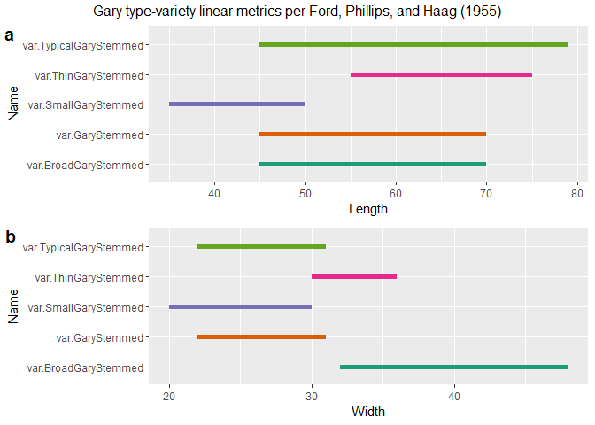
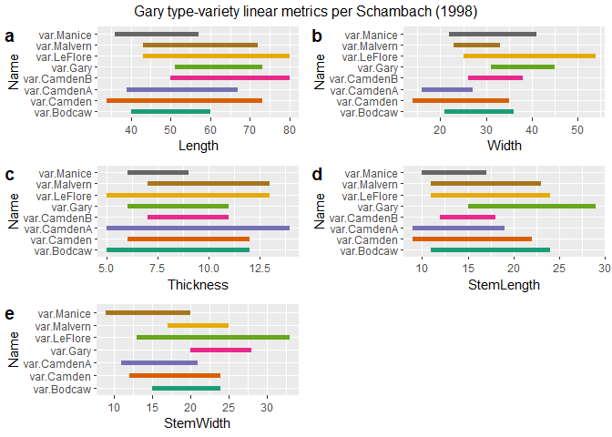
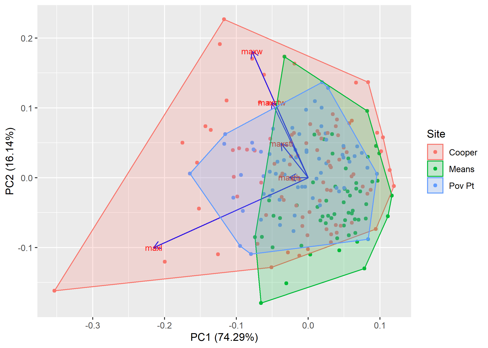

Exploratory analysis: Traditional linear metrics for Gary dart points
================
Robert Z. Selden, Jr.
February 28, 2020

### Introduction

This document includes supplemental materials for the article, “A
quantitative assessment of intraspecific morphological variation in Gary
dart points: An exercise in archaeological epistemology and heuristics.”
The traditional linear measures of maximum length, width, and thickness
were combined with stem length and stem width for this study. These
variables represent the full suite of metrics used to characterise Gary
points in previous studies, while also providing those data needed to
examine whether specimens included in this study may transcend the
threshold between dart and arrow points (Hildebrandt and King 2012).

Others have noted a gradual diminution in the size of Gary dart points
through time (Ford and Webb 1956; Schambach 1998; Densmore 2007), thus
it was necessary to begin by asking whether the size of those points
aggregated for this study may fall below the arbitrary 11.8 mm
dart-arrow index (DAI) threshold posited by Hildebrandt and King (2012).
The temporal span associated with morphologically-diagnostic Gary dart
points is thought to transcend the cultural shift from hunter-gatherer
to emergent horticulturalist, and overlaps temporally with the advent
and flourescence of the bow and arrow. The dart-arrow index was
calculated for all specimens of Gary dart points used in this study, and
none fell below the dart-arrow threshold posited by Hildebrandt and King
(2012). It is noteworthy that others (Erlandson, Watts, and Jew 2014)
have found that the DAI may not be universally applicable; however, the
DAI and the threshold identified by Hildebrandt and King (2012) is a
useful heuristic in this instance.

### Load packages for analysis

``` r
# install required analysis packages
devtools::install_github("vqv/ggbiplot")
```

    ## Skipping install of 'ggbiplot' from a github remote, the SHA1 (7325e880) has not changed since last install.
    ##   Use `force = TRUE` to force installation

``` r
devtools::install_github("mlcollyer/RRPP")
```

    ## Skipping install of 'RRPP' from a github remote, the SHA1 (e29228ed) has not changed since last install.
    ##   Use `force = TRUE` to force installation

``` r
devtools::install_github("tidyverse/ggplot2")
```

    ## Skipping install of 'ggplot2' from a github remote, the SHA1 (8bc39f28) has not changed since last install.
    ##   Use `force = TRUE` to force installation

``` r
devtools::install_github("kassambara/ggpubr")
```

    ## Skipping install of 'ggpubr' from a github remote, the SHA1 (a8a3db99) has not changed since last install.
    ##   Use `force = TRUE` to force installation

``` r
# load libraries
library(ggbiplot)
```

    ## Loading required package: ggplot2

    ## Loading required package: plyr

    ## Loading required package: scales

    ## Loading required package: grid

``` r
library(RRPP)
library(ggplot2)
library(ggpubr)
```

    ## Loading required package: magrittr

    ## 
    ## Attaching package: 'ggpubr'

    ## The following object is masked from 'package:plyr':
    ## 
    ##     mutate

### Set working directory, load data, and define variables

``` r
# set working directory
setwd(getwd())
data<-read.csv("garymorphlm.csv",header = TRUE)
# define variables
maxl<-data$maxl # maximum length
maxw<-data$maxw # maximum width
maxth<-data$maxth # maximum thickness
maxstl<-data$maxstl # maximum stem length
maxstw<-data$maxstw # maximum stem width
site<-data$site # site name
```

### Calculate dart-arrow index

``` r
# calculate dart-arrow index (max stem width + max thickness)
dai<-maxstw + maxth
dai
```

    ##   [1] 40.47 25.12 33.19 36.56 28.00 36.08 34.01 30.26 31.36 33.92 27.97 30.39
    ##  [13] 29.38 27.30 34.16 25.09 31.20 36.02 32.25 28.93 28.57 32.01 32.01 33.70
    ##  [25] 29.51 26.08 27.44 29.76 29.11 22.56 30.09 32.71 26.92 36.95 30.71 28.86
    ##  [37] 31.34 32.64 24.83 24.91 25.12 33.19 28.90 27.95 30.12 26.73 36.43 26.12
    ##  [49] 26.82 24.17 34.50 24.62 31.06 23.25 32.00 26.78 30.83 26.06 19.27 28.60
    ##  [61] 25.81 23.21 23.94 21.07 37.55 36.55 38.94 34.81 37.01 39.62 37.32 32.32
    ##  [73] 28.28 24.73 25.19 33.60 27.26 28.58 26.67 24.55 25.96 25.28 28.76 44.05
    ##  [85] 28.00 32.85 36.73 38.55 29.36 42.17 39.01 34.68 27.59 23.80 25.68 28.01
    ##  [97] 17.75 23.81 22.13 24.53 20.59 25.92 27.12 22.20 19.16 26.42 26.33 17.18
    ## [109] 17.70 20.52 19.21 18.93 20.13

### Gary type-variety linear metrics

``` r
# Ford, Phillips, and Haag (1955)
fphl<-data.frame(Name=c('var.GaryStemmed','var.TypicalGaryStemmed','var.BroadGaryStemmed','var.ThinGaryStemmed','var.SmallGaryStemmed'),
           Length=c(45,45,45,55,35), # in mm
           end=c(70,79,70,75,50) # in mm
)
fphlength<-ggplot(fphl,aes(x=Length,xend=end,y=Name,yend=Name,color=Name)) +
  geom_segment(size=2) +
  scale_color_brewer(palette = "Dark2") +
  theme(legend.position = "none")
fphw<-data.frame(Name=c('var.GaryStemmed','var.TypicalGaryStemmed','var.BroadGaryStemmed','var.ThinGaryStemmed','var.SmallGaryStemmed'),
           Width=c(22,22,32,30,20), # in mm
           end=c(31,31,48,36,30) # in mm
)
fphwidth<-ggplot(fphw,aes(x=Width,xend=end,y=Name,yend=Name,color=Name)) +
  geom_segment(size=2) +
  scale_color_brewer(palette = "Dark2") +
  theme(legend.position = "none")
# render figure
fwebbfig<-ggarrange(fphlength,fphwidth,
                  labels = c("a","b"),
                  ncol = 1, nrow = 2)
annotate_figure(fwebbfig,
                top=text_grob("Gary type-variety linear metrics per Ford, Phillips, and Haag (1955)")
)
```

<!-- -->

``` r
# Ford and Webb (1956)
fwebbl<-data.frame(Name=c('var.GaryLarge','var.GaryMed/Typical','var.GarySmall'),
           Length=c(80,46,33), # in mm
           end=c(140,79,45) # in mm
)
fwebblength<-ggplot(fwebbl,aes(x=Length,xend=end,y=Name,yend=Name,color=Name)) +
  geom_segment(size=2) +
  scale_color_brewer(palette = "Dark2") +
  theme(legend.position = "none")
fwebbw<-data.frame(Name=c('var.GaryLarge','var.GaryMed/Typical','var.GarySmall'),
           Width=c(30,20,19), # in mm
           end=c(42,45,32) # in mm
)
fwebbwidth<-ggplot(fwebbw,aes(x=Width,xend=end,y=Name,yend=Name,color=Name)) +
  geom_segment(size=2) +
  scale_color_brewer(palette = "Dark2") +
  theme(legend.position = "none")
# thickness values were not precisely reported for GaryLarge and GaryTypical, and are included here for reference only
fwebbth<-data.frame(Name=c('var.GaryLarge','var.GaryMed/Typical','var.GarySmall'),
           Thickness=c(13,9,5), # in mm
           end=c(13,10,10) # in mm
)
fwebbthickness<-ggplot(fwebbth,aes(x=Thickness,xend=end,y=Name,yend=Name,color=Name)) +
  geom_segment(size=2) +
  scale_color_brewer(palette = "Dark2") +
  theme(legend.position = "none")
# render figure
fwebbfig<-ggarrange(fwebblength,fwebbwidth,fwebbthickness,
                  labels = c("a","b","c"),
                  ncol = 1, nrow = 3)
annotate_figure(fwebbfig,
                top=text_grob("Gary type-variety linear metrics per Ford and Webb (1956)")
)
```

<!-- -->

``` r
# Schambach (1998)
# reported length by variety
schambl<-data.frame(Name=c('var.Gary','var.Malvern','var.LeFlore','var.Bodcaw','var.Manice','var.CamdenA','var.CamdenB'),
           Length=c(51,43,43,40,36,39,50), # in mm
           end=c(73,72,80,60,57,67,80) # in mm
)
length<-ggplot(schambl,aes(x=Length,xend=end,y=Name,yend=Name,color=Name)) +
  geom_segment(size=2) +
  scale_color_brewer(palette = "Dark2") +
  theme(legend.position = "none")
# reported width by variety
schambw<-data.frame(Name=c('var.Gary','var.Malvern','var.LeFlore','var.Bodcaw','var.Manice','var.CamdenA','var.CamdenB'),
           Width=c(31,23,25,21,22,16,26), # in mm
           end=c(45,33,54,36,41,27,38) # in mm
)
width<-ggplot(schambw,aes(x=Width,xend=end,y=Name,yend=Name,color=Name)) +
  geom_segment(size=2) +
  scale_color_brewer(palette = "Dark2") +
  theme(legend.position = "none")
# reported thickness by variety
schambth<-data.frame(Name=c('var.Gary','var.Malvern','var.LeFlore','var.Bodcaw','var.Manice','var.CamdenA','var.CamdenB'),
           Thickness=c(6,7,5,5,6,5,7), # in mm
           end=c(11,13,13,12,9,14,11) # in mm
)
thickness<-ggplot(schambth,aes(x=Thickness,xend=end,y=Name,yend=Name,color=Name)) +
  geom_segment(size=2) +
  scale_color_brewer(palette = "Dark2") +
  theme(legend.position = "none")
# reported stem length by variety
schambstl<-data.frame(Name=c('var.Gary','var.Malvern','var.LeFlore','var.Bodcaw','var.Manice','var.CamdenA','var.CamdenB'),
           StemLength=c(15,11,11,11,10,9,12), # in mm
           end=c(29,23,24,24,17,19,18) # in mm
)
stemlength<-ggplot(schambstl,aes(x=StemLength,xend=end,y=Name,yend=Name,color=Name)) +
  geom_segment(size=2) +
  scale_color_brewer(palette = "Dark2") +
  theme(legend.position = "none")
# reported stem width by variety
schambstw<-data.frame(Name=c('var.Gary','var.Malvern','var.LeFlore','var.Bodcaw','var.Manice','var.CamdenA'), # var.CamdenB-stemlength not listed in text
           StemWidth=c(20,17,13,15,12,11), # in mm
           end=c(28,25,33,24,24,21) # in mm
)
stemwidth<-ggplot(schambstw,aes(x=StemWidth,xend=end,y=Name,yend=Name,color=Name)) +
  geom_segment(size=2) +
  scale_color_brewer(palette = "Dark2") +
  theme(legend.position = "none")
# render figure
schambachfig<-ggarrange(length,width,thickness,stemlength,stemwidth,
                  labels = c("a","b","c","d","e"),
                  ncol = 2, nrow = 3)
annotate_figure(schambachfig,
                top=text_grob("Gary type-variety linear metrics per Schambach (1998)")
)
```

<!-- -->

## Linear metrics of Gary dart points by site

### Boxplots for `variable` by `site`

``` r
# boxplot of maximum length ~ site
sitemaxl<-ggplot(data,aes(x=site,y=maxl,color=site)) + geom_boxplot(notch = TRUE) +
  geom_dotplot(binaxis = 'y',stackdir = 'center',dotsize = 0.3) +
  scale_color_brewer(palette = "Dark2") +
  theme(legend.position = "none")
# boxplot of maximum width ~ site
sitemaxw<-ggplot(data,aes(x=site,y=maxw,color=site)) + geom_boxplot(notch = TRUE) +
  geom_dotplot(binaxis = 'y',stackdir = 'center',dotsize = 0.3) +
  scale_color_brewer(palette = "Dark2") +
  theme(legend.position = "none")
# boxplot of maximum thickness ~ site
sitemaxth<-ggplot(data,aes(x=site,y=maxth,color=site)) + geom_boxplot(notch = TRUE) +
  geom_dotplot(binaxis = 'y',stackdir = 'center',dotsize = 0.3) +
  scale_color_brewer(palette = "Dark2") +
  theme(legend.position = "none")
# boxplot of stem length ~ site
sitemaxstl<-ggplot(data,aes(x=site,y=maxstl,color=site)) + geom_boxplot(notch = TRUE) +
  geom_dotplot(binaxis = 'y',stackdir = 'center',dotsize = 0.3) +
  scale_color_brewer(palette = "Dark2") +
  theme(legend.position = "none")
# boxplot of stem width ~ site
sitemaxstw<-ggplot(data,aes(x=site,y=maxstw,color=site)) + geom_boxplot(notch = TRUE) +
  geom_dotplot(binaxis = 'y',stackdir = 'center',dotsize = 0.3) +
  scale_color_brewer(palette = "Dark2") +
  theme(legend.position = "none")
# render figure
sitefigure<-ggarrange(sitemaxl,sitemaxw,sitemaxth,sitemaxstl,sitemaxstw,
                  labels = c("a","b","c","d","e"),
                  ncol = 3, nrow = 2)
```

    ## `stat_bindot()` using `bins = 30`. Pick better value with `binwidth`.
    ## `stat_bindot()` using `bins = 30`. Pick better value with `binwidth`.
    ## `stat_bindot()` using `bins = 30`. Pick better value with `binwidth`.
    ## `stat_bindot()` using `bins = 30`. Pick better value with `binwidth`.
    ## `stat_bindot()` using `bins = 30`. Pick better value with `binwidth`.

``` r
sitefigure
```

<!-- -->

### Principal Components Analysis for `site`

``` r
#pca
data.pca<-prcomp(data[c(2:6)],center = TRUE,scale. = TRUE)
summary(data.pca)
```

    ## Importance of components:
    ##                           PC1    PC2    PC3     PC4     PC5
    ## Standard deviation     1.7466 0.9585 0.7415 0.60279 0.34274
    ## Proportion of Variance 0.6101 0.1837 0.1100 0.07267 0.02349
    ## Cumulative Proportion  0.6101 0.7939 0.9038 0.97651 1.00000

``` r
sitepca<-ggbiplot(data.pca,obs.scale = 1,var.scale = 1,ellipse = TRUE,groups = site) +
  scale_color_brewer(name = "Site",palette = "Dark2") +
  theme(legend.position = "right")
#render figure
sitepca
```

<!-- -->

### Analyses of Variance (ANOVA) for `variable` \~ `site`

``` r
# anova = maximum length ~ site
siteml<-lm.rrpp(maxl ~ site, SS.type = "I",data = data,iter = 9999,print.progress = FALSE)
anova(siteml)
```

    ## 
    ## Analysis of Variance, using Residual Randomization
    ## Permutation procedure: Randomization of null model residuals 
    ## Number of permutations: 10000 
    ## Estimation method: Ordinary Least Squares 
    ## Sums of Squares and Cross-products: Type I 
    ## Effect sizes (Z) based on F distributions
    ## 
    ##            Df    SS      MS     Rsq      F      Z Pr(>F)    
    ## site        2  3368 1684.01 0.20053 13.795 2.5113  1e-04 ***
    ## Residuals 110 13428  122.07 0.79947                         
    ## Total     112 16796                                         
    ## ---
    ## Signif. codes:  0 '***' 0.001 '**' 0.01 '*' 0.05 '.' 0.1 ' ' 1
    ## 
    ## Call: lm.rrpp(f1 = maxl ~ site, iter = 9999, SS.type = "I", data = data,  
    ##     print.progress = FALSE)

``` r
# anova = maximum width ~ site
sitemw<-lm.rrpp(maxw ~ site, SS.type = "I",data = data,iter = 9999,print.progress = FALSE)
anova(sitemw)
```

    ## 
    ## Analysis of Variance, using Residual Randomization
    ## Permutation procedure: Randomization of null model residuals 
    ## Number of permutations: 10000 
    ## Estimation method: Ordinary Least Squares 
    ## Sums of Squares and Cross-products: Type I 
    ## Effect sizes (Z) based on F distributions
    ## 
    ##            Df     SS     MS     Rsq      F      Z Pr(>F)    
    ## site        2 1487.8 743.91 0.42347 40.399 3.2907  1e-04 ***
    ## Residuals 110 2025.6  18.41 0.57653                         
    ## Total     112 3513.4                                        
    ## ---
    ## Signif. codes:  0 '***' 0.001 '**' 0.01 '*' 0.05 '.' 0.1 ' ' 1
    ## 
    ## Call: lm.rrpp(f1 = maxw ~ site, iter = 9999, SS.type = "I", data = data,  
    ##     print.progress = FALSE)

``` r
# anova = maximum thickness ~ site
sitemth<-lm.rrpp(maxth ~ site, SS.type = "I",data = data,iter = 9999,print.progress = FALSE)
anova(sitemth)
```

    ## 
    ## Analysis of Variance, using Residual Randomization
    ## Permutation procedure: Randomization of null model residuals 
    ## Number of permutations: 10000 
    ## Estimation method: Ordinary Least Squares 
    ## Sums of Squares and Cross-products: Type I 
    ## Effect sizes (Z) based on F distributions
    ## 
    ##            Df     SS     MS    Rsq      F      Z Pr(>F)    
    ## site        2 106.99 53.493 0.1954 13.357 2.4344  1e-04 ***
    ## Residuals 110 440.53  4.005 0.8046                         
    ## Total     112 547.52                                       
    ## ---
    ## Signif. codes:  0 '***' 0.001 '**' 0.01 '*' 0.05 '.' 0.1 ' ' 1
    ## 
    ## Call: lm.rrpp(f1 = maxth ~ site, iter = 9999, SS.type = "I", data = data,  
    ##     print.progress = FALSE)

``` r
# anova = maximum stem length ~ site
sitemstl<-lm.rrpp(maxstl ~ site, SS.type = "I",data = data,iter = 9999,print.progress = FALSE)
anova(sitemstl)
```

    ## 
    ## Analysis of Variance, using Residual Randomization
    ## Permutation procedure: Randomization of null model residuals 
    ## Number of permutations: 10000 
    ## Estimation method: Ordinary Least Squares 
    ## Sums of Squares and Cross-products: Type I 
    ## Effect sizes (Z) based on F distributions
    ## 
    ##            Df      SS      MS     Rsq      F      Z Pr(>F)    
    ## site        2  483.14 241.568 0.27321 20.675 2.8293  1e-04 ***
    ## Residuals 110 1285.22  11.684 0.72679                         
    ## Total     112 1768.35                                         
    ## ---
    ## Signif. codes:  0 '***' 0.001 '**' 0.01 '*' 0.05 '.' 0.1 ' ' 1
    ## 
    ## Call: lm.rrpp(f1 = maxstl ~ site, iter = 9999, SS.type = "I", data = data,  
    ##     print.progress = FALSE)

``` r
# anova = maximum stem width ~ site
sitemstw<-lm.rrpp(maxstw ~ site, SS.type = "I",data = data,iter = 9999,print.progress = FALSE)
anova(sitemstw)
```

    ## 
    ## Analysis of Variance, using Residual Randomization
    ## Permutation procedure: Randomization of null model residuals 
    ## Number of permutations: 10000 
    ## Estimation method: Ordinary Least Squares 
    ## Sums of Squares and Cross-products: Type I 
    ## Effect sizes (Z) based on F distributions
    ## 
    ##            Df      SS     MS     Rsq      F      Z Pr(>F)    
    ## site        2  897.96 448.98 0.39742 36.275 3.2028  1e-04 ***
    ## Residuals 110 1361.49  12.38 0.60258                         
    ## Total     112 2259.44                                        
    ## ---
    ## Signif. codes:  0 '***' 0.001 '**' 0.01 '*' 0.05 '.' 0.1 ' ' 1
    ## 
    ## Call: lm.rrpp(f1 = maxstw ~ site, iter = 9999, SS.type = "I", data = data,  
    ##     print.progress = FALSE)

## Gary varieties proposed by Ford and Webb (1956)

The `type1` argument used within this and the subsequent section
articulates with three variants of the Gary type (`Large`,
`Medium/Typical`, and `Small`), which were assigned using those
morphological criteria first advanced by Ford, Phillips, and Haag (1955)
at the Jaketown site, and later refined by Ford and Webb (1956) at
Poverty Point.

Each of the three type-varieties proposed by Ford and Webb (1956) was
based upon a suite of morphological criteria that can be systematically
replicated, and a function was used to assign each of the Gary points to
the correct type-variety. Gary type varieties range between 80 and 140
mm in maxl, and between 30 and 42 mm in maxw for *Gary Large*; between
46 to 79 mm in maxl, and between 20 and 45 mm in maxw for *Gary
Medium/Typical*; and between 33 to 45 mm in maxl, 19 to 32 mm in maxw,
and five to 10 mm in maxth for *Gary Small* (Ford and Webb 1956).

### Function used to assign Gary type-varieties

### Boxplots for `site` by `type1` for Gary dart points from Cooper

``` r
# subset cooper data
cprmxl<-subset(data,site=="Cooper",select=maxl:type1)
# boxplot of maximum length
cprmaxl<-ggplot(cprmxl,aes(x=type1,y=maxl,color=type1)) + 
  geom_boxplot() +
  geom_dotplot(binaxis = 'y',stackdir = 'center',dotsize = 0.3) +
  scale_color_brewer(palette = "Dark2") +
  theme(legend.position = "none")
# boxplot of maximum width
cprmaxw<-ggplot(cprmxl,aes(x=type1,y=maxw,color=type1)) + 
  geom_boxplot() +
  geom_dotplot(binaxis = 'y',stackdir = 'center',dotsize = 0.3)+
  scale_color_brewer(palette = "Dark2") +
  theme(legend.position = "none")
# boxplot of maximum thickness
cprmaxth<-ggplot(cprmxl,aes(x=type1,y=maxth,color=type1)) + 
  geom_boxplot() +
  geom_dotplot(binaxis = 'y',stackdir = 'center',dotsize = 0.3)+
  scale_color_brewer(palette = "Dark2") +
  theme(legend.position = "none")
# boxplot of maximum stem length
cprmaxstl<-ggplot(cprmxl,aes(x=type1,y=maxstl,color=type1)) + 
  geom_boxplot() +
  geom_dotplot(binaxis = 'y',stackdir = 'center',dotsize = 0.3)+
  scale_color_brewer(palette = "Dark2") +
  theme(legend.position = "none")
# boxplot of maximum thickness
cprmaxstw<-ggplot(cprmxl,aes(x=type1,y=maxstw,color=type1)) + 
  geom_boxplot() +
  geom_dotplot(binaxis = 'y',stackdir = 'center',dotsize = 0.3)+
  scale_color_brewer(palette = "Dark2") +
  theme(legend.position = "none")
# render figure
cprfigure<-ggarrange(cprmaxl,cprmaxw,cprmaxth,cprmaxstl,cprmaxstw,
                  labels = c("a","b","c","d","e"),
                  ncol = 3, nrow = 2)
```

    ## `stat_bindot()` using `bins = 30`. Pick better value with `binwidth`.
    ## `stat_bindot()` using `bins = 30`. Pick better value with `binwidth`.
    ## `stat_bindot()` using `bins = 30`. Pick better value with `binwidth`.
    ## `stat_bindot()` using `bins = 30`. Pick better value with `binwidth`.
    ## `stat_bindot()` using `bins = 30`. Pick better value with `binwidth`.

``` r
cprfigure
```

<!-- -->

``` r
fig.cap = "Labels: lc, Gary Large from Cooper; mc, Gary Medium/Typical from Cooper; sc, Gary Small from Cooper."
```

### Boxplots for `site` by `type1` for Gary dart points from Means

``` r
# subset means data
mnsmxl<-subset(data,site=="Means",select=maxl:type1)
# boxplot of maximum length
mnsmaxl<-ggplot(mnsmxl,aes(x=type1,y=maxl,color=type1)) + 
  geom_boxplot() +
  geom_dotplot(binaxis = 'y',stackdir = 'center',dotsize = 0.3) +
  scale_color_brewer(palette = "Dark2") +
  theme(legend.position = "none")
# boxplot of maximum width
mnsmaxw<-ggplot(mnsmxl,aes(x=type1,y=maxw,color=type1)) + 
  geom_boxplot() +
  geom_dotplot(binaxis = 'y',stackdir = 'center',dotsize = 0.3)+
  scale_color_brewer(palette = "Dark2") +
  theme(legend.position = "none")
# boxplot of maximum thickness
mnsmaxth<-ggplot(mnsmxl,aes(x=type1,y=maxth,color=type1)) + 
  geom_boxplot() +
  geom_dotplot(binaxis = 'y',stackdir = 'center',dotsize = 0.3)+
  scale_color_brewer(palette = "Dark2") +
  theme(legend.position = "none")
# boxplot of maximum stem length
mnsmaxstl<-ggplot(mnsmxl,aes(x=type1,y=maxstl,color=type1)) + 
  geom_boxplot() +
  geom_dotplot(binaxis = 'y',stackdir = 'center',dotsize = 0.3)+
  scale_color_brewer(palette = "Dark2") +
  theme(legend.position = "none")
# boxplot of maximum thickness
mnsmaxstw<-ggplot(mnsmxl,aes(x=type1,y=maxstw,color=type1)) + 
  geom_boxplot() +
  geom_dotplot(binaxis = 'y',stackdir = 'center',dotsize = 0.3)+
  scale_color_brewer(palette = "Dark2") +
  theme(legend.position = "none")
# render figure
mnsfigure<-ggarrange(mnsmaxl,mnsmaxw,mnsmaxth,mnsmaxstl,mnsmaxstw,
                  labels = c("a","b","c","d","e"),
                  ncol = 3, nrow = 2)
```

    ## `stat_bindot()` using `bins = 30`. Pick better value with `binwidth`.
    ## `stat_bindot()` using `bins = 30`. Pick better value with `binwidth`.
    ## `stat_bindot()` using `bins = 30`. Pick better value with `binwidth`.
    ## `stat_bindot()` using `bins = 30`. Pick better value with `binwidth`.
    ## `stat_bindot()` using `bins = 30`. Pick better value with `binwidth`.

``` r
mnsfigure
```

<!-- -->

``` r
fig.cap = "Labels: lm, Gary Large from Means; mm, Gary Medium/Typical from Means; sm, Gary Small from Means"
```

### Boxplots for `site` by `type1` for Gary dart points from Poverty Point

``` r
# subset poverty point data
pvptmxl<-subset(data,site=="Pov Pt",select=maxl:type1)
# boxplot of maximum length
pvptmaxl<-ggplot(pvptmxl,aes(x=type1,y=maxl,color=type1)) + 
  geom_boxplot() +
  geom_dotplot(binaxis = 'y',stackdir = 'center',dotsize = 0.3) +
  scale_color_brewer(palette = "Dark2") +
  theme(legend.position = "none")
# boxplot of maximum width
pvptmaxw<-ggplot(pvptmxl,aes(x=type1,y=maxw,color=type1)) + 
  geom_boxplot() +
  geom_dotplot(binaxis = 'y',stackdir = 'center',dotsize = 0.3)+
  scale_color_brewer(palette = "Dark2") +
  theme(legend.position = "none")
# boxplot of maximum thickness
pvptmaxth<-ggplot(pvptmxl,aes(x=type1,y=maxth,color=type1)) + 
  geom_boxplot() +
  geom_dotplot(binaxis = 'y',stackdir = 'center',dotsize = 0.3)+
  scale_color_brewer(palette = "Dark2") +
  theme(legend.position = "none")
# boxplot of maximum stem length
pvptmaxstl<-ggplot(pvptmxl,aes(x=type1,y=maxstl,color=type1)) + 
  geom_boxplot() +
  geom_dotplot(binaxis = 'y',stackdir = 'center',dotsize = 0.3)+
  scale_color_brewer(palette = "Dark2") +
  theme(legend.position = "none")
# boxplot of maximum thickness
pvptmaxstw<-ggplot(pvptmxl,aes(x=type1,y=maxstw,color=type1)) + 
  geom_boxplot() +
  geom_dotplot(binaxis = 'y',stackdir = 'center',dotsize = 0.3)+
  scale_color_brewer(palette = "Dark2") +
  theme(legend.position = "none")
# render figure
ppfigure<-ggarrange(pvptmaxl,pvptmaxw,pvptmaxth,pvptmaxstl,pvptmaxstw,
                  labels = c("a","b","c","d","e"),
                  ncol = 3, nrow = 2)
```

    ## `stat_bindot()` using `bins = 30`. Pick better value with `binwidth`.
    ## `stat_bindot()` using `bins = 30`. Pick better value with `binwidth`.
    ## `stat_bindot()` using `bins = 30`. Pick better value with `binwidth`.
    ## `stat_bindot()` using `bins = 30`. Pick better value with `binwidth`.
    ## `stat_bindot()` using `bins = 30`. Pick better value with `binwidth`.

``` r
ppfigure
```

<!-- -->

``` r
fig.cap = "Labels: lpv, Gary Large from Poverty Point; mpv, Gary Medium/Typical from Poverty Point; spv, Gary Small from Poverty Point."
```

### Principal Components Analysis for `type1` at all sites

``` r
#pca
data.pca<-prcomp(data[c(2:6)],center = TRUE,scale. = TRUE)
summary(data.pca)
```

    ## Importance of components:
    ##                           PC1    PC2    PC3     PC4     PC5
    ## Standard deviation     1.7466 0.9585 0.7415 0.60279 0.34274
    ## Proportion of Variance 0.6101 0.1837 0.1100 0.07267 0.02349
    ## Cumulative Proportion  0.6101 0.7939 0.9038 0.97651 1.00000

``` r
t1pca<-ggbiplot(data.pca,obs.scale = 1,var.scale = 1,ellipse = TRUE,groups = type1) +
  scale_color_brewer(name = "Type-Variety",palette = "Dark2") +
  theme(legend.position = "right")
#render figure
t1pca
```

<!-- -->

### Analyses of Variance (ANOVA) for `variable` \~ `type1`

``` r
# anova = maximum length ~ type
t1ml<-lm.rrpp(maxl ~ type1, SS.type = "I",data = data,iter = 9999,print.progress = FALSE)
anova(t1ml)
```

    ## 
    ## Analysis of Variance, using Residual Randomization
    ## Permutation procedure: Randomization of null model residuals 
    ## Number of permutations: 10000 
    ## Estimation method: Ordinary Least Squares 
    ## Sums of Squares and Cross-products: Type I 
    ## Effect sizes (Z) based on F distributions
    ## 
    ##            Df      SS      MS   Rsq      F      Z Pr(>F)    
    ## type1       7 11169.2 1595.59 0.665 29.776 5.6056  1e-04 ***
    ## Residuals 105  5626.6   53.59 0.335                         
    ## Total     112 16795.8                                       
    ## ---
    ## Signif. codes:  0 '***' 0.001 '**' 0.01 '*' 0.05 '.' 0.1 ' ' 1
    ## 
    ## Call: lm.rrpp(f1 = maxl ~ type1, iter = 9999, SS.type = "I", data = data,  
    ##     print.progress = FALSE)

``` r
# anova = maximum width ~ type
t1mw<-lm.rrpp(maxw ~ type1, SS.type = "I",data = data,iter = 9999,print.progress = FALSE)
anova(t1mw)
```

    ## 
    ## Analysis of Variance, using Residual Randomization
    ## Permutation procedure: Randomization of null model residuals 
    ## Number of permutations: 10000 
    ## Estimation method: Ordinary Least Squares 
    ## Sums of Squares and Cross-products: Type I 
    ## Effect sizes (Z) based on F distributions
    ## 
    ##            Df     SS      MS     Rsq      F      Z Pr(>F)    
    ## type1       7 1781.7 254.523 0.50711 15.433 4.9516  1e-04 ***
    ## Residuals 105 1731.7  16.492 0.49289                         
    ## Total     112 3513.4                                         
    ## ---
    ## Signif. codes:  0 '***' 0.001 '**' 0.01 '*' 0.05 '.' 0.1 ' ' 1
    ## 
    ## Call: lm.rrpp(f1 = maxw ~ type1, iter = 9999, SS.type = "I", data = data,  
    ##     print.progress = FALSE)

``` r
# anova = maximum thickness ~ type
t1mth<-lm.rrpp(maxth ~ type1, SS.type = "I",data = data,iter = 9999,print.progress = FALSE)
anova(t1mth)
```

    ## 
    ## Analysis of Variance, using Residual Randomization
    ## Permutation procedure: Randomization of null model residuals 
    ## Number of permutations: 10000 
    ## Estimation method: Ordinary Least Squares 
    ## Sums of Squares and Cross-products: Type I 
    ## Effect sizes (Z) based on F distributions
    ## 
    ##            Df     SS      MS     Rsq      F     Z Pr(>F)    
    ## type1       7 177.74 25.3916 0.32463 7.2101 3.549  1e-04 ***
    ## Residuals 105 369.77  3.5217 0.67537                        
    ## Total     112 547.52                                        
    ## ---
    ## Signif. codes:  0 '***' 0.001 '**' 0.01 '*' 0.05 '.' 0.1 ' ' 1
    ## 
    ## Call: lm.rrpp(f1 = maxth ~ type1, iter = 9999, SS.type = "I", data = data,  
    ##     print.progress = FALSE)

``` r
# anova = maximum stem length ~ type
t1mstl<-lm.rrpp(maxstl ~ type1, SS.type = "I",data = data,iter = 9999,print.progress = FALSE)
anova(t1mstl)
```

    ## 
    ## Analysis of Variance, using Residual Randomization
    ## Permutation procedure: Randomization of null model residuals 
    ## Number of permutations: 10000 
    ## Estimation method: Ordinary Least Squares 
    ## Sums of Squares and Cross-products: Type I 
    ## Effect sizes (Z) based on F distributions
    ## 
    ##            Df     SS      MS     Rsq      F     Z Pr(>F)    
    ## type1       7  701.7 100.242 0.39681 9.8677 4.148  1e-04 ***
    ## Residuals 105 1066.7  10.159 0.60319                        
    ## Total     112 1768.3                                        
    ## ---
    ## Signif. codes:  0 '***' 0.001 '**' 0.01 '*' 0.05 '.' 0.1 ' ' 1
    ## 
    ## Call: lm.rrpp(f1 = maxstl ~ type1, iter = 9999, SS.type = "I", data = data,  
    ##     print.progress = FALSE)

``` r
# anova = maximum stem width ~ type
t1mstw<-lm.rrpp(maxstw ~ type1, SS.type = "I",data = data,iter = 9999,print.progress = FALSE)
anova(t1mstw)
```

    ## 
    ## Analysis of Variance, using Residual Randomization
    ## Permutation procedure: Randomization of null model residuals 
    ## Number of permutations: 10000 
    ## Estimation method: Ordinary Least Squares 
    ## Sums of Squares and Cross-products: Type I 
    ## Effect sizes (Z) based on F distributions
    ## 
    ##            Df     SS      MS     Rsq      F      Z Pr(>F)    
    ## type1       7 1157.9 165.409 0.51245 15.766 4.9573  1e-04 ***
    ## Residuals 105 1101.6  10.491 0.48755                         
    ## Total     112 2259.4                                         
    ## ---
    ## Signif. codes:  0 '***' 0.001 '**' 0.01 '*' 0.05 '.' 0.1 ' ' 1
    ## 
    ## Call: lm.rrpp(f1 = maxstw ~ type1, iter = 9999, SS.type = "I", data = data,  
    ##     print.progress = FALSE)

## Acknowledgments

Funding for this project was provided to RZS by the United States Forest
Service, National Forests and Grasslands in Texas (15-PA-11081300-033
and 20-PA-11081300-074), and components of this analytical work flow
were developed and funded by a Preservation Technology and Training
grant (P14AP00138) to RZS from the National Center for Preservation
Technology and Training.

## References cited

<div id="refs" class="references">

<div id="ref-RN20874">

Densmore, Julie A. 2007. “A Detailed Analysis of the Variation in
Morphology of the Gary Dart Point.” *Lithic Technology* 32 (1): 7–16.
<https://doi.org/10.1080/01977261.2007.11721040>.

</div>

<div id="ref-RN20880">

Erlandson, Jon M., Jack L. Watts, and Nicholas P. Jew. 2014. “Darts,
Arrows, and Archaeologists: Distinguishing Dart and Arrow Points in the
Archaeological Record.” *American Antiquity* 79 (1): 162–69.
<https://doi.org/10.7183/0002-7316.79.1.162>.

</div>

<div id="ref-RN20899">

Ford, James A., Philip Phillips, and William G. Haag. 1955. *The
Jaketown Site in West-Central Mississippi*. Vol. 45: Part 1.
Anthropological Papers of the American Museum of Natural History. New
York: American Museum of Natural History.
<http://digitallibrary.amnh.org/handle/2246/90>.

</div>

<div id="ref-RN20898">

Ford, James A., and Clarence H. Webb. 1956. *Poverty Point, a Late
Archaic Site in Louisiana*. Vol. 46. Anthropological Papers of the
American Museum of Natural History. New York: American Museum of Natural
History. <http://digitallibrary.amnh.org/handle/2246/108>.

</div>

<div id="ref-RN20881">

Hildebrandt, William R., and Jerome H. King. 2012. “Distinguishing
Between Darts and Arrows in the Archaeological Record: Implications for
Technological Change in the American West.” *American Antiquity* 77 (4):
789–99. <https://doi.org/10.7183/0002-7316.77.4.789>.

</div>

<div id="ref-RN3132">

Schambach, Frank F. 1998. *Pre-Caddoan Cultures in the Trans-Mississippi
South: A Beginning Sequence*. Fayetteville: Research Series 53, Arkansas
Archeological Survey.

</div>

</div>
