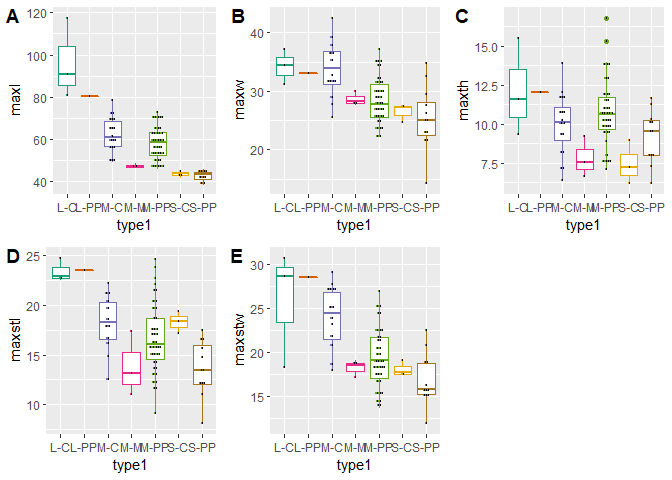

Traditional linear metrics for Gary dart points
================
Robert Z. Selden, Jr.
February 22, 2020

## Introduction

The traditional linear measures of maximum length, width, and thickness
were combined with stem length and stem width for this study. These
variables represent the full suite of metrics used to characterise Gary
points in previous studies, while also providing those data needed to
examine whether specimens included in this study may transcend the
threshold between dart and arrow points (Hildebrandt and King 2012).

Others have noted a gradual diminution in the size of Gary dart points
through time (Ford and Webb 1956; Schambach 1998; Densmore 2007), thus
it was necessary to begin by asking whether the size of those points
aggregated for this study may fall below the arbitrary 11.8 mm
dart-arrow index (DAI) threshold posited by Hildebrandt and King (2012).
The temporal span associated with morphologically-diagnostic Gary dart
points is thought to transcend the cultural shift from hunter-gatherer
to emergent horticulturalist, and overlaps temporally with the advent
and flourescence of the bow and arrow. The dart-arrow index was
calculated for all specimens of Gary dart points used in this study, and
none fell below the dart-arrow threshold posited by Hildebrandt and King
(2012). It is noteworthy that others (Erlandson, Watts, and Jew 2014)
have found that the DAI may not be universally applicable; however, the
DAI and the threshold identified by Hildebrandt and King (2012) is a
useful heuristic in this instance.

### Load packages

``` r
# load required analysis packages
devtools::install_github("vqv/ggbiplot")
```

    ## Skipping install of 'ggbiplot' from a github remote, the SHA1 (7325e880) has not changed since last install.
    ##   Use `force = TRUE` to force installation

``` r
devtools::install_github("mlcollyer/RRPP")
```

    ## Skipping install of 'RRPP' from a github remote, the SHA1 (e29228ed) has not changed since last install.
    ##   Use `force = TRUE` to force installation

``` r
devtools::install_github("tidyverse/ggplot2")
```

    ## Skipping install of 'ggplot2' from a github remote, the SHA1 (b4343511) has not changed since last install.
    ##   Use `force = TRUE` to force installation

``` r
devtools::install_github("kassambara/ggpubr")
```

    ## Skipping install of 'ggpubr' from a github remote, the SHA1 (f414fd41) has not changed since last install.
    ##   Use `force = TRUE` to force installation

``` r
library(ggbiplot)
```

    ## Loading required package: ggplot2

    ## Loading required package: plyr

    ## Loading required package: scales

    ## Loading required package: grid

``` r
library(RRPP)
library(ggplot2)
library(ggpubr)
```

    ## Loading required package: magrittr

    ## 
    ## Attaching package: 'ggpubr'

    ## The following object is masked from 'package:plyr':
    ## 
    ##     mutate

### Principal Components Analysis

The `type` argument used in this and the subsequent section articulates
with three variants of the Gary type (`Large`, `Typical`, and `Small`),
which were assigned using those morphological criteria first advanced by
Ford, Phillips, and Haag (1955) at the Jaketown site, and later refined
by Ford and Webb (1956) at Poverty Point. The `type2` argument used in
this and the subsequent section articulates with a modified approach to
the classification system developed by Densmore (2007) that leverages
shoulder classes, which is detailed in at the end of the [landmarking
protocol](landmarking-protocol.md).

``` r
# set working directory
setwd(getwd())
ppgary<-read.csv("garymorphlm.csv",header = TRUE)
#define variables
maxl<-ppgary$maxl #maximum length
maxw<-ppgary$maxw #maximum width
maxth<-ppgary$maxth #maximum thickness
maxstl<-ppgary$maxstl #maximum stem length
maxstw<-ppgary$maxstw #maximum stem width
dai<-ppgary$dai #dart-arrow index value
type<-ppgary$frdwbgrp #Gary varieties defined by Ford and Webb (1956)
ppgary.pca<-prcomp(ppgary[c(2:6)],center = TRUE,scale. = TRUE)
summary(ppgary.pca)
```

    ## Importance of components:
    ##                           PC1    PC2    PC3    PC4     PC5
    ## Standard deviation     1.5521 1.0832 0.8842 0.6925 0.39530
    ## Proportion of Variance 0.4818 0.2347 0.1564 0.0959 0.03125
    ## Cumulative Proportion  0.4818 0.7165 0.8729 0.9688 1.00000

``` r
#plot pca
pca<-ggbiplot(ppgary.pca,obs.scale = 1, var.scale = 1, ellipse = TRUE,groups = type)
pca + scale_color_brewer(name = "Type-Variety",palette = "Dark2") +
  theme(legend.position = "right")
```

<!-- -->

### Boxplots for `variable` by `type`

``` r
#boxplot of maximum length ~ type
mxl<-ggplot(ppgary,aes(x=type, y=maxl,color=type)) + geom_boxplot() + 
  geom_dotplot(binaxis = 'y',stackdir = 'center',dotsize = 0.3) +
  scale_color_brewer(palette = "Dark2") +
  theme(legend.position = "none")
#boxplot of maximum width ~ type
mxw<-ggplot(ppgary,aes(x=type, y=maxw,color=type)) + geom_boxplot() +
  geom_dotplot(binaxis = 'y',stackdir = 'center',dotsize = 0.3) +
  scale_color_brewer(palette = "Dark2") +
  theme(legend.position = "none")
#boxplot of maximum thickness ~ type
mxth<-ggplot(ppgary,aes(x=type, y=maxth,color=type)) + geom_boxplot() +
  geom_dotplot(binaxis = 'y',stackdir = 'center',dotsize = 0.3) +
  scale_color_brewer(palette = "Dark2") +
  theme(legend.position = "none")
#boxplot of stem length ~ type
mxstl<-ggplot(ppgary,aes(x=type, y=maxstl,color=type)) + geom_boxplot() +
  geom_dotplot(binaxis = 'y',stackdir = 'center',dotsize = 0.3) +
  scale_color_brewer(palette = "Dark2") +
  theme(legend.position = "none")
#boxplot of stem width ~ type
mxstw<-ggplot(ppgary,aes(x=type, y=maxstw,color=type)) + geom_boxplot() +
  geom_dotplot(binaxis = 'y',stackdir = 'center',dotsize = 0.3) +
  scale_color_brewer(palette = "Dark2") +
  theme(legend.position = "none")
#boxplot of dart-arrow index ~ type
bdai<-ggplot(ppgary,aes(x=type, y=dai,color=type)) + geom_boxplot() +
  geom_dotplot(binaxis = 'y',stackdir = 'center',dotsize = 0.3) +
  scale_color_brewer(palette = "Dark2") +
  theme(legend.position = "none")
#render figure
figure<-ggarrange(mxl,mxw,mxth,mxstl,mxstw,bdai,
                  labels = c("A","B","C","D","E","F"),
                  ncol = 3, nrow = 2)
```

    ## `stat_bindot()` using `bins = 30`. Pick better value with `binwidth`.
    ## `stat_bindot()` using `bins = 30`. Pick better value with `binwidth`.
    ## `stat_bindot()` using `bins = 30`. Pick better value with `binwidth`.
    ## `stat_bindot()` using `bins = 30`. Pick better value with `binwidth`.
    ## `stat_bindot()` using `bins = 30`. Pick better value with `binwidth`.
    ## `stat_bindot()` using `bins = 30`. Pick better value with `binwidth`.

``` r
figure
```

<!-- -->

### Analyses of Variance (ANOVA) for `variable` \~ `type`

``` r
#anova = maximum length ~ type
ml<-lm.rrpp(maxl ~ type, SS.type = "I",data = ppgary,iter = 9999,print.progress = FALSE)
anova(ml)
```

    ## 
    ## Analysis of Variance, using Residual Randomization
    ## Permutation procedure: Randomization of null model residuals 
    ## Number of permutations: 10000 
    ## Estimation method: Ordinary Least Squares 
    ## Sums of Squares and Cross-products: Type I 
    ## Effect sizes (Z) based on F distributions
    ## 
    ##           Df     SS      MS     Rsq     F      Z Pr(>F)    
    ## type       2 2925.7 1462.87 0.49302 29.66 3.2263  1e-04 ***
    ## Residuals 61 3008.6   49.32 0.50698                        
    ## Total     63 5934.4                                        
    ## ---
    ## Signif. codes:  0 '***' 0.001 '**' 0.01 '*' 0.05 '.' 0.1 ' ' 1
    ## 
    ## Call: lm.rrpp(f1 = maxl ~ type, iter = 9999, SS.type = "I", data = ppgary,  
    ##     print.progress = FALSE)

``` r
#anova = maximum width ~ type
mw<-lm.rrpp(maxw ~ type, SS.type = "I",data = ppgary,iter = 9999,print.progress = FALSE)
anova(mw)
```

    ## 
    ## Analysis of Variance, using Residual Randomization
    ## Permutation procedure: Randomization of null model residuals 
    ## Number of permutations: 10000 
    ## Estimation method: Ordinary Least Squares 
    ## Sums of Squares and Cross-products: Type I 
    ## Effect sizes (Z) based on F distributions
    ## 
    ##           Df      SS     MS     Rsq      F      Z Pr(>F)  
    ## type       2  123.57 61.787 0.10497 3.5769 1.4664  0.033 *
    ## Residuals 61 1053.69 17.274 0.89503                       
    ## Total     63 1177.26                                      
    ## ---
    ## Signif. codes:  0 '***' 0.001 '**' 0.01 '*' 0.05 '.' 0.1 ' ' 1
    ## 
    ## Call: lm.rrpp(f1 = maxw ~ type, iter = 9999, SS.type = "I", data = ppgary,  
    ##     print.progress = FALSE)

``` r
#anova = maximum thickness ~ type
mth<-lm.rrpp(maxth ~ type, SS.type = "I",data = ppgary,iter = 9999,print.progress = FALSE)
anova(mth)
```

    ## 
    ## Analysis of Variance, using Residual Randomization
    ## Permutation procedure: Randomization of null model residuals 
    ## Number of permutations: 10000 
    ## Estimation method: Ordinary Least Squares 
    ## Sums of Squares and Cross-products: Type I 
    ## Effect sizes (Z) based on F distributions
    ## 
    ##           Df      SS      MS     Rsq      F      Z Pr(>F)  
    ## type       2  25.741 12.8704 0.09701 3.2768 1.3278 0.0464 *
    ## Residuals 61 239.594  3.9278 0.90299                       
    ## Total     63 265.335                                       
    ## ---
    ## Signif. codes:  0 '***' 0.001 '**' 0.01 '*' 0.05 '.' 0.1 ' ' 1
    ## 
    ## Call: lm.rrpp(f1 = maxth ~ type, iter = 9999, SS.type = "I", data = ppgary,  
    ##     print.progress = FALSE)

``` r
#anova = maximum stem length ~ type
mstl<-lm.rrpp(maxstl ~ type, SS.type = "I",data = ppgary,iter = 9999,print.progress = FALSE)
anova(mstl)
```

    ## 
    ## Analysis of Variance, using Residual Randomization
    ## Permutation procedure: Randomization of null model residuals 
    ## Number of permutations: 10000 
    ## Estimation method: Ordinary Least Squares 
    ## Sums of Squares and Cross-products: Type I 
    ## Effect sizes (Z) based on F distributions
    ## 
    ##           Df     SS     MS     Rsq      F      Z Pr(>F)   
    ## type       2 141.07 70.534 0.17904 6.6514 1.8069  0.002 **
    ## Residuals 61 646.87 10.604 0.82096                        
    ## Total     63 787.94                                       
    ## ---
    ## Signif. codes:  0 '***' 0.001 '**' 0.01 '*' 0.05 '.' 0.1 ' ' 1
    ## 
    ## Call: lm.rrpp(f1 = maxstl ~ type, iter = 9999, SS.type = "I", data = ppgary,  
    ##     print.progress = FALSE)

``` r
#anova = maximum stem width ~ type
mstw<-lm.rrpp(maxw ~ type, SS.type = "I",data = ppgary,iter = 9999,print.progress = FALSE)
anova(mstw)
```

    ## 
    ## Analysis of Variance, using Residual Randomization
    ## Permutation procedure: Randomization of null model residuals 
    ## Number of permutations: 10000 
    ## Estimation method: Ordinary Least Squares 
    ## Sums of Squares and Cross-products: Type I 
    ## Effect sizes (Z) based on F distributions
    ## 
    ##           Df      SS     MS     Rsq      F      Z Pr(>F)  
    ## type       2  123.57 61.787 0.10497 3.5769 1.4664  0.033 *
    ## Residuals 61 1053.69 17.274 0.89503                       
    ## Total     63 1177.26                                      
    ## ---
    ## Signif. codes:  0 '***' 0.001 '**' 0.01 '*' 0.05 '.' 0.1 ' ' 1
    ## 
    ## Call: lm.rrpp(f1 = maxw ~ type, iter = 9999, SS.type = "I", data = ppgary,  
    ##     print.progress = FALSE)

``` r
#anova = dart-arrow index ~ type
dai<-lm.rrpp(dai ~ type, SS.type = "I",data = ppgary,iter = 9999,print.progress = FALSE)
anova(dai)
```

    ## 
    ## Analysis of Variance, using Residual Randomization
    ## Permutation procedure: Randomization of null model residuals 
    ## Number of permutations: 10000 
    ## Estimation method: Ordinary Least Squares 
    ## Sums of Squares and Cross-products: Type I 
    ## Effect sizes (Z) based on F distributions
    ## 
    ##           Df      SS      MS    Rsq      F      Z Pr(>F)    
    ## type       2  276.44 138.222 0.2432 9.8015 2.2253  2e-04 ***
    ## Residuals 61  860.23  14.102 0.7568                         
    ## Total     63 1136.68                                        
    ## ---
    ## Signif. codes:  0 '***' 0.001 '**' 0.01 '*' 0.05 '.' 0.1 ' ' 1
    ## 
    ## Call: lm.rrpp(f1 = dai ~ type, iter = 9999, SS.type = "I", data = ppgary,  
    ##     print.progress = FALSE)

## References cited

<div id="refs" class="references">

<div id="ref-RN20874">

Densmore, Julie A. 2007. “A Detailed Analysis of the Variation in
Morphology of the Gary Dart Point.” *Lithic Technology* 32 (1): 7–16.
<https://doi.org/10.1080/01977261.2007.11721040>.

</div>

<div id="ref-RN20880">

Erlandson, Jon M., Jack L. Watts, and Nicholas P. Jew. 2014. “Darts,
Arrows, and Archaeologists: Distinguishing Dart and Arrow Points in the
Archaeological Record.” *American Antiquity* 79 (1): 162–69.
<https://doi.org/10.7183/0002-7316.79.1.162>.

</div>

<div id="ref-RN20899">

Ford, James A., Philip Phillips, and William G. Haag. 1955. *The
Jaketown Site in West-Central Mississippi*. Vol. 45: Part 1.
Anthropological Papers of the American Museum of Natural History. New
York: American Museum of Natural History.
<http://digitallibrary.amnh.org/handle/2246/90>.

</div>

<div id="ref-RN20898">

Ford, James A., and Clarence H. Webb. 1956. *Poverty Point, a Late
Archaic Site in Louisiana*. Vol. 46. Anthropological Papers of the
American Museum of Natural History. New York: American Museum of Natural
History. <http://digitallibrary.amnh.org/handle/2246/108>.

</div>

<div id="ref-RN20881">

Hildebrandt, William R., and Jerome H. King. 2012. “Distinguishing
Between Darts and Arrows in the Archaeological Record: Implications for
Technological Change in the American West.” *American Antiquity* 77 (4):
789–99. <https://doi.org/10.7183/0002-7316.77.4.789>.

</div>

<div id="ref-RN3132">

Schambach, Frank F. 1998. *Pre-Caddoan Cultures in the Trans-Mississippi
South: A Beginning Sequence*. Fayetteville: Research Series 53, Arkansas
Archeological Survey.

</div>

</div>
