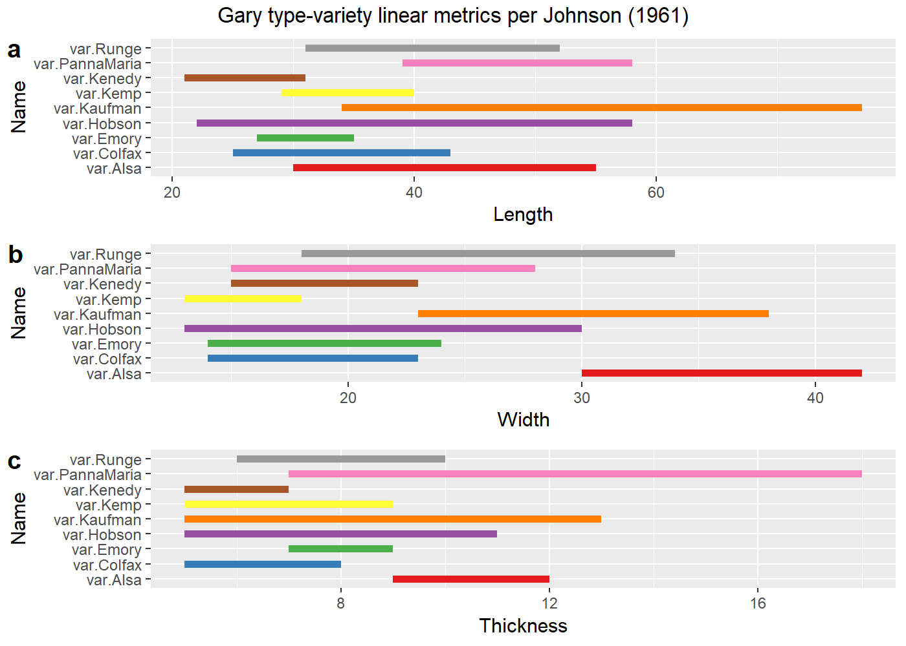

Supplementary Material: Linear metrics of Gary type-varieties
================
Robert Z. Selden, Jr.
March 1, 2020

## Introduction

This document includes supplemental materials for the article, “A
quantitative assessment of intraspecific morphological variation in Gary
dart points: An exercise in archaeological epistemology and heuristics.”
The traditional linear measures of maximum length, width, and thickness
were combined with stem length and stem width for this study. These
variables represent the standard suite of metrics used to characterise
Gary points in previous studies, and provide those data needed to
examine whether specimens included in this study may transcend the
threshold between dart and arrow points (Hildebrandt and King 2012).

Others have noted the gradual diminution in the size of Gary dart points
through time (Baerreis 1951; Ford and Webb 1956; Schambach 1998;
Densmore 2007), thus it was necessary to begin by asking whether the
size of those points aggregated for this study may fall below the
arbitrary 11.8 mm dart-arrow index (DAI) threshold posited by
Hildebrandt and King (2012). The temporal span associated with
morphologically-diagnostic Gary dart points is thought to transcend the
cultural shift from hunter-gatherer to emergent horticulturalist, and
overlaps temporally with the advent and flourescence of the bow and
arrow. The dart-arrow index was calculated for all specimens of Gary
dart points used in this study, and none fall below the dart-arrow
threshold posited by Hildebrandt and King (2012). It is noteworthy that
others (Erlandson, Watts, and Jew 2014) have found that the DAI may not
be universally applicable; however, the DAI and the threshold identified
by Hildebrandt and King (2012) is a useful heuristic in this instance.

### The Gary type prior to formal definition by Suhm, Krieger, and Jelks (1954, 430–31, Plate 94)

Gary dart points were formally defined by (Suhm, Krieger, and Jelks
1954, 430–31, Plate 94), providing a description with defining
morphological characteristics for a point known to investigators working
across the region, but by different names. The earliest recorded Gary
dart point was excavated on September 14, 1930 by Frank Bryan
(Aynesworth 1936, 76). The point was recovered from the chest cavity,
behind the sternum of a flexed burial eroding from a wall in an active
gravel pit—roughly two and one-half feet below the surface—located
around 14 miles from Waco, Texas on the East side of the Brazos River in
Texas (Aynesworth 1936, 76, 78–79, Plate XIV:6). While discovered in
association with the burial, this point may have been included in the
fill that was excavated when the burial was interred. In the same
burial, a Perdiz arrow point was found lodged in the upper end of the
right humerus (Aynesworth 1936, Plate XIV:4a, 4b, 5), and a small arrow
point fragment was found lodged between the neck and greater trochanter
of the left femur (Aynesworth 1936, Plate XIV:3).

In Limestone County, Texas, (Bryan 1936, 83–84) found Gary points in the
Delia Area (sites 7, 8, 9, 10, 11, 18, 19, and 20), the Cooledge Area
(Bryan 1936, 85–86) (sites 1, 2, 3, 4, 5, and 6), the Tehuacana-Wortham
Area (Bryan 1936, 85, 87) (sites 3, 4, and 6), on Christmas Creek (Bryan
1936, 85, 90) (all sites; 1-6), the Frosa Area (Bryan 1936, 89–90)
(sites 1, 2, 4, and 5), the Ben Hur Area (Bryan 1936, 89, 94) (sites 1,
2, 3, and 6), and near Groesbeck and Thornton (Bryan 1936, 89, 91)
(sites 6 and 7). In Hill County, Texas, (Bryan 1936, 92, 95) also found
Gary points at sites 1, 3, and 4. Bryan (1936, 92, Plate XV) determined
that this point type was common enough across the various localities
that it was deserving of a name, dubbing them *Dead-Man Triangle
Points*, which would later be replaced by *Gary Contracting Stemmed*,
*Gary Stemmed* (Newell and Krieger 1949, 164–66), and finally, Gary
(Suhm, Krieger, and Jelks 1954, 430–31, Plate 94).

Ford, Quimby Jr., and Snow (1945, 35) refer to the Gary type that
articulates with the Tchefuncte period as Simple Haft 1A; however, that
type is first introduced in the analysis of the materials from the
Crooks site (Ford and Willey 1940, 97). In that volume, Gary points were
also assigned to Simple Haft 1C (Ford and Willey 1940, 97, Figures
45a-b, 46a-d), described as leaf-shaped with a stem that may be either
flat or convex, and Simple Haft 2A (Ford and Willey 1940, 99, Figures
45d, 46g-h), described as the narrowest of their Blade 2 group, which is
almost as thick as they are wide, with sloped shoulders, a pronounced
median ridge, and an ill-organised approach to secondary flaking. Ford
and Willey (1940, 99) describe Simple Haft 2B as identical in shape to
Simple Haft 2A, but with excellent primary and secondary flaking, no
similarities in execution, and a cross-section that is less than 5mm
thick. This is the only type at the Crooks site that was assigned based
upon execution alone. Simple Haft 2C (Ford and Willey 1940, 99, Figure
45f) displays thickening at the median, with a triangular blade, small
contracting stem, and broad, straight shoulders. This is the earliest
work that begins to expound upon the diversity of morphological
variation thought to occur within what would later become the Gary type.

Webb and DeJarnette (1942, 8–9) developed a hierarchically-nested
classification system for projectile points from the Pickwick Basin.
Within that system, the number *2* denoted a stemmed point, and *b* that
it contracted toward the base. It is noteworthy that the shape of the
projectile points was considered the dominant element in classification,
and comparison of each specimen with the type form was made by the same
individual throughout their multi-year study (Webb and DeJarnette 1942).
Many of the *2b* (and various other) projectile point types identified
during that study would now be considered Gary or Adena, depending upon
their temporal and contextual association.

In the winter of 1938, two Gary points were excavated from midden B, a
150 x 100 foot (long axis along northeast-southwest line) elongated-oval
shell midden, at the Tchefuncte site, located parallel to the shoreline
of Lake Pontchartrain (Louisiana) (Ford, Quimby Jr., and Snow 1945,
11–12, Figure 5). Ford, Quimby Jr., and Snow (1945, 35) refer to the
type as Simple Haft 1A, described earlier by Ford and Willey (1940, 97),
noting that blade shape is represented by a near-equilateral triangle,
straight shoulders, and the characteristic broad stem atop a convex
base. This point type was also found to occur in Marksville period sites
(Ford, Quimby Jr., and Snow 1945, 35). While Newell and Krieger (1949)
later considered five of the point types found by Ford et al. (1945,
Figure 8:D, H-K) to be Gary, that assignment is revised to include only
one type—represented by two projectiles (one illustrated) (Ford, Quimby
Jr., and Snow 1945, Figure 8:K)—based upon the initial (Suhm, Krieger,
and Jelks 1954, 430–31, Plate 94) and current formal definitions
(Turner, Hester, and McReynolds 2011, 107–8).

In his discussion of the assemblage from the Harrell site, Krieger
(1946, 115–17, Table 2, Figure 8p) includes *Gary Contracting Stem*
among those dart points that are very common in northeast Texas pottery
sites. All three of the *Gary Contracting Stem* specimens were noted to
have possibly come from Level II (Krieger 1946, Table 2).

Lewis and Kneberg (1947, 12–18) identified Gary dart points as the
Tapered Stem and Beaver Tail Stem types as Eva Focus traits not shared
by Lauderdale and Indian Knoll. Both types were noted to be rare or
alien (Lewis and Kneberg 1947). The Tapered Stem type was noted to be
ubiquitous but rare, and the Beaver Tail Stem type–noted to be a
specialised variant of the Tapered Stem (the earliest recorded Gary
variety)–was reported to rarely occur at most sites, but frequently at
two of the southernmost sites in the area (Lewis and Kneberg 1947). The
Tapered Stem *var. Beaver Tail Stem* was noted to be an Archaic or
Woodland type (Lewis and Kneberg 1947).

  - Ford (1951, 115, Figure 45)

  - Baerreis (1951)

  - Bell and Baerreis (1951, Plate 1 (8,22), Plate 3 (6), Plate 8 (8),
    Plate 9 (3,4), Plate 10 (1,4), Plate 11 (14), and Plate 13 (15))

  - Wheat (1953, 204–5, Plate 36)

#### Discussions of manufacture and retouch in Gary dart points

In his study of the lithic assemblage from the Icy Eye site, Studer
(1982, 67–73, Figure 3) posited a useful reduction sequence. Unlike
other areas where Gary dart points are produced, the available raw
materials from the area where Studer was working (east Texas) were quite
small (Studer 1982). Studer (1982, 71) posits that bipolar flaking may
have been used to reflect the percussion force otherwise lost through
movement, where anvil stones were used to hold the pebbles stationary
and localise percussion forces.

  - Ensor and Carlson (1991, Figure 85)

  - Patterson (1996)

## Preliminaries

``` r
# install required analysis packages
#devtools::install_github("rich-iannone/DiagrammeR")
#devtools::install_github("vqv/ggbiplot")
#devtools::install_github("mlcollyer/RRPP")
#devtools::install_github("tidyverse/ggplot2")
#devtools::install_github("kassambara/ggpubr")
# load libraries
library(DiagrammeR)
library(ggbiplot)
```

    ## Loading required package: ggplot2

    ## Loading required package: plyr

    ## Loading required package: scales

    ## Loading required package: grid

``` r
library(RRPP)
library(ggplot2)
library(ggpubr)
```

    ## Loading required package: magrittr

    ## 
    ## Attaching package: 'ggpubr'

    ## The following object is masked from 'package:plyr':
    ## 
    ##     mutate

``` r
library(ggfortify)
```

    ## 
    ## Attaching package: 'ggfortify'

    ## The following object is masked from 'package:ggbiplot':
    ## 
    ##     ggbiplot

``` r
library(cluster)
```

### Set working directory, load data, and define variables

``` r
# set working directory
setwd(getwd())
data<-read.csv("garymorphlm.csv",header = TRUE, as.is=TRUE)
# define variables
maxl<-data$maxl # maximum length
maxw<-data$maxw # maximum width
maxth<-data$maxth # maximum thickness
maxstl<-data$maxstl # maximum stem length
maxstw<-data$maxstw # maximum stem width
site<-data$site # site name
```

## Theoretical underpinnings

### Calculate dart-arrow index (Hildebrandt and King 2012)

``` r
# calculate dart-arrow index (max stem width + max thickness)
dai<-maxstw + maxth
dai
```

    ##   [1] 44.05 42.17 27.59 40.47 37.55 36.55 38.94 34.81 37.01 39.62 37.32 32.32
    ##  [13] 33.60 27.26 28.58 25.96 28.76 28.00 32.85 36.73 38.55 29.36 39.01 34.68
    ##  [25] 28.28 24.73 25.19 28.01 23.81 24.53 20.59 25.92 27.12 19.16 26.42 26.33
    ##  [37] 17.70 20.52 18.93 20.13 25.12 33.19 36.56 28.00 36.08 34.01 30.26 31.36
    ##  [49] 33.92 27.97 30.39 29.38 27.30 34.16 25.09 31.20 36.02 32.25 28.93 28.57
    ##  [61] 32.01 32.01 33.70 29.51 26.08 27.44 29.76 29.11 22.56 30.09 32.71 26.92
    ##  [73] 36.95 30.71 28.86 31.34 32.64 24.83 24.91 25.12 33.19 28.90 27.95 30.12
    ##  [85] 26.73 36.43 26.12 26.82 24.17 34.50 24.62 26.67 24.55 25.28 23.80 25.68
    ##  [97] 17.75 22.13 22.20 17.18 19.21 31.06 23.25 32.00 26.78 30.83 26.06 19.27
    ## [109] 28.60 25.81 23.21 23.94 21.07 29.02 23.43 26.58 29.73 21.93 24.00 30.50
    ## [121] 21.16 27.67 22.66 22.63 25.43 31.09 23.35 20.78 30.33 18.84 22.17 20.92
    ## [133] 22.19 17.17 21.99 23.43 26.36 23.38 29.81 27.64 24.08 17.44 22.68 19.89
    ## [145] 20.02 22.79 20.43 25.73 46.83 25.94 24.07 30.82 26.90 25.01 25.98 30.96
    ## [157] 29.12 21.29 28.55 22.89 26.21 23.41 24.73 32.80 31.24 23.55 29.19 28.39
    ## [169] 20.61 22.45 22.29 22.95 21.20 27.51 25.89 23.28 26.19 24.47 21.45 25.22
    ## [181] 29.24 33.74 27.45 23.18 24.54 27.87 29.92 37.59 26.06 23.98 29.23 26.32
    ## [193] 23.76 23.20 21.15 24.98 19.68 30.92 32.30 22.82 23.99 21.36 20.39 24.75
    ## [205] 20.64 26.46 30.38 19.16 27.81 25.46 16.74 24.78

``` r
# how many observations fall at or below 11.8 mm
arrow<-sum(data$dai <= 11.8)
arrow
```

    ## [1] 0

### Krieger’s (1944, Figure 25) typological concept and the Gary dart point

``` r
#grViz("
#  digraph{
#    node[shape = rectangle
#         fontname = lato
#         penwidth = 0.2]
#    Material; Pattern1; Pattern2; Pattern3; 1; 2; 3; 4
#    
#    node[shape = doublecircle]
#    A; B; C; D; E; F; G
#    
#    node[shape = diamond
#         style = filled
#         fillcolor = grey]
#    x
#    
#    edge[fontname = lato
#         penwidth = 0.2]
#    Material->Pattern1; Material->Pattern2; Material->Pattern3;
#    Pattern2->A; Pattern2->B; Pattern2->C; Pattern2->D; 
#    Pattern2->E; Pattern2->F; Pattern2->G; A->1; C->1; F->1; B->2;
#    D->3; E->3; G->4; x->4
#    
#    graph[nodesep = 0.8]
#  }
#")
knitr::include_graphics('krieger.png')
```


``` r
fig.cap = "Step 1: sorting into working patterns of distinct structural plan. Step 2: sorting into detailed working groups each consistently combining features in but one way. Step 3: recombining working groups into tentative types on basis of comparative distributions and associations of working groups. Step 4: consolidation of types through further testing for consistency in form and variation. Step 5: description and illustration of types with full range of variation. Step 6: a - determination of series of linked types, b - determination of material-culture complexes, and c - determination of type relationships in related cultures."
```

## Linear metrics of Gary dart points by `site`

### Boxplots for `variable` by `site`

``` r
# boxplot of maximum length ~ site
sitemaxl<-ggplot(data,aes(x=site,y=maxl,color=site)) + geom_boxplot(notch = TRUE) +
  geom_dotplot(binaxis = 'y',stackdir = 'center',dotsize = 0.3) +
  scale_color_brewer(palette = "Set1") +
  theme(legend.position = "none")
# boxplot of maximum width ~ site
sitemaxw<-ggplot(data,aes(x=site,y=maxw,color=site)) + geom_boxplot(notch = TRUE) +
  geom_dotplot(binaxis = 'y',stackdir = 'center',dotsize = 0.3) +
  scale_color_brewer(palette = "Set1") +
  theme(legend.position = "none")
# boxplot of maximum thickness ~ site
sitemaxth<-ggplot(data,aes(x=site,y=maxth,color=site)) + geom_boxplot(notch = TRUE) +
  geom_dotplot(binaxis = 'y',stackdir = 'center',dotsize = 0.3) +
  scale_color_brewer(palette = "Set1") +
  theme(legend.position = "none")
# boxplot of stem length ~ site
sitemaxstl<-ggplot(data,aes(x=site,y=maxstl,color=site)) + geom_boxplot(notch = TRUE) +
  geom_dotplot(binaxis = 'y',stackdir = 'center',dotsize = 0.3) +
  scale_color_brewer(palette = "Set1") +
  theme(legend.position = "none")
# boxplot of stem width ~ site
sitemaxstw<-ggplot(data,aes(x=site,y=maxstw,color=site)) + geom_boxplot(notch = TRUE) +
  geom_dotplot(binaxis = 'y',stackdir = 'center',dotsize = 0.3) +
  scale_color_brewer(palette = "Set1") +
  theme(legend.position = "none")
# render figure
sitefigure<-ggarrange(sitemaxl,sitemaxw,sitemaxth,sitemaxstl,sitemaxstw,
                  labels = c("a","b","c","d","e"),
                  ncol = 3, nrow = 2)
```

    ## `stat_bindot()` using `bins = 30`. Pick better value with `binwidth`.
    ## `stat_bindot()` using `bins = 30`. Pick better value with `binwidth`.
    ## `stat_bindot()` using `bins = 30`. Pick better value with `binwidth`.
    ## `stat_bindot()` using `bins = 30`. Pick better value with `binwidth`.
    ## `stat_bindot()` using `bins = 30`. Pick better value with `binwidth`.

``` r
sitefigure
```

<!-- -->

### Principal Components Analysis for `site`

``` r
#pca
df<-data[c(2:6)]
sitepca<-autoplot(prcomp(df),data = data, colour = 'site',
         loadings = TRUE, loadings.colour = 'blue',
         loadings.label = TRUE,loadings.label.size = 3, 
         frame = TRUE)
#render figure
sitepca
```

<!-- -->

### Analyses of Variance (ANOVA) for `variable` \~ `site`

``` r
# anova = maximum length ~ site
siteml<-lm.rrpp(maxl ~ site, SS.type = "I",data = data,iter = 9999,print.progress = FALSE)
anova(siteml)
```

    ## 
    ## Analysis of Variance, using Residual Randomization
    ## Permutation procedure: Randomization of null model residuals 
    ## Number of permutations: 10000 
    ## Estimation method: Ordinary Least Squares 
    ## Sums of Squares and Cross-products: Type I 
    ## Effect sizes (Z) based on F distributions
    ## 
    ##            Df      SS     MS     Rsq      F      Z Pr(>F)   
    ## site        2  1654.9 827.46 0.05936 6.5946 1.9163 0.0016 **
    ## Residuals 209 26224.4 125.48 0.94064                        
    ## Total     211 27879.3                                       
    ## ---
    ## Signif. codes:  0 '***' 0.001 '**' 0.01 '*' 0.05 '.' 0.1 ' ' 1
    ## 
    ## Call: lm.rrpp(f1 = maxl ~ site, iter = 9999, SS.type = "I", data = data,  
    ##     print.progress = FALSE)

``` r
# anova = maximum width ~ site
sitemw<-lm.rrpp(maxw ~ site, SS.type = "I",data = data,iter = 9999,print.progress = FALSE)
anova(sitemw)
```

    ## 
    ## Analysis of Variance, using Residual Randomization
    ## Permutation procedure: Randomization of null model residuals 
    ## Number of permutations: 10000 
    ## Estimation method: Ordinary Least Squares 
    ## Sums of Squares and Cross-products: Type I 
    ## Effect sizes (Z) based on F distributions
    ## 
    ##            Df     SS     MS     Rsq      F      Z Pr(>F)    
    ## site        2 1499.0 749.49 0.18081 23.064 2.9037  1e-04 ***
    ## Residuals 209 6791.6  32.50 0.81919                         
    ## Total     211 8290.6                                        
    ## ---
    ## Signif. codes:  0 '***' 0.001 '**' 0.01 '*' 0.05 '.' 0.1 ' ' 1
    ## 
    ## Call: lm.rrpp(f1 = maxw ~ site, iter = 9999, SS.type = "I", data = data,  
    ##     print.progress = FALSE)

``` r
# anova = maximum thickness ~ site
sitemth<-lm.rrpp(maxth ~ site, SS.type = "I",data = data,iter = 9999,print.progress = FALSE)
anova(sitemth)
```

    ## 
    ## Analysis of Variance, using Residual Randomization
    ## Permutation procedure: Randomization of null model residuals 
    ## Number of permutations: 10000 
    ## Estimation method: Ordinary Least Squares 
    ## Sums of Squares and Cross-products: Type I 
    ## Effect sizes (Z) based on F distributions
    ## 
    ##            Df      SS     MS     Rsq      F      Z Pr(>F)    
    ## site        2  153.07 76.533 0.15023 18.475 2.7012  1e-04 ***
    ## Residuals 209  865.80  4.143 0.84977                         
    ## Total     211 1018.87                                        
    ## ---
    ## Signif. codes:  0 '***' 0.001 '**' 0.01 '*' 0.05 '.' 0.1 ' ' 1
    ## 
    ## Call: lm.rrpp(f1 = maxth ~ site, iter = 9999, SS.type = "I", data = data,  
    ##     print.progress = FALSE)

``` r
# anova = maximum stem length ~ site
sitemstl<-lm.rrpp(maxstl ~ site, SS.type = "I",data = data,iter = 9999,print.progress = FALSE)
anova(sitemstl)
```

    ## 
    ## Analysis of Variance, using Residual Randomization
    ## Permutation procedure: Randomization of null model residuals 
    ## Number of permutations: 10000 
    ## Estimation method: Ordinary Least Squares 
    ## Sums of Squares and Cross-products: Type I 
    ## Effect sizes (Z) based on F distributions
    ## 
    ##            Df     SS      MS     Rsq      F     Z Pr(>F)    
    ## site        2  417.9 208.963 0.12494 14.921 2.528  1e-04 ***
    ## Residuals 209 2927.1  14.005 0.87506                        
    ## Total     211 3345.0                                        
    ## ---
    ## Signif. codes:  0 '***' 0.001 '**' 0.01 '*' 0.05 '.' 0.1 ' ' 1
    ## 
    ## Call: lm.rrpp(f1 = maxstl ~ site, iter = 9999, SS.type = "I", data = data,  
    ##     print.progress = FALSE)

``` r
# anova = maximum stem width ~ site
sitemstw<-lm.rrpp(maxstw ~ site, SS.type = "I",data = data,iter = 9999,print.progress = FALSE)
anova(sitemstw)
```

    ## 
    ## Analysis of Variance, using Residual Randomization
    ## Permutation procedure: Randomization of null model residuals 
    ## Number of permutations: 10000 
    ## Estimation method: Ordinary Least Squares 
    ## Sums of Squares and Cross-products: Type I 
    ## Effect sizes (Z) based on F distributions
    ## 
    ##            Df     SS      MS     Rsq      F      Z Pr(>F)    
    ## site        2  581.8 290.876 0.15969 19.859 2.7559  1e-04 ***
    ## Residuals 209 3061.3  14.647 0.84031                         
    ## Total     211 3643.0                                         
    ## ---
    ## Signif. codes:  0 '***' 0.001 '**' 0.01 '*' 0.05 '.' 0.1 ' ' 1
    ## 
    ## Call: lm.rrpp(f1 = maxstw ~ site, iter = 9999, SS.type = "I", data = data,  
    ##     print.progress = FALSE)

## Toward a replicable method of assigning Gary type-varieties

### Gary varieties proposed by Ford, Phillips, and Haag (1955)

The `tv0` argument used within this and the subsequent section
articulates with three variants of the Gary type–including *Gary
Stemmed*, *Typical Gary Stemmed*, *Broad Gary Stemmed*, *Thin Gary
Stemmed*, and *Small Gary Stemmed*, which were assigned using those
morphological criteria advanced by Ford, Phillips, and Haag (1955) at
the Jaketown site in west central Mississippi. The *Long Gary Stemmed*
type was omitted from consideration due to the absence of reported
metrics.

``` r
# Ford, Phillips, and Haag (1955)
fphl<-data.frame(Name=c('var.GaryStemmed','var.TypicalGaryStemmed','var.BroadGaryStemmed','var.ThinGaryStemmed','var.SmallGaryStemmed'),
           Length=c(45,45,45,55,35), # in mm
           end=c(70,79,70,75,50) # in mm
)
fphlength<-ggplot(fphl,aes(x=Length,xend=end,y=Name,yend=Name,color=Name)) +
  geom_segment(size=2) +
  scale_color_brewer(palette = "Set1") +
  theme(legend.position = "none")
fphw<-data.frame(Name=c('var.GaryStemmed','var.TypicalGaryStemmed','var.BroadGaryStemmed','var.ThinGaryStemmed','var.SmallGaryStemmed'),
           Width=c(22,22,32,30,20), # in mm
           end=c(31,31,48,36,30) # in mm
)
fphwidth<-ggplot(fphw,aes(x=Width,xend=end,y=Name,yend=Name,color=Name)) +
  geom_segment(size=2) +
  scale_color_brewer(palette = "Set1") +
  theme(legend.position = "none")
# render figure
fwebbfig<-ggarrange(fphlength,fphwidth,
                  labels = c("a","b"),
                  ncol = 1, nrow = 2)
annotate_figure(fwebbfig,
                top=text_grob("Gary type-variety linear metrics per Ford, Phillips, and Haag (1955)")
)
```

<!-- -->

### Assign Gary type-varieties proposed by Ford, Phillips, and Haag (1955)

Ford, Phillips, and Haag (1955) used a series of metrics (maximum
length) to assign Gary varieties at the Jaketown site. The approach
empoyed here enlists all of Ford and Webb’s (1956) reported metrics, and
applies them to each of the points. Those points that do not articulate
with one of the three criteria were assigned as unidentified (UID), and
should be considered as Gary with no type-variety assignment. Due to the
degree of overlap in those ranges associated with the Gary
type-varieties advanced by Ford, Phillips, and Haag (1956), it is
expected that *Gary Stemmed* will fall out due to overlap in length with
*Broad Gary Stemmed*, and overlap in width with *Typical Gary Stemmed*.

``` r
# assign varieties based upon reported metrics in Ford, Phillips, and Haag [1954]
fphlcheck1 <- data$maxl >= 45 & data$maxl <= 70
fphlcheck2 <- data$maxl > 45 & data$maxl <= 79
fphlcheck3 <- data$maxl > 45 & data$maxl < 70
fphlcheck4 <- data$maxl >= 55 & data$maxl <= 75
fphlcheck5 <- data$maxl >= 35 & data$maxl <= 50

fphwcheck1 <- data$maxw >= 22 & data$maxw <=31
fphwcheck2 <- data$maxw > 22 & data$maxw < 31
fphwcheck3 <- data$maxw >= 32 & data$maxw <= 48
fphwcheck4 <- data$maxw >= 30 & data$maxw <= 36
fphwcheck5 <- data$maxw >= 20 & data$maxw <= 30

data$tv0 <- "UID" # = Gary points (no variety)
data$tv0 <- ifelse(fphlcheck1 & fphwcheck1, "GS", data$tv0)
data$tv0 <- ifelse(fphlcheck2 & fphwcheck2, "TyGS", data$tv0)
data$tv0 <- ifelse(fphlcheck3 & fphwcheck3, "BGS", data$tv0)
data$tv0 <- ifelse(fphlcheck4 & fphwcheck4, "ThGS", data$tv0)
data$tv0 <- ifelse(fphlcheck5 & fphwcheck5, "SGS", data$tv0)

tv0<-data$tv0
tv0
```

    ##   [1] "UID"  "UID"  "UID"  "UID"  "BGS"  "BGS"  "BGS"  "BGS"  "ThGS" "UID" 
    ##  [11] "BGS"  "ThGS" "TyGS" "ThGS" "TyGS" "ThGS" "SGS"  "ThGS" "ThGS" "ThGS"
    ##  [21] "ThGS" "UID"  "UID"  "TyGS" "TyGS" "SGS"  "SGS"  "TyGS" "SGS"  "TyGS"
    ##  [31] "UID"  "TyGS" "TyGS" "SGS"  "UID"  "SGS"  "UID"  "UID"  "UID"  "SGS" 
    ##  [41] "TyGS" "ThGS" "ThGS" "TyGS" "UID"  "TyGS" "ThGS" "TyGS" "ThGS" "ThGS"
    ##  [51] "ThGS" "ThGS" "ThGS" "ThGS" "TyGS" "TyGS" "TyGS" "ThGS" "TyGS" "TyGS"
    ##  [61] "TyGS" "TyGS" "ThGS" "TyGS" "TyGS" "ThGS" "TyGS" "TyGS" "TyGS" "ThGS"
    ##  [71] "TyGS" "TyGS" "TyGS" "BGS"  "TyGS" "TyGS" "TyGS" "TyGS" "TyGS" "TyGS"
    ##  [81] "TyGS" "TyGS" "SGS"  "SGS"  "SGS"  "BGS"  "SGS"  "UID"  "SGS"  "SGS" 
    ##  [91] "SGS"  "SGS"  "SGS"  "SGS"  "SGS"  "SGS"  "UID"  "SGS"  "UID"  "UID" 
    ## [101] "UID"  "BGS"  "SGS"  "UID"  "SGS"  "SGS"  "SGS"  "UID"  "SGS"  "SGS" 
    ## [111] "SGS"  "SGS"  "SGS"  "UID"  "TyGS" "TyGS" "TyGS" "SGS"  "SGS"  "TyGS"
    ## [121] "SGS"  "TyGS" "UID"  "SGS"  "SGS"  "TyGS" "TyGS" "SGS"  "SGS"  "UID" 
    ## [131] "SGS"  "UID"  "UID"  "UID"  "SGS"  "SGS"  "SGS"  "SGS"  "TyGS" "BGS" 
    ## [141] "TyGS" "UID"  "UID"  "UID"  "UID"  "UID"  "UID"  "BGS"  "UID"  "TyGS"
    ## [151] "TyGS" "SGS"  "TyGS" "SGS"  "BGS"  "UID"  "BGS"  "UID"  "TyGS" "BGS" 
    ## [161] "SGS"  "TyGS" "TyGS" "BGS"  "TyGS" "TyGS" "SGS"  "SGS"  "SGS"  "SGS" 
    ## [171] "UID"  "UID"  "UID"  "TyGS" "UID"  "TyGS" "SGS"  "UID"  "UID"  "TyGS"
    ## [181] "TyGS" "TyGS" "TyGS" "UID"  "SGS"  "TyGS" "SGS"  "UID"  "TyGS" "SGS" 
    ## [191] "TyGS" "TyGS" "UID"  "SGS"  "UID"  "UID"  "UID"  "UID"  "UID"  "UID" 
    ## [201] "TyGS" "SGS"  "SGS"  "SGS"  "UID"  "TyGS" "TyGS" "SGS"  "SGS"  "UID" 
    ## [211] "UID"  "UID"

### Maximum and minimum values for all `tv0` variables

The Gary type-varieties defined by Ford, Phillips, and Haag (1955) only
included ranges for maximum length and width. The listing appended below
reflects the maximum and minimum values for each orthogonal measurement
included in the dataset. These metrics may have utility in positing
type-variety assignments to partial specimens.

``` r
# subset dataset by tv0 type-varieties
mmtygs<-subset(data,tv0=="TyGS",select=maxl:tv0)
mmbgs<-subset(data,tv0=="BGS",select=maxl:tv0)
mmthgs<-subset(data,tv0=="ThGS",select=maxl:tv0)
mmsgs<-subset(data,tv0=="SGS",select=maxl:tv0)
```

#### Maximum/minimum for Typical Gary Stemmed

``` r
# identify maximum/minimum metrics for Typical Gary Stemmed

# max length (mm)
max(mmtygs$maxl)
```

    ## [1] 78.63

``` r
# min length (mm)
min(mmtygs$maxl)
```

    ## [1] 48.54

``` r
# max width (mm)
max(mmtygs$maxw)
```

    ## [1] 30.36

``` r
# min width (mm)
min(mmtygs$maxw)
```

    ## [1] 22.04

``` r
# max thickness (mm)
max(mmtygs$maxth)
```

    ## [1] 16.76

``` r
# min thickness (mm)
min(mmtygs$maxth)
```

    ## [1] 6.6

``` r
# max stem length (mm)
max(mmtygs$maxstl)
```

    ## [1] 24.62

``` r
# min stem length (mm)
min(mmtygs$maxstl)
```

    ## [1] 7.11

``` r
# max stem width (mm)
max(mmtygs$maxstw)
```

    ## [1] 25.44

``` r
# min stem width (mm)
min(mmtygs$maxstw)
```

    ## [1] 13.79

#### Maximum/minimum for Broad Gary Stemmed

``` r
# identify maximum/minimum metrics for Broad Gary Stemmed

# max length (mm)
max(mmbgs$maxl)
```

    ## [1] 68.54

``` r
# min length (mm)
min(mmbgs$maxl)
```

    ## [1] 45.26

``` r
# max width (mm)
max(mmbgs$maxw)
```

    ## [1] 44.22

``` r
# min width (mm)
min(mmbgs$maxw)
```

    ## [1] 32

``` r
# max thickness (mm)
max(mmbgs$maxth)
```

    ## [1] 13.73

``` r
# min thickness (mm)
min(mmbgs$maxth)
```

    ## [1] 6.02

``` r
# max stem length (mm)
max(mmbgs$maxstl)
```

    ## [1] 21.52

``` r
# min stem length (mm)
min(mmbgs$maxstl)
```

    ## [1] 10.6

``` r
# max stem width (mm)
max(mmbgs$maxstw)
```

    ## [1] 27.71

``` r
# min stem width (mm)
min(mmbgs$maxstw)
```

    ## [1] 16.87

#### Maximum/minimum for Thin Gary Stemmed

``` r
# identify maximum/minimum metrics for Thin Gary Stemmed

# max length (mm)
max(mmthgs$maxl)
```

    ## [1] 71.8

``` r
# min length (mm)
min(mmthgs$maxl)
```

    ## [1] 55.03

``` r
# max width (mm)
max(mmthgs$maxw)
```

    ## [1] 35.57

``` r
# min width (mm)
min(mmthgs$maxw)
```

    ## [1] 30.1

``` r
# max thickness (mm)
max(mmthgs$maxth)
```

    ## [1] 13.94

``` r
# min thickness (mm)
min(mmthgs$maxth)
```

    ## [1] 6.35

``` r
# max stem length (mm)
max(mmthgs$maxstl)
```

    ## [1] 20.15

``` r
# min stem length (mm)
min(mmthgs$maxstl)
```

    ## [1] 12.38

``` r
# max stem width (mm)
max(mmthgs$maxstw)
```

    ## [1] 26.94

``` r
# min stem width (mm)
min(mmthgs$maxstw)
```

    ## [1] 16.66

#### Maximum/minimum for Small Gary Stemmed

``` r
# identify maximum/minimum metrics for Small Gary Stemmed

# max length (mm)
max(mmsgs$maxl)
```

    ## [1] 49.62

``` r
# min length (mm)
min(mmsgs$maxl)
```

    ## [1] 35.01

``` r
# max width (mm)
max(mmsgs$maxw)
```

    ## [1] 29.67

``` r
# min width (mm)
min(mmsgs$maxw)
```

    ## [1] 20.02

``` r
# max thickness (mm)
max(mmsgs$maxth)
```

    ## [1] 11.84

``` r
# min thickness (mm)
min(mmsgs$maxth)
```

    ## [1] 5.95

``` r
# max stem length (mm)
max(mmsgs$maxstl)
```

    ## [1] 23.81

``` r
# min stem length (mm)
min(mmsgs$maxstl)
```

    ## [1] 6.46

``` r
# max stem width (mm)
max(mmsgs$maxstw)
```

    ## [1] 24.09

``` r
# min stem width (mm)
min(mmsgs$maxstw)
```

    ## [1] 12.09

### Boxplots for `site` by `tv0` for Gary dart points from Cooper

``` r
# subset cooper data
cprmxl<-subset(data,site=="Cooper",select=maxl:tv0)
# boxplot of maximum length
cprmaxl<-ggplot(cprmxl,aes(x=tv0,y=maxl,color=tv0)) + 
  geom_boxplot() +
  geom_dotplot(binaxis = 'y',stackdir = 'center',dotsize = 0.3) +
  scale_color_brewer(palette = "Set1") +
  theme(legend.position = "none")
# boxplot of maximum width
cprmaxw<-ggplot(cprmxl,aes(x=tv0,y=maxw,color=tv0)) + 
  geom_boxplot() +
  geom_dotplot(binaxis = 'y',stackdir = 'center',dotsize = 0.3)+
  scale_color_brewer(palette = "Set1") +
  theme(legend.position = "none")
# boxplot of maximum thickness
cprmaxth<-ggplot(cprmxl,aes(x=tv0,y=maxth,color=tv0)) + 
  geom_boxplot() +
  geom_dotplot(binaxis = 'y',stackdir = 'center',dotsize = 0.3)+
  scale_color_brewer(palette = "Set1") +
  theme(legend.position = "none")
# boxplot of maximum stem length
cprmaxstl<-ggplot(cprmxl,aes(x=tv0,y=maxstl,color=tv0)) + 
  geom_boxplot() +
  geom_dotplot(binaxis = 'y',stackdir = 'center',dotsize = 0.3)+
  scale_color_brewer(palette = "Set1") +
  theme(legend.position = "none")
# boxplot of maximum thickness
cprmaxstw<-ggplot(cprmxl,aes(x=tv0,y=maxstw,color=tv0)) + 
  geom_boxplot() +
  geom_dotplot(binaxis = 'y',stackdir = 'center',dotsize = 0.3)+
  scale_color_brewer(palette = "Set1") +
  theme(legend.position = "none")
# render figure
cprfigure<-ggarrange(cprmaxl,cprmaxw,cprmaxth,cprmaxstl,cprmaxstw,
                  labels = c("a","b","c","d","e"),
                  ncol = 3, nrow = 2)
```

    ## `stat_bindot()` using `bins = 30`. Pick better value with `binwidth`.
    ## `stat_bindot()` using `bins = 30`. Pick better value with `binwidth`.
    ## `stat_bindot()` using `bins = 30`. Pick better value with `binwidth`.
    ## `stat_bindot()` using `bins = 30`. Pick better value with `binwidth`.
    ## `stat_bindot()` using `bins = 30`. Pick better value with `binwidth`.

``` r
cprfigure
```

<!-- -->

### Boxplots for `site` by `tv0` for Gary dart points from Means

``` r
# subset means data
mnsmxl<-subset(data,site=="Means",select=maxl:tv0)
# boxplot of maximum length
mnsmaxl<-ggplot(mnsmxl,aes(x=tv0,y=maxl,color=tv0)) + 
  geom_boxplot() +
  geom_dotplot(binaxis = 'y',stackdir = 'center',dotsize = 0.3) +
  scale_color_brewer(palette = "Set1") +
  theme(legend.position = "none")
# boxplot of maximum width
mnsmaxw<-ggplot(mnsmxl,aes(x=tv0,y=maxw,color=tv0)) + 
  geom_boxplot() +
  geom_dotplot(binaxis = 'y',stackdir = 'center',dotsize = 0.3)+
  scale_color_brewer(palette = "Set1") +
  theme(legend.position = "none")
# boxplot of maximum thickness
mnsmaxth<-ggplot(mnsmxl,aes(x=tv0,y=maxth,color=tv0)) + 
  geom_boxplot() +
  geom_dotplot(binaxis = 'y',stackdir = 'center',dotsize = 0.3)+
  scale_color_brewer(palette = "Set1") +
  theme(legend.position = "none")
# boxplot of maximum stem length
mnsmaxstl<-ggplot(mnsmxl,aes(x=tv0,y=maxstl,color=tv0)) + 
  geom_boxplot() +
  geom_dotplot(binaxis = 'y',stackdir = 'center',dotsize = 0.3)+
  scale_color_brewer(palette = "Set1") +
  theme(legend.position = "none")
# boxplot of maximum thickness
mnsmaxstw<-ggplot(mnsmxl,aes(x=tv0,y=maxstw,color=tv0)) + 
  geom_boxplot() +
  geom_dotplot(binaxis = 'y',stackdir = 'center',dotsize = 0.3)+
  scale_color_brewer(palette = "Set1") +
  theme(legend.position = "none")
# render figure
mnsfigure<-ggarrange(mnsmaxl,mnsmaxw,mnsmaxth,mnsmaxstl,mnsmaxstw,
                  labels = c("a","b","c","d","e"),
                  ncol = 3, nrow = 2)
```

    ## `stat_bindot()` using `bins = 30`. Pick better value with `binwidth`.
    ## `stat_bindot()` using `bins = 30`. Pick better value with `binwidth`.
    ## `stat_bindot()` using `bins = 30`. Pick better value with `binwidth`.
    ## `stat_bindot()` using `bins = 30`. Pick better value with `binwidth`.
    ## `stat_bindot()` using `bins = 30`. Pick better value with `binwidth`.

``` r
mnsfigure
```

<!-- -->

### Boxplots for `site` by `tv0` for Gary dart points from Poverty Point

``` r
# subset poverty point data
pvptmxl<-subset(data,site=="Pov Pt",select=maxl:tv0)
# boxplot of maximum length
pvptmaxl<-ggplot(pvptmxl,aes(x=tv0,y=maxl,color=tv0)) + 
  geom_boxplot() +
  geom_dotplot(binaxis = 'y',stackdir = 'center',dotsize = 0.3) +
  scale_color_brewer(palette = "Set1") +
  theme(legend.position = "none")
# boxplot of maximum width
pvptmaxw<-ggplot(pvptmxl,aes(x=tv0,y=maxw,color=tv0)) + 
  geom_boxplot() +
  geom_dotplot(binaxis = 'y',stackdir = 'center',dotsize = 0.3)+
  scale_color_brewer(palette = "Set1") +
  theme(legend.position = "none")
# boxplot of maximum thickness
pvptmaxth<-ggplot(pvptmxl,aes(x=tv0,y=maxth,color=tv0)) + 
  geom_boxplot() +
  geom_dotplot(binaxis = 'y',stackdir = 'center',dotsize = 0.3)+
  scale_color_brewer(palette = "Set1") +
  theme(legend.position = "none")
# boxplot of maximum stem length
pvptmaxstl<-ggplot(pvptmxl,aes(x=tv0,y=maxstl,color=tv0)) + 
  geom_boxplot() +
  geom_dotplot(binaxis = 'y',stackdir = 'center',dotsize = 0.3)+
  scale_color_brewer(palette = "Set1") +
  theme(legend.position = "none")
# boxplot of maximum thickness
pvptmaxstw<-ggplot(pvptmxl,aes(x=tv0,y=maxstw,color=tv0)) + 
  geom_boxplot() +
  geom_dotplot(binaxis = 'y',stackdir = 'center',dotsize = 0.3)+
  scale_color_brewer(palette = "Set1") +
  theme(legend.position = "none")
# render figure
ppfigure<-ggarrange(pvptmaxl,pvptmaxw,pvptmaxth,pvptmaxstl,pvptmaxstw,
                  labels = c("a","b","c","d","e"),
                  ncol = 3, nrow = 2)
```

    ## `stat_bindot()` using `bins = 30`. Pick better value with `binwidth`.
    ## `stat_bindot()` using `bins = 30`. Pick better value with `binwidth`.
    ## `stat_bindot()` using `bins = 30`. Pick better value with `binwidth`.
    ## `stat_bindot()` using `bins = 30`. Pick better value with `binwidth`.
    ## `stat_bindot()` using `bins = 30`. Pick better value with `binwidth`.

``` r
ppfigure
```

<!-- -->

### Principal Components Analysis for `tv0` at all sites

``` r
#pca
df<-data[c(2:6)]
tv0pca<-autoplot(prcomp(df),data = data, colour = 'tv0',
         loadings = TRUE, loadings.colour = 'blue',
         loadings.label = TRUE,loadings.label.size = 3, 
         frame = TRUE)
#render figure
tv0pca
```

<!-- -->

### Analyses of Variance (ANOVA) for linear variables \~ `tv0`

``` r
# anova = maximum length ~ tv0
t0ml<-lm.rrpp(maxl ~ tv0, SS.type = "I",data = data,iter = 9999,print.progress = FALSE)
anova(t0ml)
```

    ## 
    ## Analysis of Variance, using Residual Randomization
    ## Permutation procedure: Randomization of null model residuals 
    ## Number of permutations: 10000 
    ## Estimation method: Ordinary Least Squares 
    ## Sums of Squares and Cross-products: Type I 
    ## Effect sizes (Z) based on F distributions
    ## 
    ##            Df      SS      MS     Rsq      F      Z Pr(>F)    
    ## tv0         4  8985.8 2246.45 0.32231 24.612 4.2993  1e-04 ***
    ## Residuals 207 18893.5   91.27 0.67769                         
    ## Total     211 27879.3                                         
    ## ---
    ## Signif. codes:  0 '***' 0.001 '**' 0.01 '*' 0.05 '.' 0.1 ' ' 1
    ## 
    ## Call: lm.rrpp(f1 = maxl ~ tv0, iter = 9999, SS.type = "I", data = data,  
    ##     print.progress = FALSE)

``` r
# anova = maximum width ~ tv0
t0mw<-lm.rrpp(maxw ~ tv0, SS.type = "I",data = data,iter = 9999,print.progress = FALSE)
anova(t0mw)
```

    ## 
    ## Analysis of Variance, using Residual Randomization
    ## Permutation procedure: Randomization of null model residuals 
    ## Number of permutations: 10000 
    ## Estimation method: Ordinary Least Squares 
    ## Sums of Squares and Cross-products: Type I 
    ## Effect sizes (Z) based on F distributions
    ## 
    ##            Df     SS     MS     Rsq      F      Z Pr(>F)    
    ## tv0         4 2632.2 658.06 0.31749 24.074 4.2661  1e-04 ***
    ## Residuals 207 5658.4  27.34 0.68251                         
    ## Total     211 8290.6                                        
    ## ---
    ## Signif. codes:  0 '***' 0.001 '**' 0.01 '*' 0.05 '.' 0.1 ' ' 1
    ## 
    ## Call: lm.rrpp(f1 = maxw ~ tv0, iter = 9999, SS.type = "I", data = data,  
    ##     print.progress = FALSE)

``` r
# anova = maximum thickness ~ tv0
t0mth<-lm.rrpp(maxth ~ tv0, SS.type = "I",data = data,iter = 9999,print.progress = FALSE)
anova(t0mth)
```

    ## 
    ## Analysis of Variance, using Residual Randomization
    ## Permutation procedure: Randomization of null model residuals 
    ## Number of permutations: 10000 
    ## Estimation method: Ordinary Least Squares 
    ## Sums of Squares and Cross-products: Type I 
    ## Effect sizes (Z) based on F distributions
    ## 
    ##            Df      SS     MS     Rsq      F      Z Pr(>F)    
    ## tv0         4  145.89 36.471 0.14318 8.6481 3.0274  1e-04 ***
    ## Residuals 207  872.98  4.217 0.85682                         
    ## Total     211 1018.87                                        
    ## ---
    ## Signif. codes:  0 '***' 0.001 '**' 0.01 '*' 0.05 '.' 0.1 ' ' 1
    ## 
    ## Call: lm.rrpp(f1 = maxth ~ tv0, iter = 9999, SS.type = "I", data = data,  
    ##     print.progress = FALSE)

``` r
# anova = maximum stem length ~ tv0
t0mstl<-lm.rrpp(maxstl ~ tv0, SS.type = "I",data = data,iter = 9999,print.progress = FALSE)
anova(t0mstl)
```

    ## 
    ## Analysis of Variance, using Residual Randomization
    ## Permutation procedure: Randomization of null model residuals 
    ## Number of permutations: 10000 
    ## Estimation method: Ordinary Least Squares 
    ## Sums of Squares and Cross-products: Type I 
    ## Effect sizes (Z) based on F distributions
    ## 
    ##            Df     SS     MS     Rsq      F      Z Pr(>F)   
    ## tv0         4  252.8 63.196 0.07557 4.2305 2.0857 0.0029 **
    ## Residuals 207 3092.2 14.938 0.92443                        
    ## Total     211 3345.0                                       
    ## ---
    ## Signif. codes:  0 '***' 0.001 '**' 0.01 '*' 0.05 '.' 0.1 ' ' 1
    ## 
    ## Call: lm.rrpp(f1 = maxstl ~ tv0, iter = 9999, SS.type = "I", data = data,  
    ##     print.progress = FALSE)

``` r
# anova = maximum stem width ~ tv0
t0mstw<-lm.rrpp(maxstw ~ tv0, SS.type = "I",data = data,iter = 9999,print.progress = FALSE)
anova(t0mstw)
```

    ## 
    ## Analysis of Variance, using Residual Randomization
    ## Permutation procedure: Randomization of null model residuals 
    ## Number of permutations: 10000 
    ## Estimation method: Ordinary Least Squares 
    ## Sums of Squares and Cross-products: Type I 
    ## Effect sizes (Z) based on F distributions
    ## 
    ##            Df     SS      MS     Rsq      F      Z Pr(>F)    
    ## tv0         4  696.1 174.025 0.19108 12.224 3.4191  1e-04 ***
    ## Residuals 207 2946.9  14.236 0.80892                         
    ## Total     211 3643.0                                         
    ## ---
    ## Signif. codes:  0 '***' 0.001 '**' 0.01 '*' 0.05 '.' 0.1 ' ' 1
    ## 
    ## Call: lm.rrpp(f1 = maxstw ~ tv0, iter = 9999, SS.type = "I", data = data,  
    ##     print.progress = FALSE)

## Gary varieties proposed by Ford and Webb (1956)

The `tv1` argument used within this and the subsequent section
articulates with three variants of the Gary type that include *Large*,
*Medium/Typical*, and *Small*, which were assigned using those
morphological criteria first advanced by Ford, Phillips, and Haag (1955)
at the Jaketown site, and later refined by Ford and Webb (1956) at
Poverty Point.

Each of the three type-varieties proposed by Ford and Webb (1956) was
based upon a suite of morphological criteria that can be systematically
replicated, and a function was used to assign each of the Gary points to
the correct type-variety. Gary type varieties range between 80 and 140
mm in maxl, and between 30 and 42 mm in maxw for *Gary Large*; between
46 to 79 mm in maxl, and between 20 and 45 mm in maxw for *Gary
Medium/Typical*; and between 33 to 45 mm in maxl, 19 to 32 mm in maxw,
and five to 10 mm in maxth for *Gary Small* (Ford and Webb 1956).

``` r
# Ford and Webb (1956)
fwebbl<-data.frame(Name=c('var.GaryLarge','var.GaryMed/Typical','var.GarySmall'),
           Length=c(80,46,33), # in mm
           end=c(140,80,45) # in mm
)
fwebblength<-ggplot(fwebbl,aes(x=Length,xend=end,y=Name,yend=Name,color=Name)) +
  geom_segment(size=2) +
  scale_color_brewer(palette = "Set1") +
  theme(legend.position = "none")
fwebbw<-data.frame(Name=c('var.GaryLarge','var.GaryMed/Typical','var.GarySmall'),
           Width=c(30,20,19), # in mm
           end=c(42,45,32) # in mm
)
fwebbwidth<-ggplot(fwebbw,aes(x=Width,xend=end,y=Name,yend=Name,color=Name)) +
  geom_segment(size=2) +
  scale_color_brewer(palette = "Set1") +
  theme(legend.position = "none")
# thickness values were not precisely reported for GaryLarge and GaryTypical, and are included here for reference only
fwebbth<-data.frame(Name=c('var.GaryLarge','var.GaryMed/Typical','var.GarySmall'),
           Thickness=c(13,9,5), # in mm
           end=c(13,10,10) # in mm
)
fwebbthickness<-ggplot(fwebbth,aes(x=Thickness,xend=end,y=Name,yend=Name,color=Name)) +
  geom_segment(size=2) +
  scale_color_brewer(palette = "Set1") +
  theme(legend.position = "none")
# render figure
fwebbfig<-ggarrange(fwebblength,fwebbwidth,fwebbthickness,
                  labels = c("a","b","c"),
                  ncol = 1, nrow = 3)
annotate_figure(fwebbfig,
                top=text_grob("Gary type-variety linear metrics per Ford and Webb (1956)")
)
```

<!-- -->

### Assign Gary type-varieties proposed by Ford and Webb (1956)

Ford and Webb (1956) used a single metric (maximum length) to assign
Gary varieties at the Poverty Point site. The approach empoyed here
enlists all of Ford and Webb’s (1956) reported metrics, including
maximum length and maximum width for all varieties, coupled with maximum
thickness for *Gary Small*. No metrics were reported for *Gary Long*,
which was omitted from this analysis. Those points that do not match
with one of the three criteria were assigned as unidentified (“UID”).

``` r
# assign varieties based upon reported metrics in Ford and Webb [1956]
lcheck1 <- data$maxl >= 80 & data$maxl <= 140
lcheck2 <- data$maxl >= 46 & data$maxl < 80
lcheck3 <- data$maxl >= 33 & data$maxl < 46

wcheck1 <- data$maxw >= 30 & data$maxw <= 42
wcheck2 <- data$maxw >= 20 & data$maxw <= 45
wcheck3 <- data$maxw >= 19 & data$maxw <= 32

tcheck <- data$maxth >= 5 & data$maxth <= 10

data$tv1 <- "UID" # = Gary points (no variety)
data$tv1 <- ifelse(lcheck1 & wcheck1, "L", data$tv1)
data$tv1 <- ifelse(lcheck2 & wcheck2, "M/T", data$tv1)
data$tv1 <- ifelse(lcheck3 & wcheck3 & tcheck, "S", data$tv1)

tv1<-data$tv1
tv1
```

    ##   [1] "L"   "L"   "L"   "L"   "M/T" "M/T" "M/T" "M/T" "M/T" "M/T" "M/T" "M/T"
    ##  [13] "M/T" "M/T" "M/T" "M/T" "M/T" "M/T" "M/T" "M/T" "M/T" "M/T" "M/T" "M/T"
    ##  [25] "M/T" "M/T" "M/T" "M/T" "M/T" "M/T" "UID" "M/T" "M/T" "M/T" "M/T" "S"  
    ##  [37] "UID" "UID" "UID" "S"   "M/T" "M/T" "M/T" "M/T" "M/T" "M/T" "M/T" "M/T"
    ##  [49] "M/T" "M/T" "M/T" "M/T" "M/T" "M/T" "M/T" "M/T" "M/T" "M/T" "M/T" "M/T"
    ##  [61] "M/T" "M/T" "M/T" "M/T" "M/T" "M/T" "M/T" "M/T" "M/T" "M/T" "M/T" "M/T"
    ##  [73] "M/T" "M/T" "M/T" "M/T" "M/T" "M/T" "M/T" "M/T" "M/T" "M/T" "M/T" "M/T"
    ##  [85] "M/T" "M/T" "M/T" "M/T" "M/T" "M/T" "M/T" "S"   "S"   "S"   "S"   "S"  
    ##  [97] "UID" "S"   "UID" "S"   "S"   "UID" "S"   "UID" "UID" "UID" "UID" "UID"
    ## [109] "S"   "S"   "S"   "S"   "S"   "UID" "M/T" "M/T" "M/T" "M/T" "S"   "M/T"
    ## [121] "S"   "M/T" "UID" "S"   "S"   "M/T" "M/T" "S"   "UID" "UID" "M/T" "M/T"
    ## [133] "UID" "UID" "S"   "S"   "S"   "M/T" "M/T" "M/T" "M/T" "UID" "UID" "S"  
    ## [145] "M/T" "M/T" "S"   "M/T" "M/T" "M/T" "M/T" "S"   "M/T" "M/T" "UID" "L"  
    ## [157] "M/T" "M/T" "M/T" "M/T" "S"   "M/T" "M/T" "M/T" "M/T" "M/T" "M/T" "S"  
    ## [169] "S"   "M/T" "UID" "M/T" "M/T" "M/T" "M/T" "M/T" "M/T" "S"   "M/T" "M/T"
    ## [181] "M/T" "M/T" "M/T" "UID" "M/T" "M/T" "S"   "UID" "M/T" "S"   "M/T" "M/T"
    ## [193] "S"   "S"   "UID" "UID" "M/T" "UID" "UID" "UID" "M/T" "S"   "S"   "S"  
    ## [205] "S"   "M/T" "M/T" "M/T" "M/T" "UID" "UID" "M/T"

### Maximum and minimum values for all `tv1` variables

The Gary type-varieties defined by Ford and Webb (1956) only included
ranges for maximum length and width, and an incomplete listing of
thickness. The listing appended below reflects the maximum and minimum
values for each measure included in the dataset. These metrics may have
utility in positing type-variety assignments to partial specimens.

``` r
# subset dataset by tv1 type-varieties
mml<-subset(data,tv1=="L",select=maxl:tv1)
mmmt<-subset(data,tv1=="M/T",select=maxl:tv1)
mms<-subset(data,tv1=="S",select=maxl:tv1)
```

#### Maximum/minimum for Gary Large

``` r
# identify maximum/minimum metrics for Gary Large

# max length (mm)
max(mml$maxl)
```

    ## [1] 117.24

``` r
# min length (mm)
min(mml$maxl)
```

    ## [1] 80.32

``` r
# max width (mm)
max(mml$maxw)
```

    ## [1] 37.22

``` r
# min width (mm)
min(mml$maxw)
```

    ## [1] 31.13

``` r
# max thickness (mm)
max(mml$maxth)
```

    ## [1] 15.5

``` r
# min thickness (mm)
min(mml$maxth)
```

    ## [1] 9.3

``` r
# max stem length (mm)
max(mml$maxstl)
```

    ## [1] 24.74

``` r
# min stem length (mm)
min(mml$maxstl)
```

    ## [1] 15.71

``` r
# max stem width (mm)
max(mml$maxstw)
```

    ## [1] 30.62

``` r
# min stem width (mm)
min(mml$maxstw)
```

    ## [1] 18.29

#### Maximum/minimum for Gary Med/Typical

``` r
# identify maximum/minimum metrics for Gary Med/Typical

# max length (mm)
max(mmmt$maxl)
```

    ## [1] 78.7

``` r
# min length (mm)
min(mmmt$maxl)
```

    ## [1] 46.01

``` r
# max width (mm)
max(mmmt$maxw)
```

    ## [1] 44.22

``` r
# min width (mm)
min(mmmt$maxw)
```

    ## [1] 20.02

``` r
# max thickness (mm)
max(mmmt$maxth)
```

    ## [1] 17.96

``` r
# min thickness (mm)
min(mmmt$maxth)
```

    ## [1] 5.87

``` r
# max stem length (mm)
max(mmmt$maxstl)
```

    ## [1] 24.62

``` r
# min stem length (mm)
min(mmmt$maxstl)
```

    ## [1] 6.81

``` r
# max stem width (mm)
max(mmmt$maxstw)
```

    ## [1] 29.03

``` r
# min stem width (mm)
min(mmmt$maxstw)
```

    ## [1] 12.09

#### Maximum/minimum for Gary Small

``` r
# identify maximum/minimum metrics for Gary Small

# max length (mm)
max(mms$maxl)
```

    ## [1] 45.88

``` r
# min length (mm)
min(mms$maxl)
```

    ## [1] 34.76

``` r
# max width (mm)
max(mms$maxw)
```

    ## [1] 29.67

``` r
# min width (mm)
min(mms$maxw)
```

    ## [1] 19.02

``` r
# max thickness (mm)
max(mms$maxth)
```

    ## [1] 9.93

``` r
# min thickness (mm)
min(mms$maxth)
```

    ## [1] 5.95

``` r
# max stem length (mm)
max(mms$maxstl)
```

    ## [1] 19.39

``` r
# min stem length (mm)
min(mms$maxstl)
```

    ## [1] 6.46

``` r
# max stem width (mm)
max(mms$maxstw)
```

    ## [1] 22.23

``` r
# min stem width (mm)
min(mms$maxstw)
```

    ## [1] 11.21

### Boxplots for `site` by `tv1` for Gary dart points from Cooper

``` r
# subset cooper data
cprmxl<-subset(data,site=="Cooper",select=maxl:tv1)
# boxplot of maximum length
cprmaxl<-ggplot(cprmxl,aes(x=tv1,y=maxl,color=tv1)) + 
  geom_boxplot() +
  geom_dotplot(binaxis = 'y',stackdir = 'center',dotsize = 0.3) +
  scale_color_brewer(palette = "Set1") +
  theme(legend.position = "none")
# boxplot of maximum width
cprmaxw<-ggplot(cprmxl,aes(x=tv1,y=maxw,color=tv1)) + 
  geom_boxplot() +
  geom_dotplot(binaxis = 'y',stackdir = 'center',dotsize = 0.3)+
  scale_color_brewer(palette = "Set1") +
  theme(legend.position = "none")
# boxplot of maximum thickness
cprmaxth<-ggplot(cprmxl,aes(x=tv1,y=maxth,color=tv1)) + 
  geom_boxplot() +
  geom_dotplot(binaxis = 'y',stackdir = 'center',dotsize = 0.3)+
  scale_color_brewer(palette = "Set1") +
  theme(legend.position = "none")
# boxplot of maximum stem length
cprmaxstl<-ggplot(cprmxl,aes(x=tv1,y=maxstl,color=tv1)) + 
  geom_boxplot() +
  geom_dotplot(binaxis = 'y',stackdir = 'center',dotsize = 0.3)+
  scale_color_brewer(palette = "Set1") +
  theme(legend.position = "none")
# boxplot of maximum thickness
cprmaxstw<-ggplot(cprmxl,aes(x=tv1,y=maxstw,color=tv1)) + 
  geom_boxplot() +
  geom_dotplot(binaxis = 'y',stackdir = 'center',dotsize = 0.3)+
  scale_color_brewer(palette = "Set1") +
  theme(legend.position = "none")
# render figure
cprfigure<-ggarrange(cprmaxl,cprmaxw,cprmaxth,cprmaxstl,cprmaxstw,
                  labels = c("a","b","c","d","e"),
                  ncol = 3, nrow = 2)
```

    ## `stat_bindot()` using `bins = 30`. Pick better value with `binwidth`.
    ## `stat_bindot()` using `bins = 30`. Pick better value with `binwidth`.
    ## `stat_bindot()` using `bins = 30`. Pick better value with `binwidth`.
    ## `stat_bindot()` using `bins = 30`. Pick better value with `binwidth`.
    ## `stat_bindot()` using `bins = 30`. Pick better value with `binwidth`.

``` r
cprfigure
```

<!-- -->

### Boxplots for `site` by `tv1` for Gary dart points from Means

``` r
# subset means data
mnsmxl<-subset(data,site=="Means",select=maxl:tv1)
# boxplot of maximum length
mnsmaxl<-ggplot(mnsmxl,aes(x=tv1,y=maxl,color=tv1)) + 
  geom_boxplot() +
  geom_dotplot(binaxis = 'y',stackdir = 'center',dotsize = 0.3) +
  scale_color_brewer(palette = "Set1") +
  theme(legend.position = "none")
# boxplot of maximum width
mnsmaxw<-ggplot(mnsmxl,aes(x=tv1,y=maxw,color=tv1)) + 
  geom_boxplot() +
  geom_dotplot(binaxis = 'y',stackdir = 'center',dotsize = 0.3)+
  scale_color_brewer(palette = "Set1") +
  theme(legend.position = "none")
# boxplot of maximum thickness
mnsmaxth<-ggplot(mnsmxl,aes(x=tv1,y=maxth,color=tv1)) + 
  geom_boxplot() +
  geom_dotplot(binaxis = 'y',stackdir = 'center',dotsize = 0.3)+
  scale_color_brewer(palette = "Set1") +
  theme(legend.position = "none")
# boxplot of maximum stem length
mnsmaxstl<-ggplot(mnsmxl,aes(x=tv1,y=maxstl,color=tv1)) + 
  geom_boxplot() +
  geom_dotplot(binaxis = 'y',stackdir = 'center',dotsize = 0.3)+
  scale_color_brewer(palette = "Set1") +
  theme(legend.position = "none")
# boxplot of maximum thickness
mnsmaxstw<-ggplot(mnsmxl,aes(x=tv1,y=maxstw,color=tv1)) + 
  geom_boxplot() +
  geom_dotplot(binaxis = 'y',stackdir = 'center',dotsize = 0.3)+
  scale_color_brewer(palette = "Set1") +
  theme(legend.position = "none")
# render figure
mnsfigure<-ggarrange(mnsmaxl,mnsmaxw,mnsmaxth,mnsmaxstl,mnsmaxstw,
                  labels = c("a","b","c","d","e"),
                  ncol = 3, nrow = 2)
```

    ## `stat_bindot()` using `bins = 30`. Pick better value with `binwidth`.
    ## `stat_bindot()` using `bins = 30`. Pick better value with `binwidth`.
    ## `stat_bindot()` using `bins = 30`. Pick better value with `binwidth`.
    ## `stat_bindot()` using `bins = 30`. Pick better value with `binwidth`.
    ## `stat_bindot()` using `bins = 30`. Pick better value with `binwidth`.

``` r
mnsfigure
```

<!-- -->

### Boxplots for `site` by `tv1` for Gary dart points from Poverty Point

``` r
# subset poverty point data
pvptmxl<-subset(data,site=="Pov Pt",select=maxl:tv1)
# boxplot of maximum length
pvptmaxl<-ggplot(pvptmxl,aes(x=tv1,y=maxl,color=tv1)) + 
  geom_boxplot() +
  geom_dotplot(binaxis = 'y',stackdir = 'center',dotsize = 0.3) +
  scale_color_brewer(palette = "Set1") +
  theme(legend.position = "none")
# boxplot of maximum width
pvptmaxw<-ggplot(pvptmxl,aes(x=tv1,y=maxw,color=tv1)) + 
  geom_boxplot() +
  geom_dotplot(binaxis = 'y',stackdir = 'center',dotsize = 0.3)+
  scale_color_brewer(palette = "Set1") +
  theme(legend.position = "none")
# boxplot of maximum thickness
pvptmaxth<-ggplot(pvptmxl,aes(x=tv1,y=maxth,color=tv1)) + 
  geom_boxplot() +
  geom_dotplot(binaxis = 'y',stackdir = 'center',dotsize = 0.3)+
  scale_color_brewer(palette = "Set1") +
  theme(legend.position = "none")
# boxplot of maximum stem length
pvptmaxstl<-ggplot(pvptmxl,aes(x=tv1,y=maxstl,color=tv1)) + 
  geom_boxplot() +
  geom_dotplot(binaxis = 'y',stackdir = 'center',dotsize = 0.3)+
  scale_color_brewer(palette = "Set1") +
  theme(legend.position = "none")
# boxplot of maximum thickness
pvptmaxstw<-ggplot(pvptmxl,aes(x=tv1,y=maxstw,color=tv1)) + 
  geom_boxplot() +
  geom_dotplot(binaxis = 'y',stackdir = 'center',dotsize = 0.3)+
  scale_color_brewer(palette = "Set1") +
  theme(legend.position = "none")
# render figure
ppfigure<-ggarrange(pvptmaxl,pvptmaxw,pvptmaxth,pvptmaxstl,pvptmaxstw,
                  labels = c("a","b","c","d","e"),
                  ncol = 3, nrow = 2)
```

    ## `stat_bindot()` using `bins = 30`. Pick better value with `binwidth`.
    ## `stat_bindot()` using `bins = 30`. Pick better value with `binwidth`.
    ## `stat_bindot()` using `bins = 30`. Pick better value with `binwidth`.
    ## `stat_bindot()` using `bins = 30`. Pick better value with `binwidth`.
    ## `stat_bindot()` using `bins = 30`. Pick better value with `binwidth`.

``` r
ppfigure
```

<!-- -->

### Principal Components Analysis for `tv1` at all sites

``` r
#pca
df<-data[c(2:6)]
t1pca<-autoplot(prcomp(df),data = data, colour = 'tv1',
         loadings = TRUE, loadings.colour = 'blue',
         loadings.label = TRUE,loadings.label.size = 3, 
         frame = TRUE)
#render figure
t1pca
```

<!-- -->

### Analyses of Variance (ANOVA) for `variable` \~ `tv1`

``` r
# anova = maximum length ~ tv1
t1ml<-lm.rrpp(maxl ~ tv1, SS.type = "I",data = data,iter = 9999,print.progress = FALSE)
anova(t1ml)
```

    ## 
    ## Analysis of Variance, using Residual Randomization
    ## Permutation procedure: Randomization of null model residuals 
    ## Number of permutations: 10000 
    ## Estimation method: Ordinary Least Squares 
    ## Sums of Squares and Cross-products: Type I 
    ## Effect sizes (Z) based on F distributions
    ## 
    ##            Df    SS     MS    Rsq      F      Z Pr(>F)    
    ## tv1         3 15629 5209.7 0.5606 88.457 4.9472  1e-04 ***
    ## Residuals 208 12250   58.9 0.4394                         
    ## Total     211 27879                                       
    ## ---
    ## Signif. codes:  0 '***' 0.001 '**' 0.01 '*' 0.05 '.' 0.1 ' ' 1
    ## 
    ## Call: lm.rrpp(f1 = maxl ~ tv1, iter = 9999, SS.type = "I", data = data,  
    ##     print.progress = FALSE)

``` r
# anova = maximum width ~ tv1
t1mw<-lm.rrpp(maxw ~ tv1, SS.type = "I",data = data,iter = 9999,print.progress = FALSE)
anova(t1mw)
```

    ## 
    ## Analysis of Variance, using Residual Randomization
    ## Permutation procedure: Randomization of null model residuals 
    ## Number of permutations: 10000 
    ## Estimation method: Ordinary Least Squares 
    ## Sums of Squares and Cross-products: Type I 
    ## Effect sizes (Z) based on F distributions
    ## 
    ##            Df     SS     MS     Rsq     F      Z Pr(>F)    
    ## tv1         3 1362.0 454.01 0.16429 13.63 3.0333  1e-04 ***
    ## Residuals 208 6928.6  33.31 0.83571                        
    ## Total     211 8290.6                                       
    ## ---
    ## Signif. codes:  0 '***' 0.001 '**' 0.01 '*' 0.05 '.' 0.1 ' ' 1
    ## 
    ## Call: lm.rrpp(f1 = maxw ~ tv1, iter = 9999, SS.type = "I", data = data,  
    ##     print.progress = FALSE)

``` r
# anova = maximum thickness ~ tv1
t1mth<-lm.rrpp(maxth ~ tv1, SS.type = "I",data = data,iter = 9999,print.progress = FALSE)
anova(t1mth)
```

    ## 
    ## Analysis of Variance, using Residual Randomization
    ## Permutation procedure: Randomization of null model residuals 
    ## Number of permutations: 10000 
    ## Estimation method: Ordinary Least Squares 
    ## Sums of Squares and Cross-products: Type I 
    ## Effect sizes (Z) based on F distributions
    ## 
    ##            Df      SS     MS     Rsq      F      Z Pr(>F)    
    ## tv1         3  198.99 66.331 0.19531 16.828 3.3008  1e-04 ***
    ## Residuals 208  819.87  3.942 0.80469                         
    ## Total     211 1018.87                                        
    ## ---
    ## Signif. codes:  0 '***' 0.001 '**' 0.01 '*' 0.05 '.' 0.1 ' ' 1
    ## 
    ## Call: lm.rrpp(f1 = maxth ~ tv1, iter = 9999, SS.type = "I", data = data,  
    ##     print.progress = FALSE)

``` r
# anova = maximum stem length ~ tv1
t1mstl<-lm.rrpp(maxstl ~ tv1, SS.type = "I",data = data,iter = 9999,print.progress = FALSE)
anova(t1mstl)
```

    ## 
    ## Analysis of Variance, using Residual Randomization
    ## Permutation procedure: Randomization of null model residuals 
    ## Number of permutations: 10000 
    ## Estimation method: Ordinary Least Squares 
    ## Sums of Squares and Cross-products: Type I 
    ## Effect sizes (Z) based on F distributions
    ## 
    ##            Df   SS      MS     Rsq     F      Z Pr(>F)    
    ## tv1         3  489 162.987 0.14618 11.87 2.9386  1e-04 ***
    ## Residuals 208 2856  13.731 0.85382                        
    ## Total     211 3345                                        
    ## ---
    ## Signif. codes:  0 '***' 0.001 '**' 0.01 '*' 0.05 '.' 0.1 ' ' 1
    ## 
    ## Call: lm.rrpp(f1 = maxstl ~ tv1, iter = 9999, SS.type = "I", data = data,  
    ##     print.progress = FALSE)

``` r
# anova = maximum stem width ~ tv1
t1mstw<-lm.rrpp(maxstw ~ tv1, SS.type = "I",data = data,iter = 9999,print.progress = FALSE)
anova(t1mstw)
```

    ## 
    ## Analysis of Variance, using Residual Randomization
    ## Permutation procedure: Randomization of null model residuals 
    ## Number of permutations: 10000 
    ## Estimation method: Ordinary Least Squares 
    ## Sums of Squares and Cross-products: Type I 
    ## Effect sizes (Z) based on F distributions
    ## 
    ##            Df     SS      MS     Rsq      F      Z Pr(>F)    
    ## tv1         3  697.5 232.514 0.19147 16.419 3.2769  1e-04 ***
    ## Residuals 208 2945.5  14.161 0.80853                         
    ## Total     211 3643.0                                         
    ## ---
    ## Signif. codes:  0 '***' 0.001 '**' 0.01 '*' 0.05 '.' 0.1 ' ' 1
    ## 
    ## Call: lm.rrpp(f1 = maxstw ~ tv1, iter = 9999, SS.type = "I", data = data,  
    ##     print.progress = FALSE)

## Gary varieties proposed by Johnson (1961)

The `tv3` argument used within this and the subsequent section
articulates with nine variants of the Gary type–including *var.
Kaufman*, *var. Alsa*, *var. Hobson*, *var. Runge*, *var. Emory*, *var.
Kemp*, *var. Panna Maria*, *var. Kenedy*, and *var. Colfax*, which were
assigned using those morphological criteria advanced by Johnson (1961)
at the Yarbrough and Miller sites in northeast Texas.

``` r
# reported length by variety
jl<-data.frame(Name=c('var.Kaufman','var.Alsa','var.Hobson','var.Runge','var.Emory','var.Kemp','var.PannaMaria','var.Kenedy','var.Colfax'),
           Length=c(34,30,22,31,27,29,39,21,25), # in mm
           end=c(77,55,58,52,35,40,58,31,43) # in mm
)
length<-ggplot(jl,aes(x=Length,xend=end,y=Name,yend=Name,color=Name)) +
  geom_segment(size=2) +
  scale_color_brewer(palette = "Set1") +
  theme(legend.position = "none")
# reported width by variety
jw<-data.frame(Name=c('var.Kaufman','var.Alsa','var.Hobson','var.Runge','var.Emory','var.Kemp','var.PannaMaria','var.Kenedy','var.Colfax'),
           Width=c(23,30,13,18,14,13,15,15,14), # in mm
           end=c(38,42,30,34,24,18,28,23,23) # in mm
)
width<-ggplot(jw,aes(x=Width,xend=end,y=Name,yend=Name,color=Name)) +
  geom_segment(size=2) +
  scale_color_brewer(palette = "Set1") +
  theme(legend.position = "none")
# reported thickness by variety
jth<-data.frame(Name=c('var.Kaufman','var.Alsa','var.Hobson','var.Runge','var.Emory','var.Kemp','var.PannaMaria','var.Kenedy','var.Colfax'),
           Thickness=c(5,9,5,6,7,5,7,5,5), # in mm
           end=c(13,12,11,10,9,9,18,7,8) # in mm
)
thickness<-ggplot(jth,aes(x=Thickness,xend=end,y=Name,yend=Name,color=Name)) +
  geom_segment(size=2) +
  scale_color_brewer(palette = "Set1") +
  theme(legend.position = "none")

johnsonfig<-ggarrange(length,width,thickness,
                  labels = c("a","b","c"),
                  ncol = 1, nrow = 3)
annotate_figure(johnsonfig,
                top=text_grob("Gary type-variety linear metrics per Johnson (1961)")
)
```

<!-- -->

### Assign Gary type-varieties proposed by Johnson (1961)

Johnson (1961) used a combination of maximum length, width, and
thickness to assign Gary varieties at the Yarbrough and Miller sites.
The approach empoyed here enlists all of Johnson (1961) reported
metrics. Those points that do not match with one of the three criteria
were assigned as unidentified (“UID”), which effectively discriminates a
Gary point with no assigned variety.

``` r
# assign varieties based upon reported metrics in Schambach (1998)
jlcheck1 <- data$maxl >= 34 & data$maxl <= 77
jlcheck2 <- data$maxl >= 30 & data$maxl <= 55
jlcheck3 <- data$maxl >= 22 & data$maxl <= 58
jlcheck4 <- data$maxl >= 31 & data$maxl <= 52
jlcheck5 <- data$maxl >= 27 & data$maxl <= 35
jlcheck6 <- data$maxl >= 29 & data$maxl <= 40
jlcheck7 <- data$maxl >= 39 & data$maxl <= 58
jlcheck8 <- data$maxl >= 21 & data$maxl <= 31
jlcheck9 <- data$maxl >= 25 & data$maxl <= 43

jwcheck1 <- data$maxw >= 23 & data$maxw <= 38
jwcheck2 <- data$maxw >= 30 & data$maxw <= 42
jwcheck3 <- data$maxw >= 13 & data$maxw <= 30
jwcheck4 <- data$maxw >= 18 & data$maxw <= 34
jwcheck5 <- data$maxw >= 14 & data$maxw <= 24
jwcheck6 <- data$maxw >= 13 & data$maxw <= 18
jwcheck7 <- data$maxw >= 15 & data$maxw <= 28
jwcheck8 <- data$maxw >= 15 & data$maxw <= 23
jwcheck9 <- data$maxw >= 14 & data$maxw <= 23

jtcheck1 <- data$maxth >= 5 & data$maxth <= 13
jtcheck2 <- data$maxth >= 9 & data$maxth <= 12
jtcheck3 <- data$maxth >= 5 & data$maxth <= 11
jtcheck4 <- data$maxth >= 6 & data$maxth <= 10
jtcheck5 <- data$maxth >= 7 & data$maxth <= 9
jtcheck6 <- data$maxth >= 5 & data$maxth <= 9
jtcheck7 <- data$maxth >= 7 & data$maxth <= 18
jtcheck8 <- data$maxth >= 5 & data$maxth <= 7
jtcheck9 <- data$maxth >= 5 & data$maxth <= 8

data$tv3 <- "UID" # = Gary points (no variety)
data$tv3 <- ifelse(jlcheck1 & jwcheck1 & jtcheck1, "Kf", data$tv3)
data$tv3 <- ifelse(jlcheck2 & jwcheck2 & jtcheck2, "Al", data$tv3)
data$tv3 <- ifelse(jlcheck3 & jwcheck3 & jtcheck3, "Ho", data$tv3)
data$tv3 <- ifelse(jlcheck4 & jwcheck4 & jtcheck4, "Ru", data$tv3)
data$tv3 <- ifelse(jlcheck5 & jwcheck5 & jtcheck5, "Em", data$tv3)
data$tv3 <- ifelse(jlcheck6 & jwcheck6 & jtcheck6, "Km", data$tv3)
data$tv3 <- ifelse(jlcheck7 & jwcheck7 & jtcheck7, "PM", data$tv3)
data$tv3 <- ifelse(jlcheck8 & jwcheck8 & jtcheck8, "Kn", data$tv3)
data$tv3 <- ifelse(jlcheck9 & jwcheck9 & jtcheck9, "Cl", data$tv3)

tv3<-data$tv3
tv3
```

    ##   [1] "UID" "UID" "UID" "UID" "Kf"  "Al"  "UID" "Kf"  "Kf"  "Kf"  "UID" "Kf" 
    ##  [13] "Ho"  "Kf"  "PM"  "Kf"  "PM"  "Kf"  "Kf"  "Kf"  "Kf"  "Kf"  "UID" "Kf" 
    ##  [25] "Ru"  "PM"  "Ru"  "Kf"  "PM"  "PM"  "PM"  "PM"  "Kf"  "Ru"  "PM"  "PM" 
    ##  [37] "PM"  "PM"  "PM"  "Cl"  "Kf"  "UID" "Kf"  "Kf"  "Kf"  "UID" "Kf"  "Kf" 
    ##  [49] "Kf"  "Kf"  "Kf"  "Kf"  "Kf"  "UID" "Kf"  "Kf"  "UID" "Kf"  "Kf"  "Kf" 
    ##  [61] "Kf"  "UID" "Kf"  "Kf"  "Kf"  "Kf"  "Kf"  "PM"  "PM"  "Kf"  "PM"  "PM" 
    ##  [73] "Al"  "Al"  "PM"  "PM"  "PM"  "PM"  "PM"  "PM"  "Ru"  "PM"  "PM"  "PM" 
    ##  [85] "Ru"  "UID" "PM"  "Al"  "PM"  "PM"  "PM"  "PM"  "PM"  "Ru"  "Ru"  "PM" 
    ##  [97] "Cl"  "Ru"  "Cl"  "Ho"  "PM"  "Al"  "PM"  "Ru"  "Kf"  "PM"  "PM"  "Ho" 
    ## [109] "PM"  "PM"  "PM"  "PM"  "Cl"  "UID" "PM"  "Kf"  "PM"  "PM"  "Ru"  "PM" 
    ## [121] "Cl"  "UID" "PM"  "Ru"  "PM"  "UID" "PM"  "PM"  "PM"  "Ho"  "PM"  "PM" 
    ## [133] "PM"  "Cl"  "Ru"  "PM"  "Ru"  "PM"  "UID" "UID" "Kf"  "Ru"  "UID" "Ru" 
    ## [145] "Ho"  "PM"  "Cl"  "Ru"  "UID" "UID" "Kf"  "Ru"  "UID" "Ru"  "Ru"  "UID"
    ## [157] "Al"  "UID" "Ho"  "Ru"  "Cl"  "PM"  "PM"  "Kf"  "Kf"  "Kf"  "PM"  "Ru" 
    ## [169] "PM"  "Ru"  "Km"  "PM"  "PM"  "PM"  "Ru"  "PM"  "PM"  "Cl"  "PM"  "Kf" 
    ## [181] "PM"  "Kf"  "Kf"  "PM"  "PM"  "PM"  "PM"  "UID" "Ho"  "Ho"  "Kf"  "Ho" 
    ## [193] "Ru"  "Cl"  "PM"  "PM"  "UID" "Al"  "UID" "PM"  "Kf"  "PM"  "Cl"  "PM" 
    ## [205] "Cl"  "PM"  "Kf"  "PM"  "PM"  "Ru"  "Cl"  "PM"

### Maximum and minimum values for all `tv3` variables

The Gary type-varieties defined by Johnson (1961) only included ranges
for maximum length, width, and thickness. The listing appended below
reflects the maximum and minimum values for each measure included in the
dataset. These metrics may have utility in positing type-variety
assignments to partial specimens.

``` r
# subset dataset by tv3 type-varieties
jkf<-subset(data,tv3=="Kf",select=maxl:tv3)
jal<-subset(data,tv3=="Al",select=maxl:tv3)
jho<-subset(data,tv3=="Ho",select=maxl:tv3)
jru<-subset(data,tv3=="Ru",select=maxl:tv3)
jem<-subset(data,tv3=="Em",select=maxl:tv3)
jkm<-subset(data,tv3=="Km",select=maxl:tv3)
jpm<-subset(data,tv3=="PM",select=maxl:tv3)
jkn<-subset(data,tv3=="Kn",select=maxl:tv3)
jcl<-subset(data,tv3=="Cl",select=maxl:tv3)
```

##### Maximum/minimum for *variety Kaufman*

``` r
# identify maximum/minimum metrics for variety Kaufman

# max length (mm)
max(jkf$maxl)
```

    ## [1] 73.58

``` r
# min length (mm)
min(jkf$maxl)
```

    ## [1] 44.33

``` r
# max width (mm)
max(jkf$maxw)
```

    ## [1] 37.93

``` r
# min width (mm)
min(jkf$maxw)
```

    ## [1] 23.75

``` r
# max thickness (mm)
max(jkf$maxth)
```

    ## [1] 12.96

``` r
# min thickness (mm)
min(jkf$maxth)
```

    ## [1] 6.35

``` r
# max stem length (mm)
max(jkf$maxstl)
```

    ## [1] 22.71

``` r
# min stem length (mm)
min(jkf$maxstl)
```

    ## [1] 8.13

``` r
# max stem width (mm)
max(jkf$maxstw)
```

    ## [1] 29.03

``` r
# min stem width (mm)
min(jkf$maxstw)
```

    ## [1] 14.38

#### Maximum/minimum for *variety Alsa*

``` r
# identify maximum/minimum metrics for variety Alsa

# max length (mm)
max(jal$maxl)
```

    ## [1] 54.7

``` r
# min length (mm)
min(jal$maxl)
```

    ## [1] 44.35

``` r
# max width (mm)
max(jal$maxw)
```

    ## [1] 36.63

``` r
# min width (mm)
min(jal$maxw)
```

    ## [1] 30.36

``` r
# max thickness (mm)
max(jal$maxth)
```

    ## [1] 11.92

``` r
# min thickness (mm)
min(jal$maxth)
```

    ## [1] 9.18

``` r
# max stem length (mm)
max(jal$maxstl)
```

    ## [1] 18.45

``` r
# min stem length (mm)
min(jal$maxstl)
```

    ## [1] 10.6

``` r
# max stem width (mm)
max(jal$maxstw)
```

    ## [1] 27.37

``` r
# min stem width (mm)
min(jal$maxstw)
```

    ## [1] 16.68

#### Maximum/minimum for *variety Hobson*

``` r
# identify maximum/minimum metrics for variety Hobson

# max length (mm)
max(jho$maxl)
```

    ## [1] 57.79

``` r
# min length (mm)
min(jho$maxl)
```

    ## [1] 43.07

``` r
# max width (mm)
max(jho$maxw)
```

    ## [1] 29.93

``` r
# min width (mm)
min(jho$maxw)
```

    ## [1] 14.11

``` r
# max thickness (mm)
max(jho$maxth)
```

    ## [1] 9.84

``` r
# min thickness (mm)
min(jho$maxth)
```

    ## [1] 5.87

``` r
# max stem length (mm)
max(jho$maxstl)
```

    ## [1] 20.62

``` r
# min stem length (mm)
min(jho$maxstl)
```

    ## [1] 5.14

``` r
# max stem width (mm)
max(jho$maxstw)
```

    ## [1] 23.76

``` r
# min stem width (mm)
min(jho$maxstw)
```

    ## [1] 11.21

#### Maximum/minimum for *variety Runge*

``` r
# identify maximum/minimum metrics for variety Runge

# max length (mm)
max(jru$maxl)
```

    ## [1] 50.74

``` r
# min length (mm)
min(jru$maxl)
```

    ## [1] 34.76

``` r
# max width (mm)
max(jru$maxw)
```

    ## [1] 33.36

``` r
# min width (mm)
min(jru$maxw)
```

    ## [1] 18.45

``` r
# max thickness (mm)
max(jru$maxth)
```

    ## [1] 9.46

``` r
# min thickness (mm)
min(jru$maxth)
```

    ## [1] 6.02

``` r
# max stem length (mm)
max(jru$maxstl)
```

    ## [1] 24.62

``` r
# min stem length (mm)
min(jru$maxstl)
```

    ## [1] 6.81

``` r
# max stem width (mm)
max(jru$maxstw)
```

    ## [1] 25.44

``` r
# min stem width (mm)
min(jru$maxstw)
```

    ## [1] 10.94

#### Maximum/minimum for *variety Emory*

``` r
# identify maximum/minimum metrics for variety Emory

# max length (mm)
max(jem$maxl)
```

    ## Warning in max(jem$maxl): no non-missing arguments to max; returning -Inf

    ## [1] -Inf

``` r
# min length (mm)
min(jem$maxl)
```

    ## Warning in min(jem$maxl): no non-missing arguments to min; returning Inf

    ## [1] Inf

``` r
# max width (mm)
max(jem$maxw)
```

    ## Warning in max(jem$maxw): no non-missing arguments to max; returning -Inf

    ## [1] -Inf

``` r
# min width (mm)
min(jem$maxw)
```

    ## Warning in min(jem$maxw): no non-missing arguments to min; returning Inf

    ## [1] Inf

``` r
# max thickness (mm)
max(jem$maxth)
```

    ## Warning in max(jem$maxth): no non-missing arguments to max; returning -Inf

    ## [1] -Inf

``` r
# min thickness (mm)
min(jem$maxth)
```

    ## Warning in min(jem$maxth): no non-missing arguments to min; returning Inf

    ## [1] Inf

``` r
# max stem length (mm)
max(jem$maxstl)
```

    ## Warning in max(jem$maxstl): no non-missing arguments to max; returning -Inf

    ## [1] -Inf

``` r
# min stem length (mm)
min(jem$maxstl)
```

    ## Warning in min(jem$maxstl): no non-missing arguments to min; returning Inf

    ## [1] Inf

``` r
# max stem width (mm)
max(jem$maxstw)
```

    ## Warning in max(jem$maxstw): no non-missing arguments to max; returning -Inf

    ## [1] -Inf

``` r
# min stem width (mm)
min(jem$maxstw)
```

    ## Warning in min(jem$maxstw): no non-missing arguments to min; returning Inf

    ## [1] Inf

#### Maximum/minimum for *variety Kemp*

``` r
# identify maximum/minimum metrics for variety Kemp

# max length (mm)
max(jkm$maxl)
```

    ## [1] 34.28

``` r
# min length (mm)
min(jkm$maxl)
```

    ## [1] 34.28

``` r
# max width (mm)
max(jkm$maxw)
```

    ## [1] 16.1

``` r
# min width (mm)
min(jkm$maxw)
```

    ## [1] 16.1

``` r
# max thickness (mm)
max(jkm$maxth)
```

    ## [1] 8.01

``` r
# min thickness (mm)
min(jkm$maxth)
```

    ## [1] 8.01

``` r
# max stem length (mm)
max(jkm$maxstl)
```

    ## [1] 16.44

``` r
# min stem length (mm)
min(jkm$maxstl)
```

    ## [1] 16.44

``` r
# max stem width (mm)
max(jkm$maxstw)
```

    ## [1] 14.28

``` r
# min stem width (mm)
min(jkm$maxstw)
```

    ## [1] 14.28

#### Maximum/minimum for *variety Panna Maria*

``` r
# identify maximum/minimum metrics for variety Panna Maria

# max length (mm)
max(jpm$maxl)
```

    ## [1] 57.72

``` r
# min length (mm)
min(jpm$maxl)
```

    ## [1] 39.28

``` r
# max width (mm)
max(jpm$maxw)
```

    ## [1] 27.8

``` r
# min width (mm)
min(jpm$maxw)
```

    ## [1] 16.87

``` r
# max thickness (mm)
max(jpm$maxth)
```

    ## [1] 12.61

``` r
# min thickness (mm)
min(jpm$maxth)
```

    ## [1] 7.05

``` r
# max stem length (mm)
max(jpm$maxstl)
```

    ## [1] 24.14

``` r
# min stem length (mm)
min(jpm$maxstl)
```

    ## [1] 6.97

``` r
# max stem width (mm)
max(jpm$maxstw)
```

    ## [1] 24.09

``` r
# min stem width (mm)
min(jpm$maxstw)
```

    ## [1] 9.68

#### Maximum/minimum for *variety Kenedy*

``` r
# identify maximum/minimum metrics for variety Kenedy

# max length (mm)
max(jkn$maxl)
```

    ## Warning in max(jkn$maxl): no non-missing arguments to max; returning -Inf

    ## [1] -Inf

``` r
# min length (mm)
min(jkn$maxl)
```

    ## Warning in min(jkn$maxl): no non-missing arguments to min; returning Inf

    ## [1] Inf

``` r
# max width (mm)
max(jkn$maxw)
```

    ## Warning in max(jkn$maxw): no non-missing arguments to max; returning -Inf

    ## [1] -Inf

``` r
# min width (mm)
min(jkn$maxw)
```

    ## Warning in min(jkn$maxw): no non-missing arguments to min; returning Inf

    ## [1] Inf

``` r
# max thickness (mm)
max(jkn$maxth)
```

    ## Warning in max(jkn$maxth): no non-missing arguments to max; returning -Inf

    ## [1] -Inf

``` r
# min thickness (mm)
min(jkn$maxth)
```

    ## Warning in min(jkn$maxth): no non-missing arguments to min; returning Inf

    ## [1] Inf

``` r
# max stem length (mm)
max(jkn$maxstl)
```

    ## Warning in max(jkn$maxstl): no non-missing arguments to max; returning -Inf

    ## [1] -Inf

``` r
# min stem length (mm)
min(jkn$maxstl)
```

    ## Warning in min(jkn$maxstl): no non-missing arguments to min; returning Inf

    ## [1] Inf

``` r
# max stem width (mm)
max(jkn$maxstw)
```

    ## Warning in max(jkn$maxstw): no non-missing arguments to max; returning -Inf

    ## [1] -Inf

``` r
# min stem width (mm)
min(jkn$maxstw)
```

    ## Warning in min(jkn$maxstw): no non-missing arguments to min; returning Inf

    ## [1] Inf

#### Maximum/minimum for *variety Colfax*

``` r
# identify maximum/minimum metrics for variety Colfax

# max length (mm)
max(jcl$maxl)
```

    ## [1] 42.92

``` r
# min length (mm)
min(jcl$maxl)
```

    ## [1] 35.01

``` r
# max width (mm)
max(jcl$maxw)
```

    ## [1] 22.99

``` r
# min width (mm)
min(jcl$maxw)
```

    ## [1] 17.75

``` r
# max thickness (mm)
max(jcl$maxth)
```

    ## [1] 8

``` r
# min thickness (mm)
min(jcl$maxth)
```

    ## [1] 5.87

``` r
# max stem length (mm)
max(jcl$maxstl)
```

    ## [1] 16.98

``` r
# min stem length (mm)
min(jcl$maxstl)
```

    ## [1] 6.46

``` r
# max stem width (mm)
max(jcl$maxstw)
```

    ## [1] 18.88

``` r
# min stem width (mm)
min(jcl$maxstw)
```

    ## [1] 9.41

### Boxplots for `site` by `tv3` for Gary dart points from Cooper

``` r
# subset cooper data
cprmxl<-subset(data,site=="Cooper",select=maxl:tv3)
# boxplot of maximum length
cprmaxl<-ggplot(cprmxl,aes(x=tv3,y=maxl,color=tv3)) + 
  geom_boxplot() +
  geom_dotplot(binaxis = 'y',stackdir = 'center',dotsize = 0.3) +
  scale_color_brewer(palette = "Set1") +
  theme(legend.position = "none")
# boxplot of maximum width
cprmaxw<-ggplot(cprmxl,aes(x=tv3,y=maxw,color=tv3)) + 
  geom_boxplot() +
  geom_dotplot(binaxis = 'y',stackdir = 'center',dotsize = 0.3)+
  scale_color_brewer(palette = "Set1") +
  theme(legend.position = "none")
# boxplot of maximum thickness
cprmaxth<-ggplot(cprmxl,aes(x=tv3,y=maxth,color=tv3)) + 
  geom_boxplot() +
  geom_dotplot(binaxis = 'y',stackdir = 'center',dotsize = 0.3)+
  scale_color_brewer(palette = "Set1") +
  theme(legend.position = "none")
# boxplot of maximum stem length
cprmaxstl<-ggplot(cprmxl,aes(x=tv3,y=maxstl,color=tv3)) + 
  geom_boxplot() +
  geom_dotplot(binaxis = 'y',stackdir = 'center',dotsize = 0.3)+
  scale_color_brewer(palette = "Set1") +
  theme(legend.position = "none")
# boxplot of maximum thickness
cprmaxstw<-ggplot(cprmxl,aes(x=tv3,y=maxstw,color=tv3)) + 
  geom_boxplot() +
  geom_dotplot(binaxis = 'y',stackdir = 'center',dotsize = 0.3)+
  scale_color_brewer(palette = "Set1") +
  theme(legend.position = "none")
# render figure
cprfigure<-ggarrange(cprmaxl,cprmaxw,cprmaxth,cprmaxstl,cprmaxstw,
                  labels = c("a","b","c","d","e"),
                  ncol = 3, nrow = 2)
```

    ## `stat_bindot()` using `bins = 30`. Pick better value with `binwidth`.
    ## `stat_bindot()` using `bins = 30`. Pick better value with `binwidth`.
    ## `stat_bindot()` using `bins = 30`. Pick better value with `binwidth`.
    ## `stat_bindot()` using `bins = 30`. Pick better value with `binwidth`.
    ## `stat_bindot()` using `bins = 30`. Pick better value with `binwidth`.

``` r
cprfigure
```

<!-- -->

### Boxplots for `site` by `tv3` for Gary dart points from Means

``` r
# subset means data
mnsmxl<-subset(data,site=="Means",select=maxl:tv3)
# boxplot of maximum length
mnsmaxl<-ggplot(mnsmxl,aes(x=tv3,y=maxl,color=tv3)) + 
  geom_boxplot() +
  geom_dotplot(binaxis = 'y',stackdir = 'center',dotsize = 0.3) +
  scale_color_brewer(palette = "Set1") +
  theme(legend.position = "none")
# boxplot of maximum width
mnsmaxw<-ggplot(mnsmxl,aes(x=tv3,y=maxw,color=tv3)) + 
  geom_boxplot() +
  geom_dotplot(binaxis = 'y',stackdir = 'center',dotsize = 0.3)+
  scale_color_brewer(palette = "Set1") +
  theme(legend.position = "none")
# boxplot of maximum thickness
mnsmaxth<-ggplot(mnsmxl,aes(x=tv3,y=maxth,color=tv3)) + 
  geom_boxplot() +
  geom_dotplot(binaxis = 'y',stackdir = 'center',dotsize = 0.3)+
  scale_color_brewer(palette = "Set1") +
  theme(legend.position = "none")
# boxplot of maximum stem length
mnsmaxstl<-ggplot(mnsmxl,aes(x=tv3,y=maxstl,color=tv3)) + 
  geom_boxplot() +
  geom_dotplot(binaxis = 'y',stackdir = 'center',dotsize = 0.3)+
  scale_color_brewer(palette = "Set1") +
  theme(legend.position = "none")
# boxplot of maximum thickness
mnsmaxstw<-ggplot(mnsmxl,aes(x=tv3,y=maxstw,color=tv3)) + 
  geom_boxplot() +
  geom_dotplot(binaxis = 'y',stackdir = 'center',dotsize = 0.3)+
  scale_color_brewer(palette = "Set1") +
  theme(legend.position = "none")
# render figure
mnsfigure<-ggarrange(mnsmaxl,mnsmaxw,mnsmaxth,mnsmaxstl,mnsmaxstw,
                  labels = c("a","b","c","d","e"),
                  ncol = 3, nrow = 2)
```

    ## `stat_bindot()` using `bins = 30`. Pick better value with `binwidth`.
    ## `stat_bindot()` using `bins = 30`. Pick better value with `binwidth`.
    ## `stat_bindot()` using `bins = 30`. Pick better value with `binwidth`.
    ## `stat_bindot()` using `bins = 30`. Pick better value with `binwidth`.
    ## `stat_bindot()` using `bins = 30`. Pick better value with `binwidth`.

``` r
mnsfigure
```

<!-- -->

### Boxplots for `site` by `tv3` for Gary dart points from Poverty Point

``` r
# subset poverty point data
pvptmxl<-subset(data,site=="Pov Pt",select=maxl:tv3)
# boxplot of maximum length
pvptmaxl<-ggplot(pvptmxl,aes(x=tv3,y=maxl,color=tv3)) + 
  geom_boxplot() +
  geom_dotplot(binaxis = 'y',stackdir = 'center',dotsize = 0.3) +
  scale_color_brewer(palette = "Set1") +
  theme(legend.position = "none")
# boxplot of maximum width
pvptmaxw<-ggplot(pvptmxl,aes(x=tv3,y=maxw,color=tv3)) + 
  geom_boxplot() +
  geom_dotplot(binaxis = 'y',stackdir = 'center',dotsize = 0.3)+
  scale_color_brewer(palette = "Set1") +
  theme(legend.position = "none")
# boxplot of maximum thickness
pvptmaxth<-ggplot(pvptmxl,aes(x=tv3,y=maxth,color=tv3)) + 
  geom_boxplot() +
  geom_dotplot(binaxis = 'y',stackdir = 'center',dotsize = 0.3)+
  scale_color_brewer(palette = "Set1") +
  theme(legend.position = "none")
# boxplot of maximum stem length
pvptmaxstl<-ggplot(pvptmxl,aes(x=tv3,y=maxstl,color=tv3)) + 
  geom_boxplot() +
  geom_dotplot(binaxis = 'y',stackdir = 'center',dotsize = 0.3)+
  scale_color_brewer(palette = "Set1") +
  theme(legend.position = "none")
# boxplot of maximum thickness
pvptmaxstw<-ggplot(pvptmxl,aes(x=tv3,y=maxstw,color=tv3)) + 
  geom_boxplot() +
  geom_dotplot(binaxis = 'y',stackdir = 'center',dotsize = 0.3)+
  scale_color_brewer(palette = "Set1") +
  theme(legend.position = "none")
# render figure
ppfigure<-ggarrange(pvptmaxl,pvptmaxw,pvptmaxth,pvptmaxstl,pvptmaxstw,
                  labels = c("a","b","c","d","e"),
                  ncol = 3, nrow = 2)
```

    ## `stat_bindot()` using `bins = 30`. Pick better value with `binwidth`.
    ## `stat_bindot()` using `bins = 30`. Pick better value with `binwidth`.
    ## `stat_bindot()` using `bins = 30`. Pick better value with `binwidth`.
    ## `stat_bindot()` using `bins = 30`. Pick better value with `binwidth`.
    ## `stat_bindot()` using `bins = 30`. Pick better value with `binwidth`.

``` r
ppfigure
```

<!-- -->

### Principal Components Analysis for `tv3` at all sites

``` r
#pca
df<-data[c(2:6)]
tv3pca<-autoplot(prcomp(df),data = data, colour = 'tv3',
         loadings = TRUE, loadings.colour = 'blue',
         loadings.label = TRUE,loadings.label.size = 3, 
         frame = TRUE)
#render figure
tv3pca
```

<!-- -->

### Analyses of Variance (ANOVA) for linear variables \~ `tv3`

``` r
# anova = maximum length ~ tv3
t3ml<-lm.rrpp(maxl ~ tv3, SS.type = "I",data = data,iter = 9999,print.progress = FALSE)
anova(t3ml)
```

    ## 
    ## Analysis of Variance, using Residual Randomization
    ## Permutation procedure: Randomization of null model residuals 
    ## Number of permutations: 10000 
    ## Estimation method: Ordinary Least Squares 
    ## Sums of Squares and Cross-products: Type I 
    ## Effect sizes (Z) based on F distributions
    ## 
    ##            Df      SS      MS     Rsq     F      Z Pr(>F)    
    ## tv3         7 18834.0 2690.57 0.67555 60.68 7.0889  1e-04 ***
    ## Residuals 204  9045.4   44.34 0.32445                        
    ## Total     211 27879.3                                        
    ## ---
    ## Signif. codes:  0 '***' 0.001 '**' 0.01 '*' 0.05 '.' 0.1 ' ' 1
    ## 
    ## Call: lm.rrpp(f1 = maxl ~ tv3, iter = 9999, SS.type = "I", data = data,  
    ##     print.progress = FALSE)

``` r
# anova = maximum width ~ tv3
t3mw<-lm.rrpp(maxw ~ tv3, SS.type = "I",data = data,iter = 9999,print.progress = FALSE)
anova(t3mw)
```

    ## 
    ## Analysis of Variance, using Residual Randomization
    ## Permutation procedure: Randomization of null model residuals 
    ## Number of permutations: 10000 
    ## Estimation method: Ordinary Least Squares 
    ## Sums of Squares and Cross-products: Type I 
    ## Effect sizes (Z) based on F distributions
    ## 
    ##            Df     SS     MS     Rsq      F      Z Pr(>F)    
    ## tv3         7 3310.8 472.97 0.39934 19.375 5.2127  1e-04 ***
    ## Residuals 204 4979.8  24.41 0.60066                         
    ## Total     211 8290.6                                        
    ## ---
    ## Signif. codes:  0 '***' 0.001 '**' 0.01 '*' 0.05 '.' 0.1 ' ' 1
    ## 
    ## Call: lm.rrpp(f1 = maxw ~ tv3, iter = 9999, SS.type = "I", data = data,  
    ##     print.progress = FALSE)

``` r
# anova = maximum thickness ~ tv3
t3mth<-lm.rrpp(maxth ~ tv3, SS.type = "I",data = data,iter = 9999,print.progress = FALSE)
anova(t3mth)
```

    ## 
    ## Analysis of Variance, using Residual Randomization
    ## Permutation procedure: Randomization of null model residuals 
    ## Number of permutations: 10000 
    ## Estimation method: Ordinary Least Squares 
    ## Sums of Squares and Cross-products: Type I 
    ## Effect sizes (Z) based on F distributions
    ## 
    ##            Df      SS     MS     Rsq      F     Z Pr(>F)    
    ## tv3         7  506.64 72.377 0.49726 28.825 6.001  1e-04 ***
    ## Residuals 204  512.22  2.511 0.50274                        
    ## Total     211 1018.87                                       
    ## ---
    ## Signif. codes:  0 '***' 0.001 '**' 0.01 '*' 0.05 '.' 0.1 ' ' 1
    ## 
    ## Call: lm.rrpp(f1 = maxth ~ tv3, iter = 9999, SS.type = "I", data = data,  
    ##     print.progress = FALSE)

``` r
# anova = maximum stem length ~ tv3
t3mstl<-lm.rrpp(maxstl ~ tv3, SS.type = "I",data = data,iter = 9999,print.progress = FALSE)
anova(t3mstl)
```

    ## 
    ## Analysis of Variance, using Residual Randomization
    ## Permutation procedure: Randomization of null model residuals 
    ## Number of permutations: 10000 
    ## Estimation method: Ordinary Least Squares 
    ## Sums of Squares and Cross-products: Type I 
    ## Effect sizes (Z) based on F distributions
    ## 
    ##            Df     SS     MS     Rsq      F      Z Pr(>F)    
    ## tv3         7  464.3 66.333 0.13881 4.6975 2.8785  3e-04 ***
    ## Residuals 204 2880.6 14.121 0.86119                         
    ## Total     211 3345.0                                        
    ## ---
    ## Signif. codes:  0 '***' 0.001 '**' 0.01 '*' 0.05 '.' 0.1 ' ' 1
    ## 
    ## Call: lm.rrpp(f1 = maxstl ~ tv3, iter = 9999, SS.type = "I", data = data,  
    ##     print.progress = FALSE)

``` r
# anova = maximum stem width ~ tv3
t3mstw<-lm.rrpp(maxstw ~ tv3, SS.type = "I",data = data,iter = 9999,print.progress = FALSE)
anova(t3mstw)
```

    ## 
    ## Analysis of Variance, using Residual Randomization
    ## Permutation procedure: Randomization of null model residuals 
    ## Number of permutations: 10000 
    ## Estimation method: Ordinary Least Squares 
    ## Sums of Squares and Cross-products: Type I 
    ## Effect sizes (Z) based on F distributions
    ## 
    ##            Df   SS      MS     Rsq      F      Z Pr(>F)    
    ## tv3         7  905 129.292 0.24843 9.6332 4.0398  1e-04 ***
    ## Residuals 204 2738  13.421 0.75157                         
    ## Total     211 3643                                         
    ## ---
    ## Signif. codes:  0 '***' 0.001 '**' 0.01 '*' 0.05 '.' 0.1 ' ' 1
    ## 
    ## Call: lm.rrpp(f1 = maxstw ~ tv3, iter = 9999, SS.type = "I", data = data,  
    ##     print.progress = FALSE)

## Gary varieties proposed by Schambach (1998)

``` r
# reported length by variety
schambl<-data.frame(Name=c('var.Gary','var.Malvern','var.LeFlore','var.Bodcaw','var.Manice','var.Camden','var.CamdenA'),
           Length=c(51,43,43,40,36,34,39), # in mm
           end=c(73,72,80,60,57,73,67) # in mm
)
length<-ggplot(schambl,aes(x=Length,xend=end,y=Name,yend=Name,color=Name)) +
  geom_segment(size=2) +
  scale_color_brewer(palette = "Set1") +
  theme(legend.position = "none")
# reported width by variety
schambw<-data.frame(Name=c('var.Gary','var.Malvern','var.LeFlore','var.Bodcaw','var.Manice','var.Camden','var.CamdenA','var.CamdenB'),
           Width=c(31,23,25,21,22,14,16,26), # in mm
           end=c(45,33,54,36,41,35,27,38) # in mm
)
width<-ggplot(schambw,aes(x=Width,xend=end,y=Name,yend=Name,color=Name)) +
  geom_segment(size=2) +
  scale_color_brewer(palette = "Set1") +
  theme(legend.position = "none")
# reported thickness by variety
schambth<-data.frame(Name=c('var.Gary','var.Malvern','var.LeFlore','var.Bodcaw','var.Manice','var.Camden','var.CamdenA','var.CamdenB'),
           Thickness=c(6,7,5,5,6,6,5,7), # in mm
           end=c(11,13,13,12,9,12,14,11) # in mm
)
thickness<-ggplot(schambth,aes(x=Thickness,xend=end,y=Name,yend=Name,color=Name)) +
  geom_segment(size=2) +
  scale_color_brewer(palette = "Set1") +
  theme(legend.position = "none")
# reported stem length by variety
schambstl<-data.frame(Name=c('var.Gary','var.Malvern','var.LeFlore','var.Bodcaw','var.Manice','var.Camden','var.CamdenA','var.CamdenB'),
           StemLength=c(15,11,11,11,10,9,9,12), # in mm
           end=c(29,23,24,24,17,22,19,18) # in mm
)
stemlength<-ggplot(schambstl,aes(x=StemLength,xend=end,y=Name,yend=Name,color=Name)) +
  geom_segment(size=2) +
  scale_color_brewer(palette = "Set1") +
  theme(legend.position = "none")
# reported stem width by variety
schambstw<-data.frame(Name=c('var.Gary','var.Malvern','var.LeFlore','var.Bodcaw','var.Manice','var.Camden','var.CamdenA'), # var.CamdenB-stemlength not listed in text
           StemWidth=c(20,17,13,15,9,12,11), # in mm
           end=c(28,25,33,24,20,24,21) # in mm
)
stemwidth<-ggplot(schambstw,aes(x=StemWidth,xend=end,y=Name,yend=Name,color=Name)) +
  geom_segment(size=2) +
  scale_color_brewer(palette = "Set1") +
  theme(legend.position = "none")
# render figure
schambachfig<-ggarrange(length,width,thickness,stemlength,stemwidth,
                  labels = c("a","b","c","d","e"),
                  ncol = 2, nrow = 3)
annotate_figure(schambachfig,
                top=text_grob("Gary type-variety linear metrics per Schambach (1998)")
)
```

<!-- -->

``` r
# assign varieties based upon reported metrics in Schambach (1998)
slcheck1 <- data$maxl >= 51 & data$maxl <= 73
slcheck2 <- data$maxl >= 43 & data$maxl <= 72
slcheck3 <- data$maxl >= 43 & data$maxl <= 80
slcheck4 <- data$maxl >= 40 & data$maxl <= 60
slcheck5 <- data$maxl >= 36 & data$maxl <= 57
slcheck6 <- data$maxl >= 34 & data$maxl <= 73
slcheck7 <- data$maxl >= 39 & data$maxl <= 67

swcheck1 <- data$maxw >= 22 & data$maxw <= 31
swcheck2 <- data$maxw >= 23 & data$maxw <= 33
swcheck3 <- data$maxw >= 25 & data$maxw <= 54
swcheck4 <- data$maxw >= 21 & data$maxw <= 36
swcheck5 <- data$maxw >= 22 & data$maxw <= 41
swcheck6 <- data$maxw >= 14 & data$maxw <= 35
swcheck7 <- data$maxw >= 16 & data$maxw <= 27
swcheck8 <- data$maxw >= 26 & data$maxw <= 38

stcheck1 <- data$maxth >= 6 & data$maxth <= 11
stcheck2 <- data$maxth >= 7 & data$maxth <= 13
stcheck3 <- data$maxth >= 5 & data$maxth <= 13
stcheck4 <- data$maxth >= 5 & data$maxth <= 12
stcheck5 <- data$maxth >= 6 & data$maxth <= 9
stcheck6 <- data$maxth >= 6 & data$maxth <= 12
stcheck7 <- data$maxth >= 5 & data$maxth <= 14
stcheck8 <- data$maxth >= 7 & data$maxth <= 11

sslcheck1 <- data$maxstl >= 15 & data$maxstl <= 29
sslcheck2 <- data$maxstl >= 11 & data$maxstl <= 23
sslcheck3 <- data$maxstl >= 11 & data$maxstl <= 24
sslcheck4 <- data$maxstl >= 11 & data$maxstl <= 24
sslcheck5 <- data$maxstl >= 10 & data$maxstl <= 17
sslcheck6 <- data$maxstl >= 9 & data$maxstl <= 22
sslcheck7 <- data$maxstl >= 9 & data$maxstl <= 19
sslcheck8 <- data$maxstl >= 9 & data$maxstl <= 19

sswcheck1 <- data$maxstw >= 20 & data$maxstw <= 28
sswcheck2 <- data$maxstw >= 17 & data$maxstw <= 25
sswcheck3 <- data$maxstw >= 13 & data$maxstw <= 33
sswcheck4 <- data$maxstw >= 15 & data$maxstw <= 24
sswcheck5 <- data$maxstw >= 12 & data$maxstw <= 24
sswcheck6 <- data$maxstw >= 9 & data$maxstw <= 20
sswcheck7 <- data$maxstw >= 11 & data$maxstw <= 21

data$tv2 <- "UID" # = Gary points (no variety)
data$tv2 <- ifelse(slcheck1 & swcheck1 & stcheck1 & sslcheck1 & sswcheck1, "G", data$tv2)
data$tv2 <- ifelse(slcheck2 & swcheck2 & stcheck2 & sslcheck2 & sswcheck2, "Ml", data$tv2)
data$tv2 <- ifelse(slcheck3 & swcheck3 & stcheck3 & sslcheck3 & sswcheck3, "LF", data$tv2)
data$tv2 <- ifelse(slcheck4 & swcheck4 & stcheck4 & sslcheck4 & sswcheck4, "Bd", data$tv2)
data$tv2 <- ifelse(slcheck5 & swcheck5 & stcheck5 & sslcheck5 & sswcheck5, "Mn", data$tv2)
data$tv2 <- ifelse(slcheck6 & swcheck6 & stcheck6 & sslcheck6 & sswcheck6, "Cm", data$tv2)
data$tv2 <- ifelse(slcheck7 & swcheck7 & stcheck7 & sslcheck7 & sswcheck7, "CmA", data$tv2)
data$tv2 <- ifelse(swcheck8 & stcheck8 & sslcheck8, "CmB", data$tv2)

tv2<-data$tv2
tv2
```

    ##   [1] "UID" "UID" "UID" "UID" "LF"  "CmB" "LF"  "CmB" "CmB" "LF"  "LF"  "CmB"
    ##  [13] "Bd"  "Bd"  "Bd"  "CmB" "CmB" "CmB" "CmB" "LF"  "LF"  "CmB" "UID" "LF" 
    ##  [25] "CmB" "CmB" "Cm"  "CmB" "CmA" "CmA" "CmA" "CmA" "CmA" "UID" "UID" "CmA"
    ##  [37] "UID" "CmA" "CmA" "UID" "CmB" "UID" "LF"  "Cm"  "LF"  "UID" "CmB" "Ml" 
    ##  [49] "CmB" "CmB" "LF"  "CmB" "CmB" "UID" "CmB" "LF"  "UID" "CmB" "Ml"  "CmB"
    ##  [61] "Bd"  "UID" "Bd"  "Cm"  "CmA" "CmB" "LF"  "CmB" "CmB" "CmB" "Bd"  "CmA"
    ##  [73] "LF"  "Cm"  "CmA" "Bd"  "CmB" "CmB" "CmA" "CmB" "UID" "CmA" "CmA" "Bd" 
    ##  [85] "CmB" "UID" "CmA" "CmB" "CmA" "LF"  "CmA" "Cm"  "CmB" "Cm"  "Cm"  "Cm" 
    ##  [97] "UID" "CmA" "CmA" "CmA" "CmA" "CmB" "CmB" "CmB" "UID" "CmA" "CmA" "Cm" 
    ## [109] "CmA" "CmB" "CmA" "CmA" "Cm"  "UID" "UID" "CmA" "CmA" "CmA" "CmA" "CmA"
    ## [121] "CmA" "UID" "CmA" "CmA" "CmA" "UID" "CmA" "CmA" "UID" "UID" "CmA" "CmA"
    ## [133] "CmA" "UID" "UID" "CmA" "Cm"  "CmA" "UID" "LF"  "CmB" "Cm"  "CmA" "CmA"
    ## [145] "CmA" "CmA" "Cm"  "CmB" "UID" "CmA" "CmB" "CmB" "CmB" "CmB" "CmB" "UID"
    ## [157] "CmB" "CmA" "CmB" "Cm"  "Cm"  "CmA" "CmA" "CmB" "CmB" "CmA" "CmA" "CmB"
    ## [169] "CmA" "CmA" "Cm"  "CmA" "CmA" "CmA" "CmB" "CmA" "CmA" "CmA" "CmA" "CmB"
    ## [181] "G"   "LF"  "CmA" "CmA" "CmA" "CmB" "Bd"  "LF"  "Cm"  "CmA" "CmA" "Cm" 
    ## [193] "Cm"  "Cm"  "CmA" "Cm"  "CmA" "Cm"  "UID" "CmA" "CmB" "UID" "Cm"  "CmA"
    ## [205] "CmA" "UID" "CmB" "CmA" "CmA" "Cm"  "UID" "CmA"

### Maximum and minimum values for all `tv2` variables

The Gary type-varieties defined by Schambach (1998) included ranges for
maximum length width, thickness, stem length, and stem width for most of
the types, but maximum length and maximum stem width were missing from
*variety Camden B*. The listing appended below reflects the maximum and
minimum values for each measure included in the dataset, and extends
Schambach’s type-varieties beyond the Cooper and Means sites. These
metrics may have utility in positing type-variety assignments to partial
specimens.

``` r
# subset dataset by tv2 type-varieties
mmg<-subset(data,tv2=="G",select=maxl:tv2)
mmml<-subset(data,tv2=="Ml",select=maxl:tv2)
mmlf<-subset(data,tv2=="LF",select=maxl:tv2)
mmbd<-subset(data,tv2=="Bd",select=maxl:tv2)
mmmn<-subset(data,tv2=="Mn",select=maxl:tv2)
mmcm<-subset(data,tv2=="Cm",select=maxl:tv2)
mmcma<-subset(data,tv2=="CmA",select=maxl:tv2)
mmcmb<-subset(data,tv2=="CmB",select=maxl:tv2)
```

##### Maximum/minimum for *variety Gary*

``` r
# identify maximum/minimum metrics for variety Gary

# max length (mm)
max(mmg$maxl)
```

    ## [1] 54.69

``` r
# min length (mm)
min(mmg$maxl)
```

    ## [1] 54.69

``` r
# max width (mm)
max(mmg$maxw)
```

    ## [1] 26.16

``` r
# min width (mm)
min(mmg$maxw)
```

    ## [1] 26.16

``` r
# max thickness (mm)
max(mmg$maxth)
```

    ## [1] 8.34

``` r
# min thickness (mm)
min(mmg$maxth)
```

    ## [1] 8.34

``` r
# max stem length (mm)
max(mmg$maxstl)
```

    ## [1] 24.14

``` r
# min stem length (mm)
min(mmg$maxstl)
```

    ## [1] 24.14

``` r
# max stem width (mm)
max(mmg$maxstw)
```

    ## [1] 20.9

``` r
# min stem width (mm)
min(mmg$maxstw)
```

    ## [1] 20.9

#### Maximum/minimum for *variety Malvern*

``` r
# identify maximum/minimum metrics for variety Malvern

# max length (mm)
max(mmml$maxl)
```

    ## [1] 66.1

``` r
# min length (mm)
min(mmml$maxl)
```

    ## [1] 61.01

``` r
# max width (mm)
max(mmml$maxw)
```

    ## [1] 24.38

``` r
# min width (mm)
min(mmml$maxw)
```

    ## [1] 24.13

``` r
# max thickness (mm)
max(mmml$maxth)
```

    ## [1] 12.94

``` r
# min thickness (mm)
min(mmml$maxth)
```

    ## [1] 9.88

``` r
# max stem length (mm)
max(mmml$maxstl)
```

    ## [1] 22.71

``` r
# min stem length (mm)
min(mmml$maxstl)
```

    ## [1] 21.68

``` r
# max stem width (mm)
max(mmml$maxstw)
```

    ## [1] 19.05

``` r
# min stem width (mm)
min(mmml$maxstw)
```

    ## [1] 18.42

#### Maximum/minimum for *variety Le Flore*

``` r
# identify maximum/minimum metrics for variety Le Flore

# max length (mm)
max(mmlf$maxl)
```

    ## [1] 73.58

``` r
# min length (mm)
min(mmlf$maxl)
```

    ## [1] 46.57

``` r
# max width (mm)
max(mmlf$maxw)
```

    ## [1] 48.98

``` r
# min width (mm)
min(mmlf$maxw)
```

    ## [1] 25.49

``` r
# max thickness (mm)
max(mmlf$maxth)
```

    ## [1] 12.96

``` r
# min thickness (mm)
min(mmlf$maxth)
```

    ## [1] 8.06

``` r
# max stem length (mm)
max(mmlf$maxstl)
```

    ## [1] 23.81

``` r
# min stem length (mm)
min(mmlf$maxstl)
```

    ## [1] 14.81

``` r
# max stem width (mm)
max(mmlf$maxstw)
```

    ## [1] 29.03

``` r
# min stem width (mm)
min(mmlf$maxstw)
```

    ## [1] 16.8

#### Maximum/minimum for *variety Bodcaw*

``` r
# identify maximum/minimum metrics for variety Bodcaw

# max length (mm)
max(mmbd$maxl)
```

    ## [1] 59.7

``` r
# min length (mm)
min(mmbd$maxl)
```

    ## [1] 40.67

``` r
# max width (mm)
max(mmbd$maxw)
```

    ## [1] 35

``` r
# min width (mm)
min(mmbd$maxw)
```

    ## [1] 24.58

``` r
# max thickness (mm)
max(mmbd$maxth)
```

    ## [1] 11.99

``` r
# min thickness (mm)
min(mmbd$maxth)
```

    ## [1] 6.35

``` r
# max stem length (mm)
max(mmbd$maxstl)
```

    ## [1] 22.14

``` r
# min stem length (mm)
min(mmbd$maxstl)
```

    ## [1] 15.14

``` r
# max stem width (mm)
max(mmbd$maxstw)
```

    ## [1] 23.76

``` r
# min stem width (mm)
min(mmbd$maxstw)
```

    ## [1] 20.57

#### Maximum/minimum for *variety Manice*

``` r
# identify maximum/minimum metrics for variety Manice

# max length (mm)
max(mmmn$maxl)
```

    ## Warning in max(mmmn$maxl): no non-missing arguments to max; returning -Inf

    ## [1] -Inf

``` r
# min length (mm)
min(mmmn$maxl)
```

    ## Warning in min(mmmn$maxl): no non-missing arguments to min; returning Inf

    ## [1] Inf

``` r
# max width (mm)
max(mmmn$maxw)
```

    ## Warning in max(mmmn$maxw): no non-missing arguments to max; returning -Inf

    ## [1] -Inf

``` r
# min width (mm)
min(mmmn$maxw)
```

    ## Warning in min(mmmn$maxw): no non-missing arguments to min; returning Inf

    ## [1] Inf

``` r
# max thickness (mm)
max(mmmn$maxth)
```

    ## Warning in max(mmmn$maxth): no non-missing arguments to max; returning -Inf

    ## [1] -Inf

``` r
# min thickness (mm)
min(mmmn$maxth)
```

    ## Warning in min(mmmn$maxth): no non-missing arguments to min; returning Inf

    ## [1] Inf

``` r
# max stem length (mm)
max(mmmn$maxstl)
```

    ## Warning in max(mmmn$maxstl): no non-missing arguments to max; returning -Inf

    ## [1] -Inf

``` r
# min stem length (mm)
min(mmmn$maxstl)
```

    ## Warning in min(mmmn$maxstl): no non-missing arguments to min; returning Inf

    ## [1] Inf

``` r
# max stem width (mm)
max(mmmn$maxstw)
```

    ## Warning in max(mmmn$maxstw): no non-missing arguments to max; returning -Inf

    ## [1] -Inf

``` r
# min stem width (mm)
min(mmmn$maxstw)
```

    ## Warning in min(mmmn$maxstw): no non-missing arguments to min; returning Inf

    ## [1] Inf

#### Maximum/minimum for *variety Camden*

``` r
# identify maximum/minimum metrics for variety Camden

# max length (mm)
max(mmcm$maxl)
```

    ## [1] 70.76

``` r
# min length (mm)
min(mmcm$maxl)
```

    ## [1] 34.28

``` r
# max width (mm)
max(mmcm$maxw)
```

    ## [1] 33.36

``` r
# min width (mm)
min(mmcm$maxw)
```

    ## [1] 14.29

``` r
# max thickness (mm)
max(mmcm$maxth)
```

    ## [1] 11.69

``` r
# min thickness (mm)
min(mmcm$maxth)
```

    ## [1] 6.02

``` r
# max stem length (mm)
max(mmcm$maxstl)
```

    ## [1] 21.09

``` r
# min stem length (mm)
min(mmcm$maxstl)
```

    ## [1] 9.87

``` r
# max stem width (mm)
max(mmcm$maxstw)
```

    ## [1] 19.83

``` r
# min stem width (mm)
min(mmcm$maxstw)
```

    ## [1] 10.94

#### Maximum/minimum for *variety Camden subgroup A*

``` r
# identify maximum/minimum metrics for variety Camden subgroup A

# max length (mm)
max(mmcma$maxl)
```

    ## [1] 66.79

``` r
# min length (mm)
min(mmcma$maxl)
```

    ## [1] 39.22

``` r
# max width (mm)
max(mmcma$maxw)
```

    ## [1] 26.81

``` r
# min width (mm)
min(mmcma$maxw)
```

    ## [1] 16.87

``` r
# max thickness (mm)
max(mmcma$maxth)
```

    ## [1] 12.15

``` r
# min thickness (mm)
min(mmcma$maxth)
```

    ## [1] 5.87

``` r
# max stem length (mm)
max(mmcma$maxstl)
```

    ## [1] 18.72

``` r
# min stem length (mm)
min(mmcma$maxstl)
```

    ## [1] 9.14

``` r
# max stem width (mm)
max(mmcma$maxstw)
```

    ## [1] 20.21

``` r
# min stem width (mm)
min(mmcma$maxstw)
```

    ## [1] 11.21

#### Maximum/minimum for *variety Camden subgroup B*

``` r
# identify maximum/minimum metrics for variety Camden subgroup B

# max length (mm)
max(mmcmb$maxl)
```

    ## [1] 78.63

``` r
# min length (mm)
min(mmcmb$maxl)
```

    ## [1] 35.42

``` r
# max width (mm)
max(mmcmb$maxw)
```

    ## [1] 37.7

``` r
# min width (mm)
min(mmcmb$maxw)
```

    ## [1] 26.01

``` r
# max thickness (mm)
max(mmcmb$maxth)
```

    ## [1] 10.95

``` r
# min thickness (mm)
min(mmcmb$maxth)
```

    ## [1] 7.06

``` r
# max stem length (mm)
max(mmcmb$maxstl)
```

    ## [1] 18.67

``` r
# min stem length (mm)
min(mmcmb$maxstl)
```

    ## [1] 9.23

``` r
# max stem width (mm)
max(mmcmb$maxstw)
```

    ## [1] 27.37

``` r
# min stem width (mm)
min(mmcmb$maxstw)
```

    ## [1] 14.38

### Boxplots for `site` by `tv2` for Gary dart points from Cooper

``` r
# subset cooper data
cprmxl<-subset(data,site=="Cooper",select=maxl:tv2)
# boxplot of maximum length
cprmaxl<-ggplot(cprmxl,aes(x=tv2,y=maxl,color=tv2)) + 
  geom_boxplot() +
  geom_dotplot(binaxis = 'y',stackdir = 'center',dotsize = 0.3) +
  scale_color_brewer(palette = "Set1") +
  theme(legend.position = "none")
# boxplot of maximum width
cprmaxw<-ggplot(cprmxl,aes(x=tv2,y=maxw,color=tv2)) + 
  geom_boxplot() +
  geom_dotplot(binaxis = 'y',stackdir = 'center',dotsize = 0.3)+
  scale_color_brewer(palette = "Set1") +
  theme(legend.position = "none")
# boxplot of maximum thickness
cprmaxth<-ggplot(cprmxl,aes(x=tv2,y=maxth,color=tv2)) + 
  geom_boxplot() +
  geom_dotplot(binaxis = 'y',stackdir = 'center',dotsize = 0.3)+
  scale_color_brewer(palette = "Set1") +
  theme(legend.position = "none")
# boxplot of maximum stem length
cprmaxstl<-ggplot(cprmxl,aes(x=tv2,y=maxstl,color=tv2)) + 
  geom_boxplot() +
  geom_dotplot(binaxis = 'y',stackdir = 'center',dotsize = 0.3)+
  scale_color_brewer(palette = "Set1") +
  theme(legend.position = "none")
# boxplot of maximum thickness
cprmaxstw<-ggplot(cprmxl,aes(x=tv2,y=maxstw,color=tv2)) + 
  geom_boxplot() +
  geom_dotplot(binaxis = 'y',stackdir = 'center',dotsize = 0.3)+
  scale_color_brewer(palette = "Set1") +
  theme(legend.position = "none")
# render figure
cprfigure<-ggarrange(cprmaxl,cprmaxw,cprmaxth,cprmaxstl,cprmaxstw,
                  labels = c("a","b","c","d","e"),
                  ncol = 3, nrow = 2)
```

    ## `stat_bindot()` using `bins = 30`. Pick better value with `binwidth`.
    ## `stat_bindot()` using `bins = 30`. Pick better value with `binwidth`.
    ## `stat_bindot()` using `bins = 30`. Pick better value with `binwidth`.
    ## `stat_bindot()` using `bins = 30`. Pick better value with `binwidth`.
    ## `stat_bindot()` using `bins = 30`. Pick better value with `binwidth`.

``` r
cprfigure
```

<!-- -->

### Boxplots for `site` by `tv2` for Gary dart points from Means

``` r
# subset means data
mnsmxl<-subset(data,site=="Means",select=maxl:tv2)
# boxplot of maximum length
mnsmaxl<-ggplot(mnsmxl,aes(x=tv2,y=maxl,color=tv2)) + 
  geom_boxplot() +
  geom_dotplot(binaxis = 'y',stackdir = 'center',dotsize = 0.3) +
  scale_color_brewer(palette = "Set1") +
  theme(legend.position = "none")
# boxplot of maximum width
mnsmaxw<-ggplot(mnsmxl,aes(x=tv2,y=maxw,color=tv2)) + 
  geom_boxplot() +
  geom_dotplot(binaxis = 'y',stackdir = 'center',dotsize = 0.3)+
  scale_color_brewer(palette = "Set1") +
  theme(legend.position = "none")
# boxplot of maximum thickness
mnsmaxth<-ggplot(mnsmxl,aes(x=tv2,y=maxth,color=tv2)) + 
  geom_boxplot() +
  geom_dotplot(binaxis = 'y',stackdir = 'center',dotsize = 0.3)+
  scale_color_brewer(palette = "Set1") +
  theme(legend.position = "none")
# boxplot of maximum stem length
mnsmaxstl<-ggplot(mnsmxl,aes(x=tv2,y=maxstl,color=tv2)) + 
  geom_boxplot() +
  geom_dotplot(binaxis = 'y',stackdir = 'center',dotsize = 0.3)+
  scale_color_brewer(palette = "Set1") +
  theme(legend.position = "none")
# boxplot of maximum thickness
mnsmaxstw<-ggplot(mnsmxl,aes(x=tv2,y=maxstw,color=tv2)) + 
  geom_boxplot() +
  geom_dotplot(binaxis = 'y',stackdir = 'center',dotsize = 0.3)+
  scale_color_brewer(palette = "Set1") +
  theme(legend.position = "none")
# render figure
mnsfigure<-ggarrange(mnsmaxl,mnsmaxw,mnsmaxth,mnsmaxstl,mnsmaxstw,
                  labels = c("a","b","c","d","e"),
                  ncol = 3, nrow = 2)
```

    ## `stat_bindot()` using `bins = 30`. Pick better value with `binwidth`.
    ## `stat_bindot()` using `bins = 30`. Pick better value with `binwidth`.
    ## `stat_bindot()` using `bins = 30`. Pick better value with `binwidth`.
    ## `stat_bindot()` using `bins = 30`. Pick better value with `binwidth`.
    ## `stat_bindot()` using `bins = 30`. Pick better value with `binwidth`.

``` r
mnsfigure
```

<!-- -->

### Boxplots for `site` by `tv2` for Gary dart points from Poverty Point

``` r
# subset poverty point data
pvptmxl<-subset(data,site=="Pov Pt",select=maxl:tv2)
# boxplot of maximum length
pvptmaxl<-ggplot(pvptmxl,aes(x=tv2,y=maxl,color=tv2)) + 
  geom_boxplot() +
  geom_dotplot(binaxis = 'y',stackdir = 'center',dotsize = 0.3) +
  scale_color_brewer(palette = "Set1") +
  theme(legend.position = "none")
# boxplot of maximum width
pvptmaxw<-ggplot(pvptmxl,aes(x=tv2,y=maxw,color=tv2)) + 
  geom_boxplot() +
  geom_dotplot(binaxis = 'y',stackdir = 'center',dotsize = 0.3)+
  scale_color_brewer(palette = "Set1") +
  theme(legend.position = "none")
# boxplot of maximum thickness
pvptmaxth<-ggplot(pvptmxl,aes(x=tv2,y=maxth,color=tv2)) + 
  geom_boxplot() +
  geom_dotplot(binaxis = 'y',stackdir = 'center',dotsize = 0.3)+
  scale_color_brewer(palette = "Set1") +
  theme(legend.position = "none")
# boxplot of maximum stem length
pvptmaxstl<-ggplot(pvptmxl,aes(x=tv2,y=maxstl,color=tv2)) + 
  geom_boxplot() +
  geom_dotplot(binaxis = 'y',stackdir = 'center',dotsize = 0.3)+
  scale_color_brewer(palette = "Set1") +
  theme(legend.position = "none")
# boxplot of maximum thickness
pvptmaxstw<-ggplot(pvptmxl,aes(x=tv2,y=maxstw,color=tv2)) + 
  geom_boxplot() +
  geom_dotplot(binaxis = 'y',stackdir = 'center',dotsize = 0.3)+
  scale_color_brewer(palette = "Set1") +
  theme(legend.position = "none")
# render figure
ppfigure<-ggarrange(pvptmaxl,pvptmaxw,pvptmaxth,pvptmaxstl,pvptmaxstw,
                  labels = c("a","b","c","d","e"),
                  ncol = 3, nrow = 2)
```

    ## `stat_bindot()` using `bins = 30`. Pick better value with `binwidth`.
    ## `stat_bindot()` using `bins = 30`. Pick better value with `binwidth`.
    ## `stat_bindot()` using `bins = 30`. Pick better value with `binwidth`.
    ## `stat_bindot()` using `bins = 30`. Pick better value with `binwidth`.
    ## `stat_bindot()` using `bins = 30`. Pick better value with `binwidth`.

``` r
ppfigure
```

<!-- -->

### Principal Components Analysis for `tv2` at all sites

``` r
#pca
df<-data[c(2:6)]
tv2pca<-autoplot(prcomp(df),data = data, colour = 'tv2',
         loadings = TRUE, loadings.colour = 'blue',
         loadings.label = TRUE,loadings.label.size = 3, 
         frame = TRUE)
#render figure
tv2pca
```

<!-- -->

### Analyses of Variance (ANOVA) for linear variables \~ `tv2`

``` r
# anova = maximum length ~ tv2
t2ml<-lm.rrpp(maxl ~ tv2, SS.type = "I",data = data,iter = 9999,print.progress = FALSE)
anova(t2ml)
```

    ## 
    ## Analysis of Variance, using Residual Randomization
    ## Permutation procedure: Randomization of null model residuals 
    ## Number of permutations: 10000 
    ## Estimation method: Ordinary Least Squares 
    ## Sums of Squares and Cross-products: Type I 
    ## Effect sizes (Z) based on F distributions
    ## 
    ##            Df      SS     MS     Rsq     F      Z Pr(>F)    
    ## tv2         7  6557.1 936.72 0.23519 8.962 3.8893  1e-04 ***
    ## Residuals 204 21322.3 104.52 0.76481                        
    ## Total     211 27879.3                                       
    ## ---
    ## Signif. codes:  0 '***' 0.001 '**' 0.01 '*' 0.05 '.' 0.1 ' ' 1
    ## 
    ## Call: lm.rrpp(f1 = maxl ~ tv2, iter = 9999, SS.type = "I", data = data,  
    ##     print.progress = FALSE)

``` r
# anova = maximum width ~ tv2
t2mw<-lm.rrpp(maxw ~ tv2, SS.type = "I",data = data,iter = 9999,print.progress = FALSE)
anova(t2mw)
```

    ## 
    ## Analysis of Variance, using Residual Randomization
    ## Permutation procedure: Randomization of null model residuals 
    ## Number of permutations: 10000 
    ## Estimation method: Ordinary Least Squares 
    ## Sums of Squares and Cross-products: Type I 
    ## Effect sizes (Z) based on F distributions
    ## 
    ##            Df     SS     MS     Rsq     F      Z Pr(>F)    
    ## tv2         7 3506.5 500.93 0.42295 21.36 5.3228  1e-04 ***
    ## Residuals 204 4784.1  23.45 0.57705                        
    ## Total     211 8290.6                                       
    ## ---
    ## Signif. codes:  0 '***' 0.001 '**' 0.01 '*' 0.05 '.' 0.1 ' ' 1
    ## 
    ## Call: lm.rrpp(f1 = maxw ~ tv2, iter = 9999, SS.type = "I", data = data,  
    ##     print.progress = FALSE)

``` r
# anova = maximum thickness ~ tv2
t2mth<-lm.rrpp(maxth ~ tv2, SS.type = "I",data = data,iter = 9999,print.progress = FALSE)
anova(t2mth)
```

    ## 
    ## Analysis of Variance, using Residual Randomization
    ## Permutation procedure: Randomization of null model residuals 
    ## Number of permutations: 10000 
    ## Estimation method: Ordinary Least Squares 
    ## Sums of Squares and Cross-products: Type I 
    ## Effect sizes (Z) based on F distributions
    ## 
    ##            Df      SS     MS     Rsq      F      Z Pr(>F)    
    ## tv2         7  253.72 36.246 0.24902 9.6638 4.0704  1e-04 ***
    ## Residuals 204  765.14  3.751 0.75098                         
    ## Total     211 1018.87                                        
    ## ---
    ## Signif. codes:  0 '***' 0.001 '**' 0.01 '*' 0.05 '.' 0.1 ' ' 1
    ## 
    ## Call: lm.rrpp(f1 = maxth ~ tv2, iter = 9999, SS.type = "I", data = data,  
    ##     print.progress = FALSE)

``` r
# anova = maximum stem length ~ tv2
t2mstl<-lm.rrpp(maxstl ~ tv2, SS.type = "I",data = data,iter = 9999,print.progress = FALSE)
anova(t2mstl)
```

    ## 
    ## Analysis of Variance, using Residual Randomization
    ## Permutation procedure: Randomization of null model residuals 
    ## Number of permutations: 10000 
    ## Estimation method: Ordinary Least Squares 
    ## Sums of Squares and Cross-products: Type I 
    ## Effect sizes (Z) based on F distributions
    ## 
    ##            Df     SS      MS     Rsq      F      Z Pr(>F)    
    ## tv2         7  891.8 127.403 0.26662 10.595 4.2639  1e-04 ***
    ## Residuals 204 2453.2  12.025 0.73338                         
    ## Total     211 3345.0                                         
    ## ---
    ## Signif. codes:  0 '***' 0.001 '**' 0.01 '*' 0.05 '.' 0.1 ' ' 1
    ## 
    ## Call: lm.rrpp(f1 = maxstl ~ tv2, iter = 9999, SS.type = "I", data = data,  
    ##     print.progress = FALSE)

``` r
# anova = maximum stem width ~ tv2
t2mstw<-lm.rrpp(maxstw ~ tv2, SS.type = "I",data = data,iter = 9999,print.progress = FALSE)
anova(t2mstw)
```

    ## 
    ## Analysis of Variance, using Residual Randomization
    ## Permutation procedure: Randomization of null model residuals 
    ## Number of permutations: 10000 
    ## Estimation method: Ordinary Least Squares 
    ## Sums of Squares and Cross-products: Type I 
    ## Effect sizes (Z) based on F distributions
    ## 
    ##            Df     SS      MS     Rsq      F      Z Pr(>F)    
    ## tv2         7 1401.2 200.173 0.38463 18.215 5.0995  1e-04 ***
    ## Residuals 204 2241.8  10.989 0.61537                         
    ## Total     211 3643.0                                         
    ## ---
    ## Signif. codes:  0 '***' 0.001 '**' 0.01 '*' 0.05 '.' 0.1 ' ' 1
    ## 
    ## Call: lm.rrpp(f1 = maxstw ~ tv2, iter = 9999, SS.type = "I", data = data,  
    ##     print.progress = FALSE)

## Acknowledgments

Funding for this project was provided to RZS by the United States Forest
Service, National Forests and Grasslands in Texas (15-PA-11081300-033
and 20-PA-11081300-074), and components of this analytical work flow
were developed and funded by a Preservation Technology and Training
grant (P14AP00138) to RZS from the National Center for Preservation
Technology and Training.

I extend my gratitude to the Poverty Point World Heritage Site, and The
University Museum in the J. William Fulbright College of Arts and
Sciences at the University of Arkansas. Personal thanks go to Diana
Greenlee and Mary C. Suter for their help and guidance regarding
permissions and access to the collections. Additional thanks to Jared S.
Pebworth and Ernest Gann for their help with aggregating the Gary dart
points, and with locating and sorting through the various associated
site records for the collections from the Cooper and Means sites.

## References cited

<div id="refs" class="references">

<div id="ref-RN20871">

Aynesworth, K. H. 1936. “Flint Arrowhead Wounds of Bones as Shown in
Skeletons in Central Texas.” *Central Texas Archeological Society* 2:
74–79.

</div>

<div id="ref-RN20896">

Baerreis, David A. 1951. *The Preceramic Horizons of Northeastern
Oklahoma*. Anthropological Papers, Museum of Anthropology, No. 6. Ann
Arbor.

</div>

<div id="ref-RN1085">

Bell, Robert E., and David A. Baerreis. 1951. “A Survey of Oklahoma
Archaeology.” *Bulletin of the Texas Archeological and Paleontological
Society* 22: 7–100.

</div>

<div id="ref-RN20872B">

Bryan, Frank. 1936. “Prelminary Report on the Archeology of Western
Limestone County.” *Central Texas Archeological Society* 2: 81–95.

</div>

<div id="ref-RN20874">

Densmore, Julie A. 2007. “A Detailed Analysis of the Variation in
Morphology of the Gary Dart Point.” *Lithic Technology* 32 (1): 7–16.
<https://doi.org/10.1080/01977261.2007.11721040>.

</div>

<div id="ref-RN20913">

Ensor, H. Blaine, and David L. Carlson. 1991. “Alabonson Road: Early
Ceramic Period Adaptation to the Inland Coastal Prairie Zone, Harris
County, Southeast Texas.” Reports of Investigations 8. Archeological
Research Laboratory, Texas A\&M University, College Station.

</div>

<div id="ref-RN20880">

Erlandson, Jon M., Jack L. Watts, and Nicholas P. Jew. 2014. “Darts,
Arrows, and Archaeologists: Distinguishing Dart and Arrow Points in the
Archaeological Record.” *American Antiquity* 79 (1): 162–69.
<https://doi.org/10.7183/0002-7316.79.1.162>.

</div>

<div id="ref-RN1836">

Ford, James A. 1951. *Greenhouse: A Troyville-Coles Creek Period Site in
Avoyelles Parish, Louisiana*. Vol. 44: Part 1. Anthropological Papers of
the American Museum of Natural History. New York: American Museum of
Natural History. <http://digitallibrary.amnh.org/handle/2246/225>.

</div>

<div id="ref-RN20899">

Ford, James A., Philip Phillips, and William G. Haag. 1955. *The
Jaketown Site in West-Central Mississippi*. Vol. 45: Part 1.
Anthropological Papers of the American Museum of Natural History. New
York: American Museum of Natural History.
<http://digitallibrary.amnh.org/handle/2246/90>.

</div>

<div id="ref-RN20876">

Ford, James A., George I. Quimby Jr., and Charles E. Snow. 1945. *The
Tchefuncte Culture, an Early Occupation of the Lower Mississippi
Valley*. Memoirs of the Society for American Archaeology. Menasha,
Wisconsin: Society for American Archaeology; Louisiana State University
Press.

</div>

<div id="ref-RN20898">

Ford, James A., and Clarence H. Webb. 1956. *Poverty Point, a Late
Archaic Site in Louisiana*. Vol. 46. Anthropological Papers of the
American Museum of Natural History. New York: American Museum of Natural
History. <http://digitallibrary.amnh.org/handle/2246/108>.

</div>

<div id="ref-RN20875">

Ford, James A., and Gordon R. Willey. 1940. “Crooks Site, a Marksville
Period Burial Mound in La Salle Parish, Louisiana.” Anthropological
Study, Department of Conservation, Louisiana Geological Survey. New
Orleans: Anthropological Study No. 3, Department of Conservation,
Louisiana Geological Survey.

</div>

<div id="ref-RN20881">

Hildebrandt, William R., and Jerome H. King. 2012. “Distinguishing
Between Darts and Arrows in the Archaeological Record: Implications for
Technological Change in the American West.” *American Antiquity* 77 (4):
789–99. <https://doi.org/10.7183/0002-7316.77.4.789>.

</div>

<div id="ref-RN2403">

Johnson, L.eRoy. 1961. “The Yarbrough and Miller Sites of Northeastern
Texas, with a Preliminary Definition of the Laharpe Aspect.” *Bulletin
of the Texas Archeological Society* 32: 141–284.

</div>

<div id="ref-RN3937">

Krieger, Alex D. 1944. “The Typological Concept.” *American Antiquity* 9
(3): 271–88. <https://doi.org/10.2307/275785>.

</div>

<div id="ref-RN2518">

———. 1946. *Culture Complexes and Chronology in Northern Texas, with
Extensions of Puebloan Datings to the Mississippi Valley*. Austin:
Publication No. 4640, The University of Texas.

</div>

<div id="ref-RN20895">

Lewis, Thomas N. M., and Madeline D. Kneberg. 1947. “The Archaic Horizon
in Western Tennessee. Division of University Extension.” Tennessee
Anthropology Papers, No. 2. University of Tennessee, Knoxville.

</div>

<div id="ref-RN800">

Newell, H. Perry, and Alex D. Krieger. 1949. *The George C. Davis Site,
Cherokee County, Texas*. Menasha, Wisconsin: Memoir No. 5. Society for
American Archaeology.

</div>

<div id="ref-RN20852">

Patterson, Leland W. 1996. “Manufacturing Variation of Gary and Kent
Dart Points.” *Journal of the Houston Archeological Society* 114: 15–19.

</div>

<div id="ref-RN3132">

Schambach, Frank F. 1998. *Pre-Caddoan Cultures in the Trans-Mississippi
South: A Beginning Sequence*. Fayetteville: Research Series 53, Arkansas
Archeological Survey.

</div>

<div id="ref-RN20894">

Studer, Joseph M. 1982. *Archaic Pebble Core Reduction Technology in
East Texas: The Icy Eye Example*. Nacogdoches, Texas: Papers in
Anthropology No. 3. Stephen F. Austin State University.

</div>

<div id="ref-RN5066">

Suhm, Dee Ann, Alex D. Krieger, and Edward B. Jelks. 1954. “An
Introductory Handbook of Texas Archeology.” *Bulletin of the Texas
Archeological Society* 25: 1–562.

</div>

<div id="ref-RN871">

Turner, Ellen Sue, Thomas R. Hester, and Richard L. McReynolds. 2011.
*Stone Artifacts of Texas Indians*. Lanham, Maryland: Third Edition.
Taylor Trade Publishing.

</div>

<div id="ref-RN11562">

Webb, William S., and David L. DeJarnette. 1942. “An Archaeological
Survey of Pickwick Basin in the Adjacent Portions of the States of
Alabama, Mississippi, and Tennessee.” Bulletin 129, Smithsonian
Institution, Bureau of American Ethnology, Washington, D. C.

</div>

<div id="ref-RN20873">

Wheat, Joe Ben. 1953. “The Addicks Dam Site: An Archeological Survey of
the Addicks Dam Basin, Southeast Texas.” River Basin Surveys Papers, No.
4: Bulletin 154. Smithsonian Institution, Bureau of American Ethnology,
Washington, D. C.

</div>

</div>
