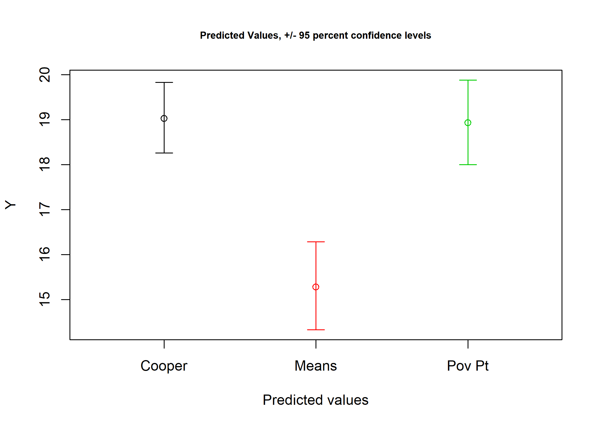
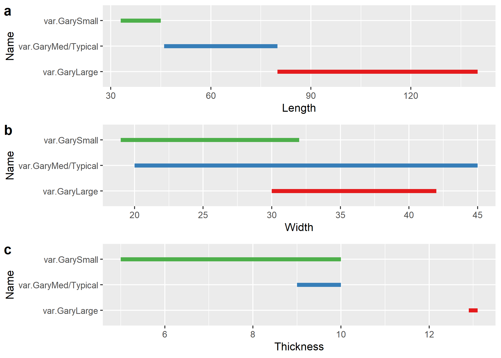

Pilot study of linear metrics for type-varieties of Gary dart points
================
Robert Z. Selden, Jr.
March 5, 2020

## The Gary type prior to formal definition by Suhm, Krieger, and Jelks (1954, 430–31, Plate 94)

Gary dart points were formally defined by Suhm, Krieger, and Jelks
(1954, 430–31, Plate 94), providing a description with defining
morphological characteristics for a projectile point known to
investigators working across the region, but by different names. The
earliest recorded Gary dart point was excavated on September 14, 1930 by
Frank Bryan (Aynesworth 1936, 76). The point was recovered from the
chest cavity, behind the sternum of a flexed burial eroding from a wall
in an active gravel pit—roughly two and one-half feet below the
surface—located around 14 miles from Waco, Texas on the East side of
the Brazos River in Texas (Aynesworth 1936, 76, 78–79, Plate XIV:6).
While discovered in association with the burial, this point may have
been included in the fill that was excavated when the burial was
interred. In the same burial, a Perdiz arrow point was found lodged in
the upper end of the right humerus (Aynesworth 1936, Plate XIV:4a, 4b,
5), and a small arrow point fragment was found lodged between the neck
and greater trochanter of the left femur (Aynesworth 1936, Plate XIV:3).

In Limestone County, Texas, (Bryan 1936, 83–84) found Gary points in the
Delia Area (sites 7, 8, 9, 10, 11, 18, 19, and 20), the Cooledge Area
(Bryan 1936, 85–86) (sites 1, 2, 3, 4, 5, and 6), the Tehuacana-Wortham
Area (Bryan 1936, 85, 87) (sites 3, 4, and 6), on Christmas Creek (Bryan
1936, 85, 90) (all sites; 1-6), the Frosa Area (Bryan 1936, 89–90)
(sites 1, 2, 4, and 5), the Ben Hur Area (Bryan 1936, 89, 94) (sites 1,
2, 3, and 6), and near Groesbeck and Thornton (Bryan 1936, 89, 91)
(sites 6 and 7). In Hill County, Texas, (Bryan 1936, 92, 95) also found
Gary points at sites 1, 3, and 4. Bryan (1936, 92, Plate XV) determined
that this point type was common enough across the various localities
that it was deserving of a name, dubbing them *Dead-Man Triangle
Points*, which would later be replaced by *Gary Contracting Stemmed*,
*Gary Stemmed* (Newell and Krieger 1949, 164–66), and finally, Gary
(Suhm, Krieger, and Jelks 1954, 430–31, Plate 94).

Ford, Quimby Jr., and Snow (1945, 35) refer to the Gary type that
articulates with the Tchefuncte period as Simple Haft 1A; however, that
type is first introduced in the analysis of the materials from the
Crooks site (Ford and Willey 1940, 97). In that volume, Gary points were
also assigned to Simple Haft 1C (Ford and Willey 1940, 97, Figures
45a-b, 46a-d), described as leaf-shaped with a stem that may be either
flat or convex, and Simple Haft 2A (Ford and Willey 1940, 99, Figures
45d, 46g-h), described as the narrowest of their Blade 2 group, which is
almost as thick as they are wide, with sloped shoulders, a pronounced
median ridge, and an ill-organised approach to secondary flaking. Ford
and Willey (1940, 99) describe Simple Haft 2B as identical in shape to
Simple Haft 2A, but with excellent primary and secondary flaking, no
similarities in execution, and a cross-section that is less than 5mm
thick. This is the only type at the Crooks site that was assigned based
upon execution alone. Simple Haft 2C (Ford and Willey 1940, 99, Figure
45f) displays thickening at the median, with a triangular blade, small
contracting stem, and broad, straight shoulders. This is the earliest
work that begins to expound upon the diversity of morphological
variation thought to occur within what would later become the Gary type.

Webb and DeJarnette (1942, 8–9) developed a hierarchically-nested
classification system for projectile points from the Pickwick Basin.
Within that system, the number *2* denoted a stemmed point, and *b* that
it contracted toward the base. It is noteworthy that the shape of the
projectile points was considered the dominant element in classification,
and comparison of each specimen with the type form was made by the same
individual throughout their multi-year study (Webb and DeJarnette 1942).
Many of the *2b* (and various other) projectile point types identified
during that study would now be considered Gary or Adena, depending upon
their temporal and contextual association.

In the winter of 1938, two Gary points were excavated from midden B, a
150 x 100 foot (long axis along northeast-southwest line) elongated-oval
shell midden, at the Tchefuncte site, located parallel to the shoreline
of Lake Pontchartrain (Louisiana) (Ford, Quimby Jr., and Snow 1945,
11–12, Figure 5). Ford, Quimby Jr., and Snow (1945, 35) refer to the
type as Simple Haft 1A, described earlier by Ford and Willey (1940, 97),
noting that blade shape is represented by a near-equilateral triangle,
straight shoulders, and the characteristic broad stem atop a convex
base. This point type was also found to occur in Marksville period sites
(Ford, Quimby Jr., and Snow 1945, 35). While Newell and Krieger (1949)
later considered five of the point types found by Ford et al. (1945,
Figure 8:D, H-K) to be Gary, that assignment is revised to include only
one type—represented by two projectiles (one illustrated) (Ford, Quimby
Jr., and Snow 1945, Figure 8:K)—based upon the initial (Suhm, Krieger,
and Jelks 1954, 430–31, Plate 94) and current formal definitions
(Turner, Hester, and McReynolds 2011, 107–8).

In his discussion of the assemblage from the Harrell site, Krieger
(1946, 115–17, Table 2, Figure 8p) includes *Gary Contracting Stem*
among those dart points that are very common in northeast Texas pottery
sites. All three of the *Gary Contracting Stem* specimens were noted to
have possibly come from Level II (Krieger 1946, Table 2).

Lewis and Kneberg (1947, 12–18) identified Gary dart points as the
Tapered Stem and Beaver Tail Stem types as Eva Focus traits not shared
by Lauderdale and Indian Knoll. Both types were noted to be rare or
alien (Lewis and Kneberg 1947). The Tapered Stem type was noted to be
ubiquitous but rare, and the Beaver Tail Stem type–noted to be a
specialised variant of the Tapered Stem (the earliest recorded Gary
variety)–was reported to rarely occur at most sites, but frequently at
two of the southernmost sites in the area (Lewis and Kneberg 1947). The
Tapered Stem *var. Beaver Tail Stem* was noted to be an Archaic or
Woodland type (Lewis and Kneberg 1947).

  - Ford (1951, 115, Figure 45)

  - Baerreis (1951)

  - Bell and Baerreis (1951, Plate 1 (8,22), Plate 3 (6), Plate 8 (8),
    Plate 9 (3,4), Plate 10 (1,4), Plate 11 (14), and Plate 13 (15))

  - Wheat (1953, 204–5, Plate 36)

### Gary type-varieties

Soon after the Gary type was formally defined, the type-varieties
followed. Like the Gary point itself, the previously-defined
type-varieties include substantial variation.

  - Ford, Phillips, and Haag (1955) at the Jaketown site (MS)
      - Gary Stemmed
      - Typical Gary Stemmed
      - Broad Gary Stemmed
      - Thin Gary Stemmed
      - Small Gary Stemmed
  - Ford and Webb (1956) at the Poverty Point site (LA)
      - Gary Large
      - Gary Typical
      - Gary Small
  - Johnson (1961) at the Yarbrough and Miller sites (TX)
      - var. Kaufman
      - var. Alsa
      - var. Hobson
      - var. Runge
      - var. Emory
      - var. Kemp
      - var. Panna Maria
      - var. Kenedy
      - var. Colfax
  - Phillips (1970) in the lower Yazoo Basin (MS)
      - var. Mabin
  - Schambach (1970) at the Cooper and Means sites (AR)
      - var. Gary
      - var. Malvern
      - var. LeFlore
      - var. Bodcaw
      - var. Manice
      - var. Camden
      - var. Camden subgroup A
      - var. Camden subgroup B
  - Shafer (1973) at the George C. Davis site (TX)
      - Group 1
      - Group 2
  - Shafer (1975) at Lake Conroe (TX)
      - ?
      - ?
  - Williams and Brain (1983) at the Lake George Site (MS)
      - var. Maybon
  - Densmore (2007) at the Scott site (OK)
      - Class A
      - Class B
      - Class C

### Discussions of manufacture and retouch in Gary dart points

In his study of the lithic assemblage from the Icy Eye site, Studer
(1982, 67–73, Figure 3) posited an archaic pebble core reduction
sequence. Unlike other areas where Gary dart points are produced, the
available raw materials from the area where Studer was working (east
Texas) were small (Studer 1982). Studer (1982, 71) posits that bipolar
flaking may have been used to reflect the percussion force otherwise
lost through movement, where anvil stones were used to hold the pebbles
stationary and localise percussion forces. The anvil stones recovered
from the Icy Eye site included U-shaped pits, which Studer (1982, 71)
believed to be suggestive of the bipolar technique used in flaking, or
splitting, rounded pebbles. He further reasons that “few angular or
worked pebbles were chipped on the anvils since such object pieces would
tend to cause V-shaped pits” (Studer 1982, 71).

  - Ensor and Carlson (1991, Figure 85)

  - Patterson (1996)

## Preliminaries

``` r
# install required analysis packages
#devtools::install_github("rich-iannone/DiagrammeR")
#devtools::install_github("vqv/ggbiplot")
#devtools::install_github("mlcollyer/RRPP")
#devtools::install_github("tidyverse/ggplot2")
#devtools::install_github("kassambara/ggpubr")
#devtools::install_github('sinhrks/ggfortify')
# load libraries
library(DiagrammeR)
library(ggbiplot)
```

    ## Loading required package: ggplot2

    ## Loading required package: plyr

    ## Loading required package: scales

    ## Loading required package: grid

``` r
library(RRPP)
library(ggplot2)
library(ggpubr)
```

    ## Loading required package: magrittr

    ## 
    ## Attaching package: 'ggpubr'

    ## The following object is masked from 'package:plyr':
    ## 
    ##     mutate

``` r
library(ggfortify)
```

    ## 
    ## Attaching package: 'ggfortify'

    ## The following object is masked from 'package:ggbiplot':
    ## 
    ##     ggbiplot

``` r
library(cluster)
```

### Set working directory, load data, and define variables

``` r
# set working directory
setwd(getwd())
data<-read.csv("garymorphlm.csv",header = TRUE, as.is=TRUE)
# define variables
maxl<-data$maxl # maximum length
maxw<-data$maxw # maximum width
maxth<-data$maxth # maximum thickness
maxstl<-data$maxstl # maximum stem length
maxstw<-data$maxstw # maximum stem width
site<-data$site # site name
```

## Theoretical underpinnings

### Calculate dart-arrow index (Hildebrandt and King 2012)

Others have noted the gradual diminution in the size of Gary dart points
through time (Baerreis 1951; Ford and Webb 1956; Schambach 1998;
Densmore 2007), thus it was necessary to begin by asking whether the
size of those points aggregated for this study may fall below the
arbitrary 11.8 mm dart-arrow index (DAI) threshold posited by
Hildebrandt and King (2012). The temporal span associated with
morphologically-diagnostic Gary dart points is thought to transcend the
cultural shift in subsistence practices from hunter-gatherer to emergent
horticulturalist, and overlaps temporally with the advent and
flourescence of the bow and arrow.

Stem width (neck width) and thickness are among those variables included
in this study, and can be used to identify whether Gary dart points may
transcend the threshold between dart and arrow points (Hildebrandt and
King 2012). The dart-arrow index was calculated for all specimens of
Gary dart points used in this study, and none fall below the dart-arrow
threshold posited by Hildebrandt and King (2012). It is noteworthy that
others (Erlandson, Watts, and Jew 2014) have found that the DAI may not
be universally applicable; however, the DAI and the threshold identified
by Hildebrandt and King (2012) is a useful heuristic in this instance.

``` r
# calculate dart-arrow index (max stem width + max thickness)
dai<-maxstw + maxth
dai
```

    ##   [1] 44.05 42.17 27.59 40.47 37.55 36.55 38.94 34.81 37.01 39.62 37.32 32.32
    ##  [13] 33.60 27.26 28.58 25.96 28.76 28.00 32.85 36.73 38.55 29.36 39.01 34.68
    ##  [25] 28.28 24.73 25.19 28.01 23.81 24.53 20.59 25.92 27.12 19.16 26.42 26.33
    ##  [37] 17.70 20.52 18.93 20.13 25.12 33.19 36.56 28.00 36.08 34.01 30.26 31.36
    ##  [49] 33.92 27.97 30.39 29.38 27.30 34.16 25.09 31.20 36.02 32.25 28.93 28.57
    ##  [61] 32.01 32.01 33.70 29.51 26.08 27.44 29.76 29.11 22.56 30.09 32.71 26.92
    ##  [73] 36.95 30.71 28.86 31.34 32.64 24.83 24.91 25.12 33.19 28.90 27.95 30.12
    ##  [85] 26.73 36.43 26.12 26.82 24.17 34.50 24.62 26.67 24.55 25.28 23.80 25.68
    ##  [97] 17.75 22.13 22.20 17.18 19.21 31.06 23.25 32.00 26.78 30.83 26.06 19.27
    ## [109] 28.60 25.81 23.21 23.94 21.07 29.02 23.43 26.58 29.73 21.93 24.00 30.50
    ## [121] 21.16 27.67 22.66 22.63 25.43 31.09 23.35 20.78 30.33 18.84 22.17 20.92
    ## [133] 22.19 17.17 21.99 23.43 26.36 23.38 29.81 27.64 24.08 17.44 22.68 19.89
    ## [145] 20.02 22.79 20.43 25.73 46.83 25.94 24.07 30.82 26.90 25.01 25.98 30.96
    ## [157] 29.12 21.29 28.55 22.89 26.21 23.41 24.73 32.80 31.24 23.55 29.19 28.39
    ## [169] 20.61 22.45 22.29 22.95 21.20 27.51 25.89 23.28 26.19 24.47 21.45 25.22
    ## [181] 29.24 33.74 27.45 23.18 24.54 27.87 29.92 37.59 26.06 23.98 29.23 26.32
    ## [193] 23.76 23.20 21.15 24.98 19.68 30.92 32.30 22.82 23.99 21.36 20.39 24.75
    ## [205] 20.64 26.46 30.38 19.16 27.81 25.46 16.74 24.78

``` r
# how many observations fall at or below 11.8 mm
arrow<-sum(data$dai <= 11.8)
arrow
```

    ## [1] 0

### Krieger’s (1944, Figure 25) typological concept and the Gary dart point

> …the purpose of a type in archaeology must be to provide an
> organizational tool which will enable the investigator to group
> specimens into bodies which have *demonstrable historical meaning in
> terms of behavior patterns*. Any group which may be labeled a ‘type’
> must embrace material which can be shown to consist of individual
> variations in the execution of a definite constructional idea;
> likewise, the dividing lines between a series of types must be based
> upon demonstrable historical factors, not, as is often the case, upon
> the inclinations of the analyst or the niceties of descriptive
> orderliness. (Krieger 1944, 272)

``` r
#grViz("
#  digraph{
#    node[shape = rectangle
#         fontname = lato
#         penwidth = 0.2]
#    Material; Pattern1; Pattern2; Pattern3; 1; 2; 3; 4
#    
#    node[shape = doublecircle]
#    A; B; C; D; E; F; G
#    
#    node[shape = diamond
#         style = filled
#         fillcolor = grey]
#    x
#    
#    edge[fontname = lato
#         penwidth = 0.2]
#    Material->Pattern1; Material->Pattern2; Material->Pattern3;
#    Pattern2->A; Pattern2->B; Pattern2->C; Pattern2->D; 
#    Pattern2->E; Pattern2->F; Pattern2->G; A->1; C->1; F->1; B->2;
#    D->3; E->3; G->4; x->4
#    
#    graph[nodesep = 0.8]
#  }
#")
knitr::include_graphics('krieger.png')
```


``` r
fig.cap = "Step 1: sorting into working patterns of distinct structural plan. Step 2: sorting into detailed working groups each consistently combining features in but one way. Step 3: recombining working groups into tentative types on basis of comparative distributions and associations of working groups. Step 4: consolidation of types through further testing for consistency in form and variation. Step 5: description and illustration of types with full range of variation. Step 6: a - determination of series of linked types, b - determination of material-culture complexes, and c - determination of type relationships in related cultures."
```

## Linear metrics of Gary dart points by *site*

### Boxplots for *variable* by *site*

``` r
# boxplot of maximum length ~ site
sitemaxl<-ggplot(data,aes(x=Site,y=maxl,color=Site)) + geom_boxplot(notch = TRUE) +
  geom_dotplot(binaxis = 'y',stackdir = 'center',dotsize = 0.3) +
  scale_color_brewer(palette = "Set1") +
  theme(legend.position = "none")
# boxplot of maximum width ~ site
sitemaxw<-ggplot(data,aes(x=Site,y=maxw,color=Site)) + geom_boxplot(notch = TRUE) +
  geom_dotplot(binaxis = 'y',stackdir = 'center',dotsize = 0.3) +
  scale_color_brewer(palette = "Set1") +
  theme(legend.position = "none")
# boxplot of maximum thickness ~ site
sitemaxth<-ggplot(data,aes(x=Site,y=maxth,color=Site)) + geom_boxplot(notch = TRUE) +
  geom_dotplot(binaxis = 'y',stackdir = 'center',dotsize = 0.3) +
  scale_color_brewer(palette = "Set1") +
  theme(legend.position = "none")
# boxplot of stem length ~ site
sitemaxstl<-ggplot(data,aes(x=Site,y=maxstl,color=Site)) + geom_boxplot(notch = TRUE) +
  geom_dotplot(binaxis = 'y',stackdir = 'center',dotsize = 0.3) +
  scale_color_brewer(palette = "Set1") +
  theme(legend.position = "none")
# boxplot of stem width ~ site
sitemaxstw<-ggplot(data,aes(x=Site,y=maxstw,color=Site)) + geom_boxplot(notch = TRUE) +
  geom_dotplot(binaxis = 'y',stackdir = 'center',dotsize = 0.3) +
  scale_color_brewer(palette = "Set1") +
  theme(legend.position = "none")
# render figure
sitefigure<-ggarrange(sitemaxl,sitemaxw,sitemaxth,sitemaxstl,sitemaxstw,
                  labels = c("a","b","c","d","e"),
                  ncol = 3, nrow = 2)
```

    ## `stat_bindot()` using `bins = 30`. Pick better value with `binwidth`.
    ## `stat_bindot()` using `bins = 30`. Pick better value with `binwidth`.
    ## `stat_bindot()` using `bins = 30`. Pick better value with `binwidth`.
    ## `stat_bindot()` using `bins = 30`. Pick better value with `binwidth`.
    ## `stat_bindot()` using `bins = 30`. Pick better value with `binwidth`.

``` r
sitefigure
```


``` r
fig.cap = "Boxplots for maximum length, width, thickness, stem length, and stem width for Gary dart points from the Cooper, Means, and Poverty Point sites used in this study."
```

### Principal Components Analysis for *site*

``` r
#pca
df<-data[c(2:6)]
sitepca<-autoplot(prcomp(df),data = data, colour = 'Site',
         loadings = TRUE, loadings.colour = 'blue',
         loadings.label = TRUE,loadings.label.size = 3, 
         frame = TRUE)
#render figure
sitepca
```


``` r
fig.cap = "PCA by site."
```

### Analyses of Variance (ANOVA) for *variable* \~ *site*

#### *Maximum length* of Gary points

``` r
# anova = maximum length ~ site
siteml<-lm.rrpp(maxl ~ Site, SS.type = "I",data = data,iter = 9999,print.progress = FALSE)
anova(siteml)
```

    ## 
    ## Analysis of Variance, using Residual Randomization
    ## Permutation procedure: Randomization of null model residuals 
    ## Number of permutations: 10000 
    ## Estimation method: Ordinary Least Squares 
    ## Sums of Squares and Cross-products: Type I 
    ## Effect sizes (Z) based on F distributions
    ## 
    ##            Df      SS     MS     Rsq      F      Z Pr(>F)   
    ## Site        2  1654.9 827.46 0.05936 6.5946 1.9163 0.0016 **
    ## Residuals 209 26224.4 125.48 0.94064                        
    ## Total     211 27879.3                                       
    ## ---
    ## Signif. codes:  0 '***' 0.001 '**' 0.01 '*' 0.05 '.' 0.1 ' ' 1
    ## 
    ## Call: lm.rrpp(f1 = maxl ~ Site, iter = 9999, SS.type = "I", data = data,  
    ##     print.progress = FALSE)

``` r
# visualise model predictions for maximum length ~ site
siteDF<-data.frame(Site = c("Cooper","Means","Pov Pt"))
rownames(siteDF)<-c("Cooper","Means","Pov Pt")
sitePreds<-predict(siteml,siteDF)
sitePreds
```

    ## 
    ## Linear Model fit with lm.rrpp
    ## 
    ## Number of predictions: 3
    ## Confidence level: 95 %
    ## Number of bootstrap permutations: 10000
    ## 
    ## Predicted values:
    ## 
    ##            [,1]
    ## Cooper 55.66802
    ## Means  49.34659
    ## Pov Pt 55.51596
    ## 
    ## 
    ##  95 % Lower confidence limits:
    ## 
    ##            [,1]
    ## Cooper 53.43557
    ## Means  46.60283
    ## Pov Pt 52.94292
    ## 
    ## 
    ##  95 % Upper confidence limits:
    ## 
    ##            [,1]
    ## Cooper 58.06382
    ## Means  52.33529
    ## Pov Pt 58.30469

``` r
plot(sitePreds, col = 1:NROW(siteDF))
```


``` r
# pairwise comparison of LS means = which sites differ?
site.pwml<-pairwise(siteml, groups = data$Site)
summary(site.pwml, confidence = 0.95, test.type = "dist")
```

    ## 
    ## Pairwise comparisons
    ## 
    ## Groups: Cooper Means Pov Pt 
    ## 
    ## RRPP: 10000 permutations
    ## 
    ## LS means:
    ## Vectors hidden (use show.vectors = TRUE to view)
    ## 
    ## Pairwise distances between means, plus statistics
    ##                       d UCL (95%)         Z Pr > d
    ## Cooper:Means  6.3331418  3.809629  4.101566 0.0009
    ## Cooper:Pov Pt 0.1628993  3.758190 -1.182297 0.9325
    ## Means:Pov Pt  6.1702425  4.056173  3.598731 0.0031

``` r
# correlation between mean vectors (angles in degrees)
summary(site.pwml, confidence = 0.95, test.type = "VC", angle.type = "deg")
```

    ## 
    ## Pairwise comparisons
    ## 
    ## Groups: Cooper Means Pov Pt 
    ## 
    ## RRPP: 10000 permutations
    ## 
    ## LS means:
    ## Vectors hidden (use show.vectors = TRUE to view)
    ## 
    ## Pairwise statistics based on mean vector correlations
    ##               r angle    UCL (95%)          Z Pr > angle
    ## Cooper:Means  1     0 8.537736e-07 -0.7534410    0.68380
    ## Cooper:Pov Pt 1     0 8.537736e-07 -0.7466076    0.68185
    ## Means:Pov Pt  1     0 8.537736e-07 -0.7471839    0.68175

``` r
# pairwise distances between variances = standardization?
summary(site.pwml, confidence = 0.95, test.type = "var")
```

    ## 
    ## Pairwise comparisons
    ## 
    ## Groups: Cooper Means Pov Pt 
    ## 
    ## RRPP: 10000 permutations
    ## 
    ## 
    ## Observed variances by group
    ## 
    ##    Cooper     Means    Pov Pt 
    ## 180.31774  70.02501  92.72468 
    ## 
    ## Pairwise distances between variances, plus statistics
    ##                       d UCL (95%)          Z Pr > d
    ## Cooper:Means  110.29274  89.95999  2.5314078 0.0105
    ## Cooper:Pov Pt  87.59306  86.51680  1.8172398 0.0458
    ## Means:Pov Pt   22.69968  98.39164 -0.7253515 0.7063

#### *Maximum width* of Gary points

``` r
# anova = maximum width ~ site
sitemw<-lm.rrpp(maxw ~ Site, SS.type = "I",data = data,iter = 9999,print.progress = FALSE)
anova(sitemw)
```

    ## 
    ## Analysis of Variance, using Residual Randomization
    ## Permutation procedure: Randomization of null model residuals 
    ## Number of permutations: 10000 
    ## Estimation method: Ordinary Least Squares 
    ## Sums of Squares and Cross-products: Type I 
    ## Effect sizes (Z) based on F distributions
    ## 
    ##            Df     SS     MS     Rsq      F      Z Pr(>F)    
    ## Site        2 1499.0 749.49 0.18081 23.064 2.9037  1e-04 ***
    ## Residuals 209 6791.6  32.50 0.81919                         
    ## Total     211 8290.6                                        
    ## ---
    ## Signif. codes:  0 '***' 0.001 '**' 0.01 '*' 0.05 '.' 0.1 ' ' 1
    ## 
    ## Call: lm.rrpp(f1 = maxw ~ Site, iter = 9999, SS.type = "I", data = data,  
    ##     print.progress = FALSE)

``` r
# visualise model predictions for maximum width ~ site
sitePreds<-predict(sitemw,siteDF)
sitePreds
```

    ## 
    ## Linear Model fit with lm.rrpp
    ## 
    ## Number of predictions: 3
    ## Confidence level: 95 %
    ## Number of bootstrap permutations: 10000
    ## 
    ## Predicted values:
    ## 
    ##            [,1]
    ## Cooper 28.19463
    ## Means  22.14619
    ## Pov Pt 27.99865
    ## 
    ## 
    ##  95 % Lower confidence limits:
    ## 
    ##            [,1]
    ## Cooper 27.05420
    ## Means  20.74502
    ## Pov Pt 26.66990
    ## 
    ## 
    ##  95 % Upper confidence limits:
    ## 
    ##            [,1]
    ## Cooper 29.40618
    ## Means  23.68212
    ## Pov Pt 29.41974

``` r
plot(sitePreds, col = 1:NROW(siteDF))
```


``` r
# pairwise comparison = which sites differ?
site.pwmw<-pairwise(siteml, groups = data$Site)
summary(site.pwmw, confidence = 0.95, test.type = "dist")
```

    ## 
    ## Pairwise comparisons
    ## 
    ## Groups: Cooper Means Pov Pt 
    ## 
    ## RRPP: 10000 permutations
    ## 
    ## LS means:
    ## Vectors hidden (use show.vectors = TRUE to view)
    ## 
    ## Pairwise distances between means, plus statistics
    ##                       d UCL (95%)         Z Pr > d
    ## Cooper:Means  6.3331418  3.809629  4.101566 0.0009
    ## Cooper:Pov Pt 0.1628993  3.758190 -1.182297 0.9325
    ## Means:Pov Pt  6.1702425  4.056173  3.598731 0.0031

``` r
# correlation between mean vectors (angles in degrees)
summary(site.pwmw, confidence = 0.95, test.type = "VC", angle.type = "deg")
```

    ## 
    ## Pairwise comparisons
    ## 
    ## Groups: Cooper Means Pov Pt 
    ## 
    ## RRPP: 10000 permutations
    ## 
    ## LS means:
    ## Vectors hidden (use show.vectors = TRUE to view)
    ## 
    ## Pairwise statistics based on mean vector correlations
    ##               r angle    UCL (95%)          Z Pr > angle
    ## Cooper:Means  1     0 8.537736e-07 -0.7534410    0.68380
    ## Cooper:Pov Pt 1     0 8.537736e-07 -0.7466076    0.68185
    ## Means:Pov Pt  1     0 8.537736e-07 -0.7471839    0.68175

``` r
# pairwise distances between variances = standardization?
summary(site.pwmw, confidence = 0.95, test.type = "var")
```

    ## 
    ## Pairwise comparisons
    ## 
    ## Groups: Cooper Means Pov Pt 
    ## 
    ## RRPP: 10000 permutations
    ## 
    ## 
    ## Observed variances by group
    ## 
    ##    Cooper     Means    Pov Pt 
    ## 180.31774  70.02501  92.72468 
    ## 
    ## Pairwise distances between variances, plus statistics
    ##                       d UCL (95%)          Z Pr > d
    ## Cooper:Means  110.29274  89.95999  2.5314078 0.0105
    ## Cooper:Pov Pt  87.59306  86.51680  1.8172398 0.0458
    ## Means:Pov Pt   22.69968  98.39164 -0.7253515 0.7063

#### *Maximum thickness* of Gary points

``` r
# anova = maximum thickness ~ site
sitemth<-lm.rrpp(maxth ~ Site, SS.type = "I",data = data,iter = 9999,print.progress = FALSE)
anova(sitemth)
```

    ## 
    ## Analysis of Variance, using Residual Randomization
    ## Permutation procedure: Randomization of null model residuals 
    ## Number of permutations: 10000 
    ## Estimation method: Ordinary Least Squares 
    ## Sums of Squares and Cross-products: Type I 
    ## Effect sizes (Z) based on F distributions
    ## 
    ##            Df      SS     MS     Rsq      F      Z Pr(>F)    
    ## Site        2  153.07 76.533 0.15023 18.475 2.7012  1e-04 ***
    ## Residuals 209  865.80  4.143 0.84977                         
    ## Total     211 1018.87                                        
    ## ---
    ## Signif. codes:  0 '***' 0.001 '**' 0.01 '*' 0.05 '.' 0.1 ' ' 1
    ## 
    ## Call: lm.rrpp(f1 = maxth ~ Site, iter = 9999, SS.type = "I", data = data,  
    ##     print.progress = FALSE)

``` r
# visualise model predictions for maximum thickness ~ site
sitePreds<-predict(sitemth,siteDF)
sitePreds
```

    ## 
    ## Linear Model fit with lm.rrpp
    ## 
    ## Number of predictions: 3
    ## Confidence level: 95 %
    ## Number of bootstrap permutations: 10000
    ## 
    ## Predicted values:
    ## 
    ##             [,1]
    ## Cooper  9.071005
    ## Means   8.217397
    ## Pov Pt 10.424915
    ## 
    ## 
    ##  95 % Lower confidence limits:
    ## 
    ##            [,1]
    ## Cooper 8.672467
    ## Means  7.722370
    ## Pov Pt 9.951151
    ## 
    ## 
    ##  95 % Upper confidence limits:
    ## 
    ##             [,1]
    ## Cooper  9.506225
    ## Means   8.742981
    ## Pov Pt 10.934948

``` r
plot(sitePreds, col = 1:NROW(siteDF))
```


``` r
# pairwise comparison = which sites differ?
site.pwmth<-pairwise(siteml, groups = data$Site)
summary(site.pwmth, confidence = 0.95, test.type = "dist")
```

    ## 
    ## Pairwise comparisons
    ## 
    ## Groups: Cooper Means Pov Pt 
    ## 
    ## RRPP: 10000 permutations
    ## 
    ## LS means:
    ## Vectors hidden (use show.vectors = TRUE to view)
    ## 
    ## Pairwise distances between means, plus statistics
    ##                       d UCL (95%)         Z Pr > d
    ## Cooper:Means  6.3331418  3.809629  4.101566 0.0009
    ## Cooper:Pov Pt 0.1628993  3.758190 -1.182297 0.9325
    ## Means:Pov Pt  6.1702425  4.056173  3.598731 0.0031

``` r
# correlation between mean vectors (angles in degrees)
summary(site.pwmth, confidence = 0.95, test.type = "VC", angle.type = "deg")
```

    ## 
    ## Pairwise comparisons
    ## 
    ## Groups: Cooper Means Pov Pt 
    ## 
    ## RRPP: 10000 permutations
    ## 
    ## LS means:
    ## Vectors hidden (use show.vectors = TRUE to view)
    ## 
    ## Pairwise statistics based on mean vector correlations
    ##               r angle    UCL (95%)          Z Pr > angle
    ## Cooper:Means  1     0 8.537736e-07 -0.7534410    0.68380
    ## Cooper:Pov Pt 1     0 8.537736e-07 -0.7466076    0.68185
    ## Means:Pov Pt  1     0 8.537736e-07 -0.7471839    0.68175

``` r
# pairwise distances between variances = standardization?
summary(site.pwmth, confidence = 0.95, test.type = "var")
```

    ## 
    ## Pairwise comparisons
    ## 
    ## Groups: Cooper Means Pov Pt 
    ## 
    ## RRPP: 10000 permutations
    ## 
    ## 
    ## Observed variances by group
    ## 
    ##    Cooper     Means    Pov Pt 
    ## 180.31774  70.02501  92.72468 
    ## 
    ## Pairwise distances between variances, plus statistics
    ##                       d UCL (95%)          Z Pr > d
    ## Cooper:Means  110.29274  89.95999  2.5314078 0.0105
    ## Cooper:Pov Pt  87.59306  86.51680  1.8172398 0.0458
    ## Means:Pov Pt   22.69968  98.39164 -0.7253515 0.7063

#### *Maximum stem length* of Gary points

``` r
# anova = maximum stem length ~ site
sitemstl<-lm.rrpp(maxstl ~ Site, SS.type = "I",data = data,iter = 9999,print.progress = FALSE)
anova(sitemstl)
```

    ## 
    ## Analysis of Variance, using Residual Randomization
    ## Permutation procedure: Randomization of null model residuals 
    ## Number of permutations: 10000 
    ## Estimation method: Ordinary Least Squares 
    ## Sums of Squares and Cross-products: Type I 
    ## Effect sizes (Z) based on F distributions
    ## 
    ##            Df     SS      MS     Rsq      F     Z Pr(>F)    
    ## Site        2  417.9 208.963 0.12494 14.921 2.528  1e-04 ***
    ## Residuals 209 2927.1  14.005 0.87506                        
    ## Total     211 3345.0                                        
    ## ---
    ## Signif. codes:  0 '***' 0.001 '**' 0.01 '*' 0.05 '.' 0.1 ' ' 1
    ## 
    ## Call: lm.rrpp(f1 = maxstl ~ Site, iter = 9999, SS.type = "I", data = data,  
    ##     print.progress = FALSE)

``` r
# visualise model predictions for maximum stem length ~ site
sitePreds<-predict(sitemstl,siteDF)
sitePreds
```

    ## 
    ## Linear Model fit with lm.rrpp
    ## 
    ## Number of predictions: 3
    ## Confidence level: 95 %
    ## Number of bootstrap permutations: 10000
    ## 
    ## Predicted values:
    ## 
    ##            [,1]
    ## Cooper 15.40778
    ## Means  12.65600
    ## Pov Pt 16.16529
    ## 
    ## 
    ##  95 % Lower confidence limits:
    ## 
    ##            [,1]
    ## Cooper 14.63914
    ## Means  11.72810
    ## Pov Pt 15.26332
    ## 
    ## 
    ##  95 % Upper confidence limits:
    ## 
    ##            [,1]
    ## Cooper 16.18544
    ## Means  13.61653
    ## Pov Pt 17.09292

``` r
plot(sitePreds, col = 1:NROW(siteDF))
```


``` r
# pairwise comparison = which sites differ?
site.pwmstl<-pairwise(siteml, groups = data$Site)
summary(site.pwmstl, confidence = 0.95, test.type = "dist")
```

    ## 
    ## Pairwise comparisons
    ## 
    ## Groups: Cooper Means Pov Pt 
    ## 
    ## RRPP: 10000 permutations
    ## 
    ## LS means:
    ## Vectors hidden (use show.vectors = TRUE to view)
    ## 
    ## Pairwise distances between means, plus statistics
    ##                       d UCL (95%)         Z Pr > d
    ## Cooper:Means  6.3331418  3.809629  4.101566 0.0009
    ## Cooper:Pov Pt 0.1628993  3.758190 -1.182297 0.9325
    ## Means:Pov Pt  6.1702425  4.056173  3.598731 0.0031

``` r
# correlation between mean vectors (angles in degrees)
summary(site.pwmstl, confidence = 0.95, test.type = "VC", angle.type = "deg")
```

    ## 
    ## Pairwise comparisons
    ## 
    ## Groups: Cooper Means Pov Pt 
    ## 
    ## RRPP: 10000 permutations
    ## 
    ## LS means:
    ## Vectors hidden (use show.vectors = TRUE to view)
    ## 
    ## Pairwise statistics based on mean vector correlations
    ##               r angle    UCL (95%)          Z Pr > angle
    ## Cooper:Means  1     0 8.537736e-07 -0.7534410    0.68380
    ## Cooper:Pov Pt 1     0 8.537736e-07 -0.7466076    0.68185
    ## Means:Pov Pt  1     0 8.537736e-07 -0.7471839    0.68175

``` r
# pairwise distances between variances = standardization?
summary(site.pwmstl, confidence = 0.95, test.type = "var")
```

    ## 
    ## Pairwise comparisons
    ## 
    ## Groups: Cooper Means Pov Pt 
    ## 
    ## RRPP: 10000 permutations
    ## 
    ## 
    ## Observed variances by group
    ## 
    ##    Cooper     Means    Pov Pt 
    ## 180.31774  70.02501  92.72468 
    ## 
    ## Pairwise distances between variances, plus statistics
    ##                       d UCL (95%)          Z Pr > d
    ## Cooper:Means  110.29274  89.95999  2.5314078 0.0105
    ## Cooper:Pov Pt  87.59306  86.51680  1.8172398 0.0458
    ## Means:Pov Pt   22.69968  98.39164 -0.7253515 0.7063

#### *Maximum stem width* of Gary points

``` r
# anova = maximum stem width ~ site
sitemstw<-lm.rrpp(maxstw ~ Site, SS.type = "I",data = data,iter = 9999,print.progress = FALSE)
anova(sitemstw)
```

    ## 
    ## Analysis of Variance, using Residual Randomization
    ## Permutation procedure: Randomization of null model residuals 
    ## Number of permutations: 10000 
    ## Estimation method: Ordinary Least Squares 
    ## Sums of Squares and Cross-products: Type I 
    ## Effect sizes (Z) based on F distributions
    ## 
    ##            Df     SS      MS     Rsq      F      Z Pr(>F)    
    ## Site        2  581.8 290.876 0.15969 19.859 2.7559  1e-04 ***
    ## Residuals 209 3061.3  14.647 0.84031                         
    ## Total     211 3643.0                                         
    ## ---
    ## Signif. codes:  0 '***' 0.001 '**' 0.01 '*' 0.05 '.' 0.1 ' ' 1
    ## 
    ## Call: lm.rrpp(f1 = maxstw ~ Site, iter = 9999, SS.type = "I", data = data,  
    ##     print.progress = FALSE)

``` r
# visualise model predictions for maximum stem width ~ site
sitePreds<-predict(sitemstw,siteDF)
sitePreds
```

    ## 
    ## Linear Model fit with lm.rrpp
    ## 
    ## Number of predictions: 3
    ## Confidence level: 95 %
    ## Number of bootstrap permutations: 10000
    ## 
    ## Predicted values:
    ## 
    ##            [,1]
    ## Cooper 19.02725
    ## Means  15.27599
    ## Pov Pt 18.92958
    ## 
    ## 
    ##  95 % Lower confidence limits:
    ## 
    ##            [,1]
    ## Cooper 18.25986
    ## Means  14.32546
    ## Pov Pt 17.99992
    ## 
    ## 
    ##  95 % Upper confidence limits:
    ## 
    ##            [,1]
    ## Cooper 19.83091
    ## Means  16.28214
    ## Pov Pt 19.88260

``` r
plot(sitePreds, col = 1:NROW(siteDF))
```



``` r
# pairwise comparison = which sites differ?
site.pwmstw<-pairwise(siteml, groups = data$Site)
summary(site.pwmstw, confidence = 0.95, test.type = "dist")
```

    ## 
    ## Pairwise comparisons
    ## 
    ## Groups: Cooper Means Pov Pt 
    ## 
    ## RRPP: 10000 permutations
    ## 
    ## LS means:
    ## Vectors hidden (use show.vectors = TRUE to view)
    ## 
    ## Pairwise distances between means, plus statistics
    ##                       d UCL (95%)         Z Pr > d
    ## Cooper:Means  6.3331418  3.809629  4.101566 0.0009
    ## Cooper:Pov Pt 0.1628993  3.758190 -1.182297 0.9325
    ## Means:Pov Pt  6.1702425  4.056173  3.598731 0.0031

``` r
# correlation between mean vectors (angles in degrees)
summary(site.pwmstw, confidence = 0.95, test.type = "VC", angle.type = "deg")
```

    ## 
    ## Pairwise comparisons
    ## 
    ## Groups: Cooper Means Pov Pt 
    ## 
    ## RRPP: 10000 permutations
    ## 
    ## LS means:
    ## Vectors hidden (use show.vectors = TRUE to view)
    ## 
    ## Pairwise statistics based on mean vector correlations
    ##               r angle    UCL (95%)          Z Pr > angle
    ## Cooper:Means  1     0 8.537736e-07 -0.7534410    0.68380
    ## Cooper:Pov Pt 1     0 8.537736e-07 -0.7466076    0.68185
    ## Means:Pov Pt  1     0 8.537736e-07 -0.7471839    0.68175

``` r
# pairwise distances between variances = standardization?
summary(site.pwmstw, confidence = 0.95, test.type = "var")
```

    ## 
    ## Pairwise comparisons
    ## 
    ## Groups: Cooper Means Pov Pt 
    ## 
    ## RRPP: 10000 permutations
    ## 
    ## 
    ## Observed variances by group
    ## 
    ##    Cooper     Means    Pov Pt 
    ## 180.31774  70.02501  92.72468 
    ## 
    ## Pairwise distances between variances, plus statistics
    ##                       d UCL (95%)          Z Pr > d
    ## Cooper:Means  110.29274  89.95999  2.5314078 0.0105
    ## Cooper:Pov Pt  87.59306  86.51680  1.8172398 0.0458
    ## Means:Pov Pt   22.69968  98.39164 -0.7253515 0.7063

## Toward a replicable method of reconstructing Gary type-varieties

Reconstructing and expanding the type-varieties of Gary dart points
proposed at Poverty Point, Cooper, and Means. This step was necessary,
as the type-variety assignments for each specimen were not reported, and
were not preserved on the associated paperwork when the collections were
curated. Additionally, the collection of Gary dart points at Poverty
Point has increased, and this method provides a replicable means of
assigning each new specimen to the previously-established
type-varieties.

## Gary varieties proposed by Ford and Webb (1956)

The `tv1` argument used within this and the subsequent section
articulates with three variants of the Gary type that include *Large*,
*Medium/Typical*, and *Small*, which were assigned using those
morphological criteria first advanced by Ford, Phillips, and Haag (1955)
at the Jaketown site, and later refined by Ford and Webb (1956) at
Poverty Point.

Each of the three type-varieties proposed by Ford and Webb (1956) was
based upon a suite of morphological criteria that can be systematically
replicated, and a function was used to assign each of the Gary points to
the correct type-variety. Gary type varieties range between 80 and 140
mm in maxl, and between 30 and 42 mm in maxw for *Gary Large*; between
46 to 79 mm in maxl, and between 20 and 45 mm in maxw for *Gary
Medium/Typical*; and between 33 to 45 mm in maxl, 19 to 32 mm in maxw,
and five to 10 mm in maxth for *Gary Small* (Ford and Webb 1956).

``` r
# Ford and Webb (1956)
fwebbl<-data.frame(Name=c('var.GaryLarge','var.GaryMed/Typical','var.GarySmall'),
           Length=c(80,46,33), # in mm
           end=c(140,80,45) # in mm
)
fwebblength<-ggplot(fwebbl,aes(x=Length,xend=end,y=Name,yend=Name,color=Name)) +
  geom_segment(size=2) +
  scale_color_brewer(palette = "Set1") +
  theme(legend.position = "none")
fwebbw<-data.frame(Name=c('var.GaryLarge','var.GaryMed/Typical','var.GarySmall'),
           Width=c(30,20,19), # in mm
           end=c(42,45,32) # in mm
)
fwebbwidth<-ggplot(fwebbw,aes(x=Width,xend=end,y=Name,yend=Name,color=Name)) +
  geom_segment(size=2) +
  scale_color_brewer(palette = "Set1") +
  theme(legend.position = "none")
# thickness values were not precisely reported for GaryLarge and GaryTypical, and are included here for reference only
fwebbth<-data.frame(Name=c('var.GaryLarge','var.GaryMed/Typical','var.GarySmall'),
           Thickness=c(12.9,9,5), # in mm (actual thickness of var. GaryLarge is 13. Plotted as 12.9-13.1 so that it shows on chart)
           end=c(13.1,10,10) # in mm
)
fwebbthickness<-ggplot(fwebbth,aes(x=Thickness,xend=end,y=Name,yend=Name,color=Name)) +
  geom_segment(size=2) +
  scale_color_brewer(palette = "Set1") +
  theme(legend.position = "none")
# render figure
fwebbfig<-ggarrange(fwebblength,fwebbwidth,fwebbthickness,
                  labels = c("a","b","c"),
                  ncol = 1, nrow = 3)
fwebbfig
```



``` r
fig.cap = "Gantt charts illustrating the range of linear measurements for each type-variety reported by Ford and Webb (1956)."
```

### Assign Gary type-varieties proposed by Ford and Webb (1956)

Ford and Webb (1956) used a single metric (maximum length) to assign
Gary varieties at the Poverty Point site. The approach empoyed here
enlists all of Ford and Webb’s (1956) reported metrics, including
maximum length and maximum width for all varieties, coupled with maximum
thickness for *Gary Small*. No metrics were reported for *Gary Long*,
which was omitted from this analysis. Those points that do not match
with one of the three criteria were assigned as unidentified (“UID”),
and should be considered as Gary with no type-variety assignment.

``` r
# assign varieties based upon reported metrics in Ford and Webb [1956]
lcheck1 <- data$maxl >= 80 & data$maxl <= 140
lcheck2 <- data$maxl >= 46 & data$maxl < 80
lcheck3 <- data$maxl >= 33 & data$maxl < 46

data$tv1 <- "UID" # = Gary points (no variety)
data$tv1 <- ifelse(lcheck1, "L", data$tv1)
data$tv1 <- ifelse(lcheck2, "M/T", data$tv1)
data$tv1 <- ifelse(lcheck3, "S", data$tv1)

tv1<-data$tv1
tv1
```

    ##   [1] "L"   "L"   "L"   "L"   "M/T" "M/T" "M/T" "M/T" "M/T" "M/T" "M/T" "M/T"
    ##  [13] "M/T" "M/T" "M/T" "M/T" "M/T" "M/T" "M/T" "M/T" "M/T" "M/T" "M/T" "M/T"
    ##  [25] "M/T" "M/T" "M/T" "M/T" "M/T" "M/T" "M/T" "M/T" "M/T" "M/T" "M/T" "S"  
    ##  [37] "M/T" "M/T" "S"   "S"   "M/T" "M/T" "M/T" "M/T" "M/T" "M/T" "M/T" "M/T"
    ##  [49] "M/T" "M/T" "M/T" "M/T" "M/T" "M/T" "M/T" "M/T" "M/T" "M/T" "M/T" "M/T"
    ##  [61] "M/T" "M/T" "M/T" "M/T" "M/T" "M/T" "M/T" "M/T" "M/T" "M/T" "M/T" "M/T"
    ##  [73] "M/T" "M/T" "M/T" "M/T" "M/T" "M/T" "M/T" "M/T" "M/T" "M/T" "M/T" "M/T"
    ##  [85] "M/T" "M/T" "M/T" "M/T" "M/T" "M/T" "M/T" "S"   "S"   "S"   "S"   "S"  
    ##  [97] "S"   "S"   "S"   "S"   "S"   "S"   "S"   "S"   "S"   "S"   "S"   "S"  
    ## [109] "S"   "S"   "S"   "S"   "S"   "M/T" "M/T" "M/T" "M/T" "M/T" "S"   "M/T"
    ## [121] "S"   "M/T" "M/T" "S"   "S"   "M/T" "M/T" "S"   "S"   "M/T" "M/T" "M/T"
    ## [133] "S"   "S"   "S"   "S"   "S"   "M/T" "M/T" "M/T" "M/T" "M/T" "M/T" "S"  
    ## [145] "M/T" "M/T" "S"   "M/T" "M/T" "M/T" "M/T" "S"   "M/T" "M/T" "S"   "L"  
    ## [157] "M/T" "M/T" "M/T" "M/T" "S"   "M/T" "M/T" "M/T" "M/T" "M/T" "M/T" "S"  
    ## [169] "S"   "M/T" "S"   "M/T" "M/T" "M/T" "M/T" "M/T" "M/T" "S"   "M/T" "M/T"
    ## [181] "M/T" "M/T" "M/T" "M/T" "M/T" "M/T" "S"   "M/T" "M/T" "S"   "M/T" "M/T"
    ## [193] "S"   "S"   "M/T" "M/T" "M/T" "S"   "M/T" "M/T" "M/T" "S"   "S"   "S"  
    ## [205] "S"   "M/T" "M/T" "M/T" "M/T" "S"   "S"   "M/T"

``` r
# subset poverty point data
pvptmx<-subset(data,Site=="Pov Pt",select=maxl:tv1)
```

### Boxplots for Ford and Webb’s (1956) type-varieties of Gary dart points from Poverty Point

``` r
# boxplot of maximum length
pvptmaxl<-ggplot(pvptmx,aes(x=tv1,y=maxl,color=tv1)) + 
  geom_boxplot() +
  geom_dotplot(binaxis = 'y',stackdir = 'center',dotsize = 0.3) +
  scale_color_brewer(palette = "Set1") +
  theme(legend.position = "none")
# boxplot of maximum width
pvptmaxw<-ggplot(pvptmx,aes(x=tv1,y=maxw,color=tv1)) + 
  geom_boxplot() +
  geom_dotplot(binaxis = 'y',stackdir = 'center',dotsize = 0.3)+
  scale_color_brewer(palette = "Set1") +
  theme(legend.position = "none")
# boxplot of maximum thickness
pvptmaxth<-ggplot(pvptmx,aes(x=tv1,y=maxth,color=tv1)) + 
  geom_boxplot() +
  geom_dotplot(binaxis = 'y',stackdir = 'center',dotsize = 0.3)+
  scale_color_brewer(palette = "Set1") +
  theme(legend.position = "none")
# boxplot of maximum stem length
pvptmaxstl<-ggplot(pvptmx,aes(x=tv1,y=maxstl,color=tv1)) + 
  geom_boxplot() +
  geom_dotplot(binaxis = 'y',stackdir = 'center',dotsize = 0.3)+
  scale_color_brewer(palette = "Set1") +
  theme(legend.position = "none")
# boxplot of maximum thickness
pvptmaxstw<-ggplot(pvptmx,aes(x=tv1,y=maxstw,color=tv1)) + 
  geom_boxplot() +
  geom_dotplot(binaxis = 'y',stackdir = 'center',dotsize = 0.3)+
  scale_color_brewer(palette = "Set1") +
  theme(legend.position = "none")
# render figure
ppfigure<-ggarrange(pvptmaxl,pvptmaxw,pvptmaxth,pvptmaxstl,pvptmaxstw,
                  labels = c("a","b","c","d","e"),
                  ncol = 3, nrow = 2)
```

    ## `stat_bindot()` using `bins = 30`. Pick better value with `binwidth`.
    ## `stat_bindot()` using `bins = 30`. Pick better value with `binwidth`.
    ## `stat_bindot()` using `bins = 30`. Pick better value with `binwidth`.
    ## `stat_bindot()` using `bins = 30`. Pick better value with `binwidth`.
    ## `stat_bindot()` using `bins = 30`. Pick better value with `binwidth`.

``` r
ppfigure
```


``` r
fig.cap = "Boxplots for maximum length, width, thickness, stem length, and stem width for Gary dart points from the Poverty Point site."
```

### Principal Components Analysis for Ford and Webb’s (1956) type-varieties at Poverty Point

``` r
#pca
df<-pvptmx[c(1:5)]
t1pca<-autoplot(prcomp(df),data = pvptmx, colour = 'tv1',
         loadings = TRUE, loadings.colour = 'blue',
         loadings.label = TRUE,loadings.label.size = 3, 
         frame = TRUE)
#render figure
t1pca
```


``` r
fig.cap = "PCA by Gary type-varieties reported by Ford and Webb (1956) at Poverty Point."
```

### Analyses of Variance (ANOVA) for *linear variables* \~ Ford and Webb’s (1956) *type-varieties*

``` r
# define variables in poverty point subset
pp.maxl<-pvptmx$maxl
pp.maxw<-pvptmx$maxw
pp.maxth<-pvptmx$maxth
pp.maxstl<-pvptmx$maxstl
pp.maxstw<-pvptmx$maxstw
pp.tv1<-pvptmx$tv1
```

#### *Maximum length* by *type-variety* at Poverty Point

``` r
# histogram and density plot by maxl by tv1
ggplot(pvptmx, aes(x=pp.maxl, fill = pp.tv1)) +
  geom_density(alpha = .5) +
  scale_color_brewer(palette = "Set1") +
  xlim(30,140) #full range of variation included in the linear measurements associated with type-varieties
```

    ## Warning: Groups with fewer than two data points have been dropped.

    ## Warning in max(ids, na.rm = TRUE): no non-missing arguments to max; returning -
    ## Inf


``` r
# anova = maximum length ~ tv1
t1ml<-lm.rrpp(pp.maxl ~ pp.tv1, SS.type = "I",data = pvptmx,iter = 9999,print.progress = FALSE)
anova(t1ml)
```

    ## 
    ## Analysis of Variance, using Residual Randomization
    ## Permutation procedure: Randomization of null model residuals 
    ## Number of permutations: 10000 
    ## Estimation method: Ordinary Least Squares 
    ## Sums of Squares and Cross-products: Type I 
    ## Effect sizes (Z) based on F distributions
    ## 
    ##           Df     SS      MS     Rsq     F      Z Pr(>F)    
    ## pp.tv1     2 2925.7 1462.87 0.49302 29.66 3.2263  1e-04 ***
    ## Residuals 61 3008.6   49.32 0.50698                        
    ## Total     63 5934.4                                        
    ## ---
    ## Signif. codes:  0 '***' 0.001 '**' 0.01 '*' 0.05 '.' 0.1 ' ' 1
    ## 
    ## Call: lm.rrpp(f1 = pp.maxl ~ pp.tv1, iter = 9999, SS.type = "I", data = pvptmx,  
    ##     print.progress = FALSE)

``` r
# visualise model predictions for maximum length ~ type-variety at poverty point
pp.tvDF<-data.frame(pp.tv1 = c("L","M/T","S"))
rownames(pp.tvDF)<-c("L","M/T","S")
ppPreds<-predict(t1ml,pp.tvDF)
ppPreds
```

    ## 
    ## Linear Model fit with lm.rrpp
    ## 
    ## Number of predictions: 3
    ## Confidence level: 95 %
    ## Number of bootstrap permutations: 10000
    ## 
    ## Predicted values:
    ## 
    ##         [,1]
    ## L   80.42881
    ## M/T 58.05568
    ## S   42.63440
    ## 
    ## 
    ##  95 % Lower confidence limits:
    ## 
    ##         [,1]
    ## L   68.84510
    ## M/T 56.18376
    ## S   38.78825
    ## 
    ## 
    ##  95 % Upper confidence limits:
    ## 
    ##         [,1]
    ## L   94.07510
    ## M/T 59.94774
    ## S   46.59299

``` r
plot(ppPreds, col = 1:NROW(pp.tvDF))
```


``` r
# pairwise comparison of LS means = which sites differ?
#pp.ml<-pairwise(t1ml, groups = pvptmx$tv1) # pairwise comparisons not possible until more than one specimen falls within each category, after which 
#summary(pp.ml, confidence = 0.95, test.type = "dist")
# correlation between mean vectors (angles in degrees)
#summary(pp.ml, confidence = 0.95, test.type = "VC", angle.type = "deg")
# pairwise distances between variances = standardization?
#summary(pp.ml, confidence = 0.95, test.type = "var")
```

#### *Maximum width* by *type-variety* at Poverty Point

``` r
# histogram and density plot by maxl by tv1
ggplot(pvptmx, aes(x=pp.maxw, fill = pp.tv1)) +
  geom_density(alpha = .5) +
  scale_color_brewer(palette = "Set1")
```

    ## Warning: Groups with fewer than two data points have been dropped.

    ## Warning in max(ids, na.rm = TRUE): no non-missing arguments to max; returning -
    ## Inf


``` r
# anova = maximum width ~ tv1
t1mw<-lm.rrpp(pp.maxw ~ pp.tv1, SS.type = "I",data = pvptmx,iter = 9999,print.progress = FALSE)
anova(t1mw)
```

    ## 
    ## Analysis of Variance, using Residual Randomization
    ## Permutation procedure: Randomization of null model residuals 
    ## Number of permutations: 10000 
    ## Estimation method: Ordinary Least Squares 
    ## Sums of Squares and Cross-products: Type I 
    ## Effect sizes (Z) based on F distributions
    ## 
    ##           Df      SS     MS     Rsq      F      Z Pr(>F)  
    ## pp.tv1     2  123.57 61.787 0.10497 3.5769 1.4664  0.033 *
    ## Residuals 61 1053.69 17.274 0.89503                       
    ## Total     63 1177.26                                      
    ## ---
    ## Signif. codes:  0 '***' 0.001 '**' 0.01 '*' 0.05 '.' 0.1 ' ' 1
    ## 
    ## Call: lm.rrpp(f1 = pp.maxw ~ pp.tv1, iter = 9999, SS.type = "I", data = pvptmx,  
    ##     print.progress = FALSE)

``` r
# visualise model predictions for maximum width ~ type-variety at poverty point
ppPreds<-predict(t1mw,pp.tvDF)
ppPreds
```

    ## 
    ## Linear Model fit with lm.rrpp
    ## 
    ## Number of predictions: 3
    ## Confidence level: 95 %
    ## Number of bootstrap permutations: 10000
    ## 
    ## Predicted values:
    ## 
    ##         [,1]
    ## L   33.22317
    ## M/T 28.51660
    ## S   25.37267
    ## 
    ## 
    ##  95 % Lower confidence limits:
    ## 
    ##         [,1]
    ## L   26.71608
    ## M/T 27.41529
    ## S   23.08942
    ## 
    ## 
    ##  95 % Upper confidence limits:
    ## 
    ##         [,1]
    ## L   41.75608
    ## M/T 29.64510
    ## S   27.72138

``` r
plot(ppPreds, col = 1:NROW(pp.tvDF))
```


#### *Maximum thickness* by *type-variety* at Poverty Point

``` r
# histogram and density plot by maxl by tv1
ggplot(pvptmx, aes(x=pp.maxth, fill = pp.tv1)) +
  geom_density(alpha = .5) +
  scale_color_brewer(palette = "Set1")
```

    ## Warning: Groups with fewer than two data points have been dropped.

    ## Warning in max(ids, na.rm = TRUE): no non-missing arguments to max; returning -
    ## Inf


``` r
# anova = maximum thickness ~ tv1
t1mth<-lm.rrpp(pp.maxth ~ pp.tv1, SS.type = "I",data = pvptmx,iter = 9999,print.progress = FALSE)
anova(t1mth)
```

    ## 
    ## Analysis of Variance, using Residual Randomization
    ## Permutation procedure: Randomization of null model residuals 
    ## Number of permutations: 10000 
    ## Estimation method: Ordinary Least Squares 
    ## Sums of Squares and Cross-products: Type I 
    ## Effect sizes (Z) based on F distributions
    ## 
    ##           Df      SS      MS     Rsq      F      Z Pr(>F)  
    ## pp.tv1     2  25.741 12.8704 0.09701 3.2768 1.3278 0.0464 *
    ## Residuals 61 239.594  3.9278 0.90299                       
    ## Total     63 265.335                                       
    ## ---
    ## Signif. codes:  0 '***' 0.001 '**' 0.01 '*' 0.05 '.' 0.1 ' ' 1
    ## 
    ## Call: lm.rrpp(f1 = pp.maxth ~ pp.tv1, iter = 9999, SS.type = "I", data = pvptmx,  
    ##     print.progress = FALSE)

``` r
# visualise model predictions for maximum thickness ~ type-variety at poverty point
ppPreds<-predict(t1mth,pp.tvDF)
ppPreds
```

    ## 
    ## Linear Model fit with lm.rrpp
    ## 
    ## Number of predictions: 3
    ## Confidence level: 95 %
    ## Number of bootstrap permutations: 10000
    ## 
    ## Predicted values:
    ## 
    ##          [,1]
    ## L   12.049687
    ## M/T 10.700037
    ## S    9.154364
    ## 
    ## 
    ##  95 % Lower confidence limits:
    ## 
    ##          [,1]
    ## L    8.763725
    ## M/T 10.198907
    ## S    8.116356
    ## 
    ## 
    ##  95 % Upper confidence limits:
    ## 
    ##         [,1]
    ## L   16.63373
    ## M/T 11.23875
    ## S   10.29476

``` r
plot(ppPreds, col = 1:NROW(pp.tvDF))
```


#### \_Maximum stem length by *type-variety* at Poverty Point

``` r
# histogram and density plot by maxl by tv1
ggplot(pvptmx, aes(x=pp.maxstl, fill = pp.tv1)) +
  geom_density(alpha = .5) +
  scale_color_brewer(palette = "Set1")
```

    ## Warning: Groups with fewer than two data points have been dropped.

    ## Warning in max(ids, na.rm = TRUE): no non-missing arguments to max; returning -
    ## Inf


``` r
# anova = maximum stem length ~ tv1
t1mstl<-lm.rrpp(pp.maxstl ~ pp.tv1, SS.type = "I",data = pvptmx,iter = 9999,print.progress = FALSE)
anova(t1mstl)
```

    ## 
    ## Analysis of Variance, using Residual Randomization
    ## Permutation procedure: Randomization of null model residuals 
    ## Number of permutations: 10000 
    ## Estimation method: Ordinary Least Squares 
    ## Sums of Squares and Cross-products: Type I 
    ## Effect sizes (Z) based on F distributions
    ## 
    ##           Df     SS     MS     Rsq      F      Z Pr(>F)   
    ## pp.tv1     2 141.07 70.534 0.17904 6.6514 1.8069  0.002 **
    ## Residuals 61 646.87 10.604 0.82096                        
    ## Total     63 787.94                                       
    ## ---
    ## Signif. codes:  0 '***' 0.001 '**' 0.01 '*' 0.05 '.' 0.1 ' ' 1
    ## 
    ## Call: lm.rrpp(f1 = pp.maxstl ~ pp.tv1, iter = 9999, SS.type = "I",  
    ##     data = pvptmx, print.progress = FALSE)

``` r
# visualise model predictions for maximum stem length ~ type-variety at poverty point
ppPreds<-predict(t1mstl,pp.tvDF)
ppPreds
```

    ## 
    ## Linear Model fit with lm.rrpp
    ## 
    ## Number of predictions: 3
    ## Confidence level: 95 %
    ## Number of bootstrap permutations: 10000
    ## 
    ## Predicted values:
    ## 
    ##         [,1]
    ## L   23.53108
    ## M/T 16.61213
    ## S   13.64376
    ## 
    ## 
    ##  95 % Lower confidence limits:
    ## 
    ##         [,1]
    ## L   18.02333
    ## M/T 15.74700
    ## S   11.87556
    ## 
    ## 
    ##  95 % Upper confidence limits:
    ## 
    ##         [,1]
    ## L   30.72961
    ## M/T 17.49213
    ## S   15.49409

``` r
plot(ppPreds, col = 1:NROW(pp.tvDF))
```


#### \_Maximum stem width by *type-variety* at Poverty Point

``` r
# histogram and density plot by maxl by tv1
ggplot(pvptmx, aes(x=pp.maxstw, fill = pp.tv1, colour = pp.tv1)) +
  geom_density(alpha = .5) +
  scale_color_brewer(palette = "Set1")
```

    ## Warning: Groups with fewer than two data points have been dropped.

    ## Warning in max(ids, na.rm = TRUE): no non-missing arguments to max; returning -
    ## Inf


``` r
# anova = maximum stem width ~ tv1
t1mstw<-lm.rrpp(pp.maxstw ~ pp.tv1, SS.type = "I",data = pvptmx,iter = 9999,print.progress = FALSE)
anova(t1mstw)
```

    ## 
    ## Analysis of Variance, using Residual Randomization
    ## Permutation procedure: Randomization of null model residuals 
    ## Number of permutations: 10000 
    ## Estimation method: Ordinary Least Squares 
    ## Sums of Squares and Cross-products: Type I 
    ## Effect sizes (Z) based on F distributions
    ## 
    ##           Df     SS     MS     Rsq      F      Z Pr(>F)   
    ## pp.tv1     2 147.67 73.833 0.19017 7.1622 1.8839 0.0022 **
    ## Residuals 61 628.83 10.309 0.80983                        
    ## Total     63 776.50                                       
    ## ---
    ## Signif. codes:  0 '***' 0.001 '**' 0.01 '*' 0.05 '.' 0.1 ' ' 1
    ## 
    ## Call: lm.rrpp(f1 = pp.maxstw ~ pp.tv1, iter = 9999, SS.type = "I",  
    ##     data = pvptmx, print.progress = FALSE)

``` r
# visualise model predictions for maximum stem length ~ type-variety at poverty point
ppPreds<-predict(t1mstw,pp.tvDF)
ppPreds
```

    ## 
    ## Linear Model fit with lm.rrpp
    ## 
    ## Number of predictions: 3
    ## Confidence level: 95 %
    ## Number of bootstrap permutations: 10000
    ## 
    ## Predicted values:
    ## 
    ##         [,1]
    ## L   28.45783
    ## M/T 19.23576
    ## S   16.85069
    ## 
    ## 
    ##  95 % Lower confidence limits:
    ## 
    ##         [,1]
    ## L   23.47353
    ## M/T 18.38683
    ## S   15.12946
    ## 
    ## 
    ##  95 % Upper confidence limits:
    ## 
    ##         [,1]
    ## L   34.63353
    ## M/T 20.10073
    ## S   18.68610

``` r
plot(ppPreds, col = 1:NROW(pp.tvDF))
```


## Acknowledgments

Funding for this project was provided to RZS by the United States Forest
Service, National Forests and Grasslands in Texas (15-PA-11081300-033
and 20-PA-11081300-074), and components of this analytical work flow
were developed and funded by a Preservation Technology and Training
grant (P14AP00138) to RZS from the National Center for Preservation
Technology and Training.

I extend my gratitude to the Poverty Point World Heritage Site, and The
University Museum in the J. William Fulbright College of Arts and
Sciences at the University of Arkansas. Personal thanks go to Diana
Greenlee and Mary C. Suter for their help and guidance regarding
permissions and access to the collections. Additional thanks to Jared S.
Pebworth and Ernest Gann for their help with aggregating the Gary dart
points, and with locating and sorting through the various associated
site records for the collections from the Cooper and Means sites.

## References cited

<div id="refs" class="references">

<div id="ref-RN20871">

Aynesworth, K. H. 1936. “Flint Arrowhead Wounds of Bones as Shown in
Skeletons in Central Texas.” *Central Texas Archeological Society* 2:
74–79.

</div>

<div id="ref-RN20896">

Baerreis, David A. 1951. *The Preceramic Horizons of Northeastern
Oklahoma*. Anthropological Papers, Museum of Anthropology, No. 6. Ann
Arbor.

</div>

<div id="ref-RN1085">

Bell, Robert E., and David A. Baerreis. 1951. “A Survey of Oklahoma
Archaeology.” *Bulletin of the Texas Archeological and Paleontological
Society* 22: 7–100.

</div>

<div id="ref-RN20872B">

Bryan, Frank. 1936. “Prelminary Report on the Archeology of Western
Limestone County.” *Central Texas Archeological Society* 2: 81–95.

</div>

<div id="ref-RN20874">

Densmore, Julie A. 2007. “A Detailed Analysis of the Variation in
Morphology of the Gary Dart Point.” *Lithic Technology* 32 (1): 7–16.
<https://doi.org/10.1080/01977261.2007.11721040>.

</div>

<div id="ref-RN20913">

Ensor, H. Blaine, and David L. Carlson. 1991. “Alabonson Road: Early
Ceramic Period Adaptation to the Inland Coastal Prairie Zone, Harris
County, Southeast Texas.” Reports of Investigations 8. Archeological
Research Laboratory, Texas A\&M University, College Station.

</div>

<div id="ref-RN20880">

Erlandson, Jon M., Jack L. Watts, and Nicholas P. Jew. 2014. “Darts,
Arrows, and Archaeologists: Distinguishing Dart and Arrow Points in the
Archaeological Record.” *American Antiquity* 79 (1): 162–69.
<https://doi.org/10.7183/0002-7316.79.1.162>.

</div>

<div id="ref-RN1836">

Ford, James A. 1951. *Greenhouse: A Troyville-Coles Creek Period Site in
Avoyelles Parish, Louisiana*. Vol. 44: Part 1. Anthropological Papers of
the American Museum of Natural History. New York: American Museum of
Natural History. <http://digitallibrary.amnh.org/handle/2246/225>.

</div>

<div id="ref-RN20899">

Ford, James A., Philip Phillips, and William G. Haag. 1955. *The
Jaketown Site in West-Central Mississippi*. Vol. 45: Part 1.
Anthropological Papers of the American Museum of Natural History. New
York: American Museum of Natural History.
<http://digitallibrary.amnh.org/handle/2246/90>.

</div>

<div id="ref-RN20876">

Ford, James A., George I. Quimby Jr., and Charles E. Snow. 1945. *The
Tchefuncte Culture, an Early Occupation of the Lower Mississippi
Valley*. Memoirs of the Society for American Archaeology. Menasha,
Wisconsin: Society for American Archaeology; Louisiana State University
Press.

</div>

<div id="ref-RN20898">

Ford, James A., and Clarence H. Webb. 1956. *Poverty Point, a Late
Archaic Site in Louisiana*. Vol. 46. Anthropological Papers of the
American Museum of Natural History. New York: American Museum of Natural
History. <http://digitallibrary.amnh.org/handle/2246/108>.

</div>

<div id="ref-RN20875">

Ford, James A., and Gordon R. Willey. 1940. “Crooks Site, a Marksville
Period Burial Mound in La Salle Parish, Louisiana.” Anthropological
Study, Department of Conservation, Louisiana Geological Survey. New
Orleans: Anthropological Study No. 3, Department of Conservation,
Louisiana Geological Survey.

</div>

<div id="ref-RN20881">

Hildebrandt, William R., and Jerome H. King. 2012. “Distinguishing
Between Darts and Arrows in the Archaeological Record: Implications for
Technological Change in the American West.” *American Antiquity* 77 (4):
789–99. <https://doi.org/10.7183/0002-7316.77.4.789>.

</div>

<div id="ref-RN3937">

Krieger, Alex D. 1944. “The Typological Concept.” *American Antiquity* 9
(3): 271–88. <https://doi.org/10.2307/275785>.

</div>

<div id="ref-RN2518">

———. 1946. *Culture Complexes and Chronology in Northern Texas, with
Extensions of Puebloan Datings to the Mississippi Valley*. Austin:
Publication No. 4640, The University of Texas.

</div>

<div id="ref-RN20895">

Lewis, Thomas N. M., and Madeline D. Kneberg. 1947. “The Archaic Horizon
in Western Tennessee. Division of University Extension.” Tennessee
Anthropology Papers, No. 2. University of Tennessee, Knoxville.

</div>

<div id="ref-RN800">

Newell, H. Perry, and Alex D. Krieger. 1949. *The George C. Davis Site,
Cherokee County, Texas*. Menasha, Wisconsin: Memoir No. 5. Society for
American Archaeology.

</div>

<div id="ref-RN20852">

Patterson, Leland W. 1996. “Manufacturing Variation of Gary and Kent
Dart Points.” *Journal of the Houston Archeological Society* 114: 15–19.

</div>

<div id="ref-RN3132">

Schambach, Frank F. 1998. *Pre-Caddoan Cultures in the Trans-Mississippi
South: A Beginning Sequence*. Fayetteville: Research Series 53, Arkansas
Archeological Survey.

</div>

<div id="ref-RN20894">

Studer, Joseph M. 1982. *Archaic Pebble Core Reduction Technology in
East Texas: The Icy Eye Example*. Nacogdoches, Texas: Papers in
Anthropology No. 3. Stephen F. Austin State University.

</div>

<div id="ref-RN5066">

Suhm, Dee Ann, Alex D. Krieger, and Edward B. Jelks. 1954. “An
Introductory Handbook of Texas Archeology.” *Bulletin of the Texas
Archeological Society* 25: 1–562.

</div>

<div id="ref-RN871">

Turner, Ellen Sue, Thomas R. Hester, and Richard L. McReynolds. 2011.
*Stone Artifacts of Texas Indians*. Lanham, Maryland: Third Edition.
Taylor Trade Publishing.

</div>

<div id="ref-RN11562">

Webb, William S., and David L. DeJarnette. 1942. “An Archaeological
Survey of Pickwick Basin in the Adjacent Portions of the States of
Alabama, Mississippi, and Tennessee.” Bulletin 129, Smithsonian
Institution, Bureau of American Ethnology, Washington, D. C.

</div>

<div id="ref-RN20873">

Wheat, Joe Ben. 1953. “The Addicks Dam Site: An Archeological Survey of
the Addicks Dam Basin, Southeast Texas.” River Basin Surveys Papers, No.
4: Bulletin 154. Smithsonian Institution, Bureau of American Ethnology,
Washington, D. C.

</div>

</div>
